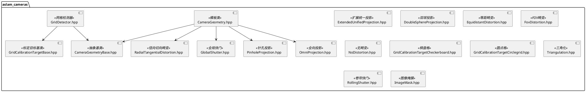
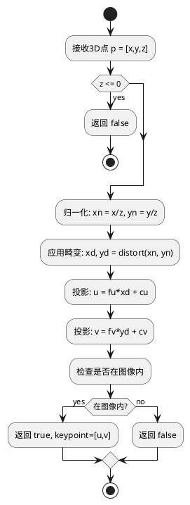

# aslam_cameras 模块文档

> 相机几何模型和标定工具库，为多相机标定提供核心支持

---

## 1. 📋 功能说明

### 1.1 定位
aslam_cameras 是 ASL (ASlam 计算机视觉库的核心相机模块，提供了完整的相机几何建模、畸变校正、标定目标检测等功能。它是 Kalibr 标定工具的底层基础。

### 1.2 核心能力
- **多种相机投影模型**：针孔、全向、欧几里得、双球等
- **多种畸变模型**：径向切向、等距、FOV 等
- **全局/卷帘快门**：支持两种快门类型
- **标定目标检测**：棋盘格、圆点格、AprilGrid
- **相机几何基类**：统一的抽象接口
- **图像掩膜支持**：有效区域掩膜
- **三角化功能**：多视角 3D 点重建

---

## 2. 🏗️ 架构设计

aslam_cameras 采用策略模式和模板设计，以 CameraGeometryBase 为核心抽象，结合多种投影和畸变模型实现。



### 主要组件划分
1. **相机几何层**：CameraGeometryBase + CameraGeometry
2. **投影模型层**：Pinhole、Omni、EUCm、DoubleSphere
3. **畸变模型层**：RadialTangential、Equidistant、Fov、NoDistortion
4. **快门模型层**：GlobalShutter、RollingShutter
5. **标定目标层**：Checkerboard、Circlegrid
6. **检测器层**：GridDetector
7. **工具层**：Triangulation、ImageMask

### 数据流走向
```
3D点 → 归一化平面 → 畸变 → 投影 → 2D关键点
          ↑
      反投影（可选）
```

### 关键设计模式
- **策略模式**：CameraGeometryBase 定义统一接口，多种实现
- **模板模式**：CameraGeometry 模板组合投影、畸变、快门
- **工厂模式**：从配置创建相机几何
- **组合模式**：投影+畸变+快门组合成完整相机

---

## 3. 🔑 关键方法

### 3.1 针孔投影模型

```cpp
template<typename DISTORTION_T>
class PinholeProjection {
public:
    PinholeProjection(double fu, double fv, double cu, double cv,
                      int ru, int rv, distortion_t distortion);

    template<typename DERIVED_P, typename DERIVED_K>
    bool euclideanToKeypoint(
        const Eigen::MatrixBase<DERIVED_P> & p,
        const Eigen::MatrixBase<DERIVED_K> & outKeypoint) const;
};
```

**原理**：经典针孔相机模型

\[
\begin{bmatrix} u \\ v \\ 1 \end{bmatrix} =
\begin{bmatrix} f_u & 0 & c_u \\ 0 & f_v & c_v \\ 0 & 0 & 1 \end{bmatrix}
\begin{bmatrix} x/z \\ y/z \\ 1 \end{bmatrix}
\]

**实现位置**：`include/aslam/cameras/PinholeProjection.hpp`

**复杂度**：O(1)



---

### 3.2 径向切向畸变

```cpp
class RadialTangentialDistortion {
public:
    RadialTangentialDistortion(double k1, double k2, double p1, double p2);

    template<typename DERIVED_Y>
    void distort(const Eigen::MatrixBase<DERIVED_Y> & y) const;
};
```

**原理**：Brown-Conrady 畸变模型

\[
\begin{cases}
x_d = x_n (1 + k_1 r^2 + k_2 r^4) + 2 p_1 x_n y_n + p_2 (r^2 + 2 x_n^2) \\
y_d = y_n (1 + k_1 r^2 + k_2 r^4) + p_1 (r^2 + 2 y_n^2) + 2 p_2 x_n y_n
\end{cases}
\]

**实现位置**：`include/aslam/cameras/RadialTangentialDistortion.hpp`

---

### 3.3 网格检测器

```cpp
class GridDetector {
public:
    GridDetector(boost::shared_ptr<CameraGeometryBase> geometry,
                 GridCalibrationTargetBase::Ptr target,
                 const GridDetectorOptions &options);

    bool findTarget(const cv::Mat &image, const aslam::Time &stamp,
                   GridCalibrationTargetObservation & outObservation) const;
};
```

**原理**：OpenCV 棋盘格/圆点格检测 + 亚像素细化

**实现位置**：`include/aslam/cameras/GridDetector.hpp`

---

### 3.4 相机几何基类

```cpp
class CameraGeometryBase {
public:
    virtual bool vsEuclideanToKeypoint(const Eigen::Vector3d & p,
                                        Eigen::VectorXd & outKeypoint) const = 0;
    virtual bool vsKeypointToEuclidean(const Eigen::VectorXd & keypoint,
                                       Eigen::Vector3d & outPoint) const = 0;
    virtual bool initializeIntrinsics(const std::vector<GridCalibrationTargetObservation> &observations) = 0;
    virtual bool estimateTransformation(
        const GridCalibrationTargetObservation & obs,
        sm::kinematics::Transformation & out_T_t_c) const = 0;
};
```

**原理**：定义所有相机几何的统一接口

**实现位置**：`include/aslam/cameras/CameraGeometryBase.hpp`

---

## 4. 🔌 对外接口

### 4.1 主要类

#### `CameraGeometryBase`
**用途**：相机几何抽象基类，定义统一接口

**关键方法**：
- `vsEuclideanToKeypoint(p, outKeypoint)` — 3D点投影到2D
- `vsKeypointToEuclidean(keypoint, outPoint)` — 2D点反投影到3D
- `initializeIntrinsics(observations)` — 从观测初始化内参
- `estimateTransformation(obs, out_T_t_c)` — 估计相机到目标的变换
- `width()` — 图像宽度
- `height()` — 图像高度

**输入输出接口定义**：
```
输入:
  - vsEuclideanToKeypoint(): Vector3d 3D点
  - vsKeypointToEuclidean(): VectorXd 2D关键点
  - initializeIntrinsics(): 观测列表

输出:
  - vsEuclideanToKeypoint(): bool(成功?), Vector2d 关键点
  - vsKeypointToEuclidean(): bool(成功?), Vector3d 3D点
```

---

#### `PinholeProjection<DISTORTION_T>`
**用途**：针孔投影模型，支持任意畸变模型

**关键方法**：
- `euclideanToKeypoint(p, outKeypoint)` — 3D到2D投影
- `homogeneousToKeypoint(ph, outKeypoint)` — 齐次点投影
- `keypointToEuclidean(keypoint, outPoint)` — 2D到3D反投影
- `fu(), fv(), cu(), cv()` — 获取内参
- `width(), height()` — 分辨率

**输入输出接口定义**：
```
输入:
  - 构造: fu, fv, cu, cv, ru, rv, distortion
  - euclideanToKeypoint(): Vector3d 3D点

输出:
  - euclideanToKeypoint(): bool(成功?), Vector2d 关键点
```

---

#### `RadialTangentialDistortion`
**用途**：径向切向畸变模型（4参数）

**关键方法**：
- `distort(y)` — 应用畸变
- `undistort(y)` — 去除畸变（迭代）
- `k1(), k2(), p1(), p2()` — 获取畸变参数

**输入输出接口定义**：
```
输入:
  - distort(): Vector2d 归一化平面点

输出:
  - distort(): 原位修改，应用畸变后的点
```

---

#### `GridDetector`
**用途**：检测图像中的标定目标

**关键方法**：
- `findTarget(image, stamp, outObservation)` — 检测目标并估计变换
- `findTargetNoTransformation(image, stamp, outObservation)` — 仅检测角点
- `initCameraGeometryFromObservation(image)` — 从单帧初始化内参

**输入输出接口定义**：
```
输入:
  - findTarget(): cv::Mat 图像, Time 时间戳

输出:
  - findTarget(): bool(成功?), GridCalibrationTargetObservation
```

---

#### `GridCalibrationTargetBase`
**用途**：标定目标抽象基类

**关键方法**：
- `points()` — 获取目标点坐标
- `size()` — 点数量
- `rows(), cols()` — 网格行列数

---

### 4.2 相机模型类型

```cpp
// 可用的相机模型组合：
// - pinhole-radtan: 针孔 + 径向切向畸变
// - pinhole-equi: 针孔 + 等距畸变
// - pinhole-fov: 针孔 + FOV畸变
// - omni-none: 全向投影 + 无畸变
// - omni-radtan: 全向投影 + 径向切向畸变
// - eucm-none: 扩展统一投影 + 无畸变
// - ds-none: 双球投影 + 无畸变
```

---

### 4.3 核心数据结构

#### 相机内参存储
```cpp
// 针孔投影内参:
double _fu;  // 水平焦距（像素）
double _fv;  // 垂直焦距（像素）
double _cu;  // 水平光心（像素）
double _cv;  // 垂直光心（像素）
int _ru;     // 水平分辨率
int _rv;     // 垂直分辨率
```

#### 径向切向畸变参数
```cpp
double _k1;  // 径向畸变1
double _k2;  // 径向畸变2
double _p1;  // 切向畸变1
double _p2;  // 切向畸变2
```

---

## 5. 📦 依赖关系

### 5.1 内部依赖
- sm_common — 基础工具、断言、ID
- sm_kinematics — 变换、四元数
- sm_eigen — Eigen 扩展
- sm_boost — Boost 序列化

### 5.2 外部依赖
- Eigen3 — 矩阵运算
- Boost (system, serialization) — 序列化
- OpenCV — 图像检测、角点检测

---

## 6. 💡 使用示例

### 6.1 创建针孔相机
```cpp
#include <aslam/cameras/CameraGeometry.hpp>
#include <aslam/cameras/PinholeProjection.hpp>
#include <aslam/cameras/RadialTangentialDistortion.hpp>
#include <aslam/cameras/NoDistortion.hpp>
#include <aslam/cameras/GlobalShutter.hpp>

// 定义相机类型
typedef aslam::cameras::PinholeProjection<
    aslam::cameras::RadialTangentialDistortion> Projection;
typedef aslam::cameras::CameraGeometry<
    Projection, aslam::cameras::GlobalShutter> Camera;

// 创建畸变模型
aslam::cameras::RadialTangentialDistortion distortion(
    -0.2, 0.1, 0.0, 0.0);

// 创建投影模型
Projection projection(450.0, 450.0, 320.0, 240.0, 640, 480, distortion);

// 创建相机几何
Camera camera(projection, aslam::cameras::GlobalShutter());

// 投影3D点
Eigen::Vector3d p(0.0, 0.0, 1.0);
Eigen::Vector2d keypoint;
if (camera.euclideanToKeypoint(p, keypoint)) {
    std::cout << "Keypoint: " << keypoint.transpose() << std::endl;
}
```

### 6.2 使用网格检测器
```cpp
#include <aslam/cameras/GridDetector.hpp>
#include <aslam/cameras/GridCalibrationTargetCheckerboard.hpp>

// 创建标定目标
aslam::cameras::GridCalibrationTargetCheckerboard::Ptr target(
    new aslam::cameras::GridCalibrationTargetCheckerboard(
        8, 6, 0.05, 0.03));

// 创建检测器
aslam::cameras::GridDetector detector(
    camera, target);

// 检测图像中的目标
cv::Mat image = cv::imread("calibration.jpg");
aslam::cameras::GridCalibrationTargetObservation observation;
aslam::Time stamp = aslam::Time::now();

if (detector.findTarget(image, stamp, observation)) {
    std::cout << "Found " << observation.size() << " corners" << std::endl;
}
```

### 6.3 从配置创建相机
```cpp
#include <sm/PropertyTree.hpp>
#include <aslam/cameras/CameraGeometryBase.hpp>

// 从YAML配置创建
sm::PropertyTree config("camera.yaml");
aslam::cameras::CameraGeometryBase::Ptr camera =
    aslam::cameras::CameraGeometryBase::create(config);
```

### 6.4 初始化内参
```cpp
#include <vector>
std::vector<aslam::cameras::GridCalibrationTargetObservation> observations;
// ... 填充观测 ...

if (camera->initializeIntrinsics(observations)) {
    std::cout << "Intrinsics initialized" << std::endl;
}
```

### 6.5 估计变换
```cpp
sm::kinematics::Transformation T_t_c;
if (camera->estimateTransformation(observation, T_t_c)) {
    std::cout << "Transformation: " << T_t_c.T() << std::endl;
}
```

---

## 7. 🔗 相关模块
- [sm_kinematics](../schweizer-messer/sm_kinematics.md) — 几何变换基础
- [sm_eigen](../schweizer-messer/sm_eigen.md) — Eigen 支持
- [kalibr](../../calibration/kalibr.md) — 标定工具

---

## 8. 📄 核心文件列表

| 文件 | 职责 |
|------|------|
| `include/aslam/cameras/CameraGeometryBase.hpp` | 相机几何抽象基类 |
| `include/aslam/cameras/CameraGeometry.hpp` | 相机几何模板类 |
| `include/aslam/cameras/PinholeProjection.hpp` | 针孔投影模型 |
| `include/aslam/cameras/OmniProjection.hpp` | 全向投影模型 |
| `include/aslam/cameras/ExtendedUnifiedProjection.hpp` | 扩展统一投影 |
| `include/aslam/cameras/DoubleSphereProjection.hpp` | 双球投影 |
| `include/aslam/cameras/RadialTangentialDistortion.hpp` | 径向切向畸变 |
| `include/aslam/cameras/EquidistantDistortion.hpp` | 等距畸变 |
| `include/aslam/cameras/FovDistortion.hpp` | FOV畸变 |
| `include/aslam/cameras/NoDistortion.hpp` | 无畸变 |
| `include/aslam/cameras/GlobalShutter.hpp` | 全局快门 |
| `include/aslam/cameras/RollingShutter.hpp` | 卷帘快门 |
| `include/aslam/cameras/GridDetector.hpp` | 网格检测器 |
| `include/aslam/cameras/GridCalibrationTargetBase.hpp` | 标定目标基类 |
| `include/aslam/cameras/GridCalibrationTargetCheckerboard.hpp` | 棋盘格目标 |
| `include/aslam/cameras/GridCalibrationTargetCirclegrid.hpp` | 圆点格目标 |
| `include/aslam/cameras/Triangulation.hpp` | 三角化 |
| `include/aslam/cameras/ImageMask.hpp` | 图像掩膜 |
| `src/CameraGeometryBase.cpp` | 基类实现 |
| `src/GridDetector.cpp` | 检测器实现 |
