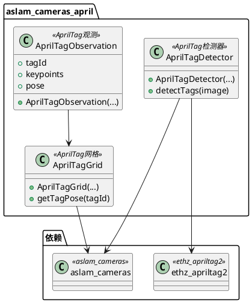
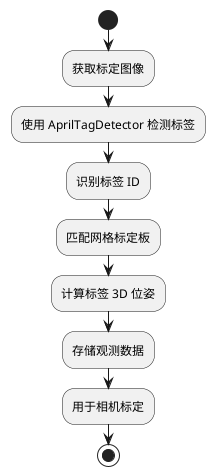

# aslam_cameras_april 模块详细文档

> ASL 相机 AprilTag 库 - 提供 AprilTag 检测和识别功能，与相机模型集成

---

## 1. 📋 功能说明

### 1.1 定位

该模块是 Kalibr 系统中 aslam_cv 模块集群的 AprilTag 检测组件，专门为相机标定和视觉惯性校准提供 AprilTag 检测功能。它将 AprilTag 检测与 aslam_cameras 相机模型深度集成，是 Kalibr 进行相机标定和视觉惯性校准的关键视觉检测基础设施。

### 1.2 核心能力

- 提供 AprilTag 检测功能，支持多种标签家族
- 与 aslam_cameras 相机模型深度集成
- 支持从图像中检测 AprilTag 并计算 3D 位姿
- 提供 AprilTag 网格标定板的检测和位姿计算
- 支持标签观测数据的存储和管理
- 高效的检测算法，适用于大规模标定数据集

---

## 2. 🏗️ 架构设计

### 2.1 主要组件



### 2.2 检测流程



### 2.3 关键设计模式

- **检测器模式**：封装 ethz_apriltag2 的检测功能
- **观测模式**：存储标签观测数据
- **网格模式**：管理 AprilTag 网格标定板
- **集成模式**：与 aslam_cameras 相机模型深度集成

---

## 3. 🔑 关键方法

### 3.1 AprilTag 检测

- **原理**：使用 ethz_apriltag2 库检测图像中的 AprilTag
- **复杂度**：O(W×H)，W 和 H 为图像宽度和高度

### 3.2 位姿计算

- **原理**：基于单应矩阵和相机内参计算标签的 3D 位姿
- **复杂度**：O(1)

---

## 4. 🔌 对外接口

### 4.1 主要类

#### 4.1.1 `AprilTagDetector`

- **用途**：AprilTag 检测器，封装 ethz_apriltag2 的检测功能
- **关键方法**：
  - `AprilTagDetector(...)` — 构造函数
  - `std::vector<AprilTagObservation> detectTags(const cv::Mat & image)` — 检测标签

#### 4.1.2 `AprilTagGrid`

- **用途**：AprilTag 网格标定板管理
- **关键方法**：
  - `AprilTagGrid(...)` — 构造函数
  - `Eigen::Matrix4d getTagPose(int tagId) const` — 获取标签位姿

#### 4.1.3 `AprilTagObservation`

- **用途**：AprilTag 观测数据存储
- **关键成员**：
  - `int tagId` — 标签 ID
  - `std::vector<Eigen::Vector2d> keypoints` — 关键点
  - `Eigen::Matrix4d pose` — 位姿

---

## 5. 📦 依赖关系

### 5.1 内部依赖

- **aslam_cameras** — 提供相机几何模型
- **ethz_apriltag2** — 提供 AprilTag 检测功能

### 5.2 外部依赖

- **OpenCV** — 用于图像处理
- **Eigen3** — 用于线性代数运算
- **C++11 及以上** — 用于现代 C++ 特性

---

## 6. 💡 使用示例

### 6.1 基本用法

```cpp
#include <aslam/cameras_april/AprilTagDetector.hpp>

// 创建检测器
aslam::cameras_april::AprilTagDetector detector;

// 加载图像
cv::Mat image = cv::imread("calibration_image.png", cv::IMREAD_GRAYSCALE);

// 检测标签
std::vector<aslam::cameras_april::AprilTagObservation> observations =
    detector.detectTags(image);

// 处理观测结果
for (const auto & obs : observations) {
    std::cout << "检测到标签 ID: " << obs.tagId << std::endl;
}
```

---

## 7. 🔗 相关模块

- [aslam_cameras](./aslam_cameras.md) — 相机模型模块
- [ethz_apriltag2](../aslam_offline_calibration/ethz_apriltag2.md) — AprilTag 检测库
- [kalibr](../calibration/kalibr.md) — Kalibr 离线校准核心

---

## 8. 📄 核心文件列表

| 文件路径 | 文件类型 | 功能描述 |
|----------|----------|----------|
| `aslam_cv/aslam_cameras_april/` | 模块目录 | AprilTag 检测模块 |

---
