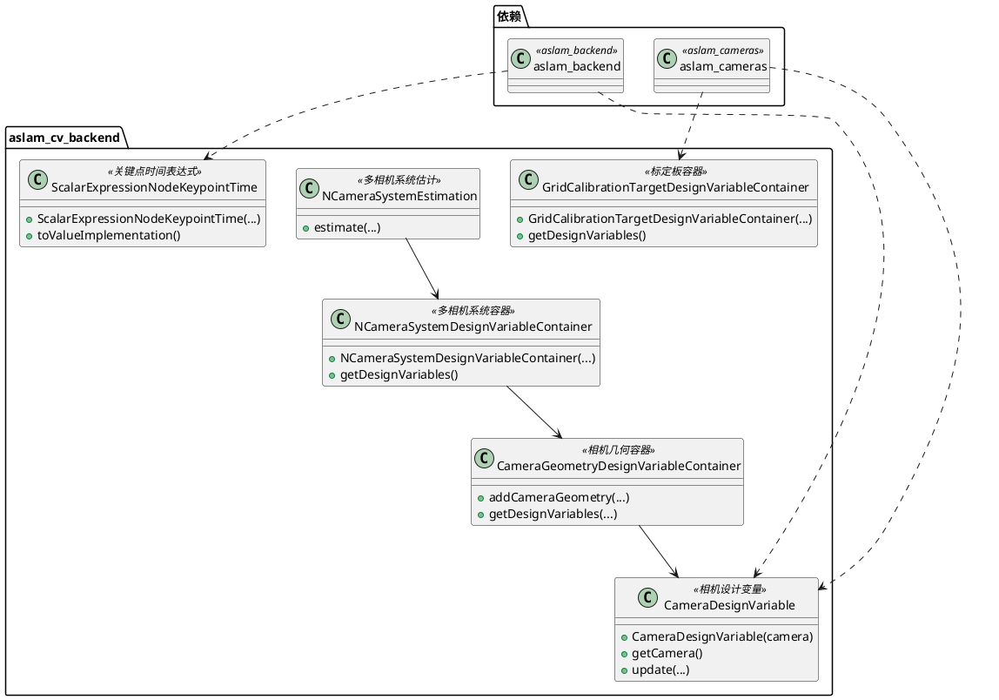
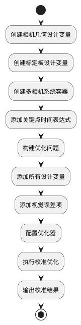

# aslam_cv_backend 模块详细文档

> ASL 计算机视觉优化后端 - 为多相机系统和视觉校准问题提供设计变量和优化接口

---

## 1. 📋 功能说明

### 1.1 定位

该模块是 Kalibr 系统中 aslam_cv 模块集群的优化后端组件，专门为多相机系统和视觉校准问题提供设计变量和优化接口。它实现了相机几何、网格标定板、多相机系统等设计变量容器，是将视觉问题与 aslam_backend 优化框架连接的关键桥梁。

### 1.2 核心能力

- 提供相机几何设计变量容器，支持相机参数的优化
- 提供网格标定板设计变量容器，支持标定板参数的优化
- 提供多相机系统设计变量容器，支持多相机系统的联合优化
- 实现关键点时间的标量表达式节点，支持时间同步校准
- 与 aslam_backend 深度集成，提供完整的优化问题构建能力
- 支持相机内外参、畸变参数、时间偏移等多种参数的同时优化

---

## 2. 🏗️ 架构设计

### 2.1 主要组件



### 2.2 优化流程



### 2.3 关键设计模式

- **容器模式**：使用设计变量容器管理多个相关设计变量
- **表达式节点模式**：实现关键点时间等特殊表达式节点
- **桥接模式**：将 aslam_cameras 的相机模型桥接到 aslam_backend
- **工厂模式**：通过容器创建和管理设计变量

---

## 3. 🔑 关键方法

### 3.1 相机设计变量更新

- **原理**：将相机参数包装为优化后端的设计变量，支持参数更新
- **实现位置**：`/home/xcandy/Workspace/kalibr/aslam_cv/aslam_cv_backend/include/aslam/backend/CameraDesignVariable.hpp`
- **复杂度**：O(1)

### 3.2 多相机系统容器管理

- **原理**：统一管理多相机系统的所有设计变量
- **实现位置**：`/home/xcandy/Workspace/kalibr/aslam_cv/aslam_cv_backend/include/aslam/NCameraSystemDesignVariableContainer.hpp`
- **复杂度**：O(N)，N 为相机数量

---

## 4. 🔌 对外接口

### 4.1 主要类

#### 4.1.1 `CameraDesignVariable`

- **用途**：将相机几何包装为优化后端的设计变量
- **关键方法**：
  - `CameraDesignVariable(const boost::shared_ptr<aslam::cameras::CameraGeometryBase> & camera)` — 构造函数
  - `const aslam::cameras::CameraGeometryBase & camera() const` — 获取相机几何
  - `boost::shared_ptr<aslam::cameras::CameraGeometryBase> cameraPtr()` — 获取相机智能指针

#### 4.1.2 `CameraGeometryDesignVariableContainer`

- **用途**：管理多个相机几何设计变量的容器
- **关键方法**：
  - `void addCameraGeometry(const aslam::cameras::CameraGeometryBase::Ptr & camera, bool estimateDistortion, bool estimateShutter, bool estimateExposure)` — 添加相机几何
  - `void getDesignVariables(aslam::backend::OptimizationProblem * problem)` — 获取所有设计变量

#### 4.1.3 `GridCalibrationTargetDesignVariableContainer`

- **用途**：管理网格标定板设计变量的容器
- **关键方法**：
  - `GridCalibrationTargetDesignVariableContainer(...)` — 构造函数
  - `void getDesignVariables(aslam::backend::OptimizationProblem * problem)` — 获取所有设计变量

#### 4.1.4 `NCameraSystemDesignVariableContainer`

- **用途**：管理多相机系统的所有设计变量
- **关键方法**：
  - `NCameraSystemDesignVariableContainer(...)` — 构造函数
  - `void getDesignVariables(aslam::backend::OptimizationProblem * problem)` — 获取所有设计变量

#### 4.1.5 `ScalarExpressionNodeKeypointTime`

- **用途**：关键点时间的标量表达式节点
- **关键方法**：
  - `ScalarExpressionNodeKeypointTime(...)` — 构造函数
  - `virtual double toScalarImplementation() const` — 求值实现

---

## 5. 📦 依赖关系

### 5.1 内部依赖

- **aslam_backend** — 提供优化后端核心功能
- **aslam_cameras** — 提供相机几何模型
- **sm_common** — 提供通用工具和断言宏

### 5.2 外部依赖

- **Eigen3** — 用于线性代数运算
- **Boost** — 用于智能指针和容器
- **C++11 及以上** — 用于现代 C++ 特性

---

## 6. 💡 使用示例

### 6.1 基本用法

```cpp
#include <aslam/backend/CameraDesignVariable.hpp>
#include <aslam/CameraGeometryDesignVariableContainer.hpp>
#include <aslam/cameras/CameraGeometryBase.hpp>

// 创建相机几何
boost::shared_ptr<aslam::cameras::CameraGeometryBase> camera =
    createCameraGeometry();

// 创建相机设计变量
aslam::backend::CameraDesignVariable cameraDv(camera);

// 或者使用容器
aslam::CameraGeometryDesignVariableContainer container;
container.addCameraGeometry(camera, true, false, false);

// 创建优化问题
boost::shared_ptr<aslam::backend::OptimizationProblem> problem(
    new aslam::backend::OptimizationProblem);

// 添加设计变量到问题
container.getDesignVariables(problem.get());
```

---

## 7. 🔗 相关模块

- [aslam_cameras](./aslam_cameras.md) — 相机模型模块
- [aslam_backend](../optimizer/aslam_backend.md) — 优化后端核心
- [kalibr](../calibration/kalibr.md) — Kalibr 离线校准核心

---

## 8. 📄 核心文件列表

| 文件路径 | 文件类型 | 功能描述 |
|----------|----------|----------|
| `/home/xcandy/Workspace/kalibr/aslam_cv/aslam_cv_backend/include/aslam/backend/CameraDesignVariable.hpp` | 头文件 | 相机设计变量定义 |
| `/home/xcandy/Workspace/kalibr/aslam_cv/aslam_cv_backend/include/aslam/backend/implementation/CameraDesignVariable.hpp` | 头文件 | 相机设计变量实现 |
| `/home/xcandy/Workspace/kalibr/aslam_cv/aslam_cv_backend/include/aslam/CameraGeometryDesignVariableContainer.hpp` | 头文件 | 相机几何容器定义 |
| `/home/xcandy/Workspace/kalibr/aslam_cv/aslam_cv_backend/include/aslam/GridCalibrationTargetDesignVariableContainer.hpp` | 头文件 | 标定板容器定义 |
| `/home/xcandy/Workspace/kalibr/aslam_cv/aslam_cv_backend/include/aslam/NCameraSystemDesignVariableContainer.hpp` | 头文件 | 多相机系统容器定义 |
| `/home/xcandy/Workspace/kalibr/aslam_cv/aslam_cv_backend/include/aslam/NCameraSystemEstimation.hpp` | 头文件 | 多相机系统估计定义 |
| `/home/xcandy/Workspace/kalibr/aslam_cv/aslam_cv_backend/include/aslam/backend/ScalarExpressionNodeKeypointTime.hpp` | 头文件 | 关键点时间表达式定义 |
| `/home/xcandy/Workspace/kalibr/aslam_cv/aslam_cv_backend/include/aslam/backend/implementation/ScalarExpressionNodeKeypointTime.hpp` | 头文件 | 关键点时间表达式实现 |

---
