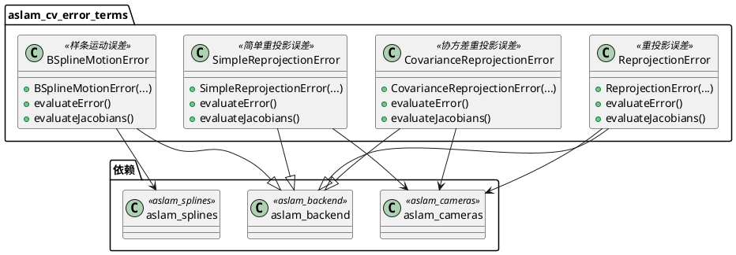
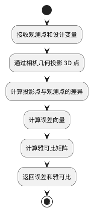

# aslam_cv_error_terms 模块详细文档

> ASL 计算机视觉误差项 - 为视觉校准问题提供重投影误差、协方差重投影误差等视觉误差项

---

## 1. 📋 功能说明

### 1.1 定位

该模块是 Kalibr 系统中 aslam_cv 模块集群的误差项组件，专门为视觉校准和视觉惯性里程计问题提供各种视觉误差项。它实现了重投影误差、协方差重投影误差、简单重投影误差、样条运动误差等多种视觉误差项，是构建视觉优化问题的核心组件。

### 1.2 核心能力

- 提供标准重投影误差（ReprojectionError），用于相机标定
- 提供协方差重投影误差（CovarianceReprojectionError），支持不确定性建模
- 提供简单重投影误差（SimpleReprojectionError），用于快速原型开发
- 提供样条运动误差（BSplineMotionError），用于运动轨迹约束
- 与 aslam_backend 深度集成，支持雅可比自动计算
- 支持多种相机模型的重投影误差计算
- 高效的误差计算和雅可比传播

---

## 2. 🏗️ 架构设计

### 2.1 主要组件



### 2.2 误差计算流程



### 2.3 关键设计模式

- **误差项模式**：继承自 aslam_backend::ErrorTerm，实现误差和雅可比计算
- **模板方法模式**：基类定义接口，子类实现具体误差计算
- **雅可比传播模式**：通过链式法则自动传播雅可比

---

## 3. 🔑 关键方法

### 3.1 重投影误差计算

- **原理**：计算 3D 点在图像上的投影与观测点的差异
- **实现位置**：`/home/xcandy/Workspace/kalibr/aslam_cv/aslam_cv_error_terms/include/aslam/backend/implementation/ReprojectionError.hpp`
- **复杂度**：O(1)

### 3.2 雅可比矩阵计算

- **原理**：计算重投影误差对相机参数和 3D 点的雅可比
- **实现位置**：`/home/xcandy/Workspace/kalibr/aslam_cv/aslam_cv_error_terms/include/aslam/backend/implementation/ReprojectionError.hpp`
- **复杂度**：O(1)

---

## 4. 🔌 对外接口

### 4.1 主要类

#### 4.1.1 `ReprojectionError`

- **用途**：标准的重投影误差项，用于相机标定和 3D 重建
- **关键方法**：
  - `ReprojectionError(const aslam::cameras::CameraGeometryBase & camera, const Eigen::VectorXd & measurement, const Eigen::MatrixXd & invR, aslam::backend::DesignVariable * dv_y_c, ...)` — 构造函数
  - `virtual double evaluateErrorImplementation()` — 评估误差实现
  - `virtual void evaluateJacobiansImplementation(aslam::backend::JacobianContainer & outJacobians) const` — 评估雅可比实现

#### 4.1.2 `CovarianceReprojectionError`

- **用途**：带协方差的重投影误差项，支持不确定性建模
- **关键方法**：
  - `CovarianceReprojectionError(...)` — 构造函数
  - `virtual double evaluateErrorImplementation()` — 评估误差实现
  - `virtual void evaluateJacobiansImplementation(aslam::backend::JacobianContainer & outJacobians) const` — 评估雅可比实现

#### 4.1.3 `SimpleReprojectionError`

- **用途**：简化的重投影误差项，用于快速原型开发
- **关键方法**：
  - `SimpleReprojectionError(...)` — 构造函数
  - `virtual double evaluateErrorImplementation()` — 评估误差实现
  - `virtual void evaluateJacobiansImplementation(aslam::backend::JacobianContainer & outJacobians) const` — 评估雅可比实现

#### 4.1.4 `BSplineMotionError`

- **用途**：样条运动误差项，用于运动轨迹约束
- **关键方法**：
  - `BSplineMotionError(...)` — 构造函数
  - `virtual double evaluateErrorImplementation()` — 评估误差实现
  - `virtual void evaluateJacobiansImplementation(aslam::backend::JacobianContainer & outJacobians) const` — 评估雅可比实现

---

## 5. 📦 依赖关系

### 5.1 内部依赖

- **aslam_backend** — 提供误差项基类和优化后端
- **aslam_cameras** — 提供相机几何模型
- **aslam_splines** — 提供样条曲线支持（BSplineMotionError）

### 5.2 外部依赖

- **Eigen3** — 用于线性代数运算
- **Boost** — 用于智能指针和容器
- **C++11 及以上** — 用于现代 C++ 特性

---

## 6. 💡 使用示例

### 6.1 基本用法

```cpp
#include <aslam/backend/ReprojectionError.hpp>
#include <aslam/cameras/CameraGeometryBase.hpp>
#include <aslam/backend/OptimizationProblem.hpp>

// 创建相机几何
boost::shared_ptr<aslam::cameras::CameraGeometryBase> camera =
    createCameraGeometry();

// 创建观测点
Eigen::VectorXd measurement(2);
measurement << 320, 240;

// 创建信息矩阵
Eigen::MatrixXd invR = Eigen::MatrixXd::Identity(2, 2);

// 创建设计变量
aslam::backend::DesignVariable* dv_y_c = createCameraDesignVariable();
aslam::backend::DesignVariable* dv_p = createPointDesignVariable();

// 创建重投影误差项
boost::shared_ptr<aslam::backend::ReprojectionError> error(
    new aslam::backend::ReprojectionError(
        *camera, measurement, invR, dv_y_c, dv_p));

// 添加到优化问题
boost::shared_ptr<aslam::backend::OptimizationProblem> problem(
    new aslam::backend::OptimizationProblem);
problem->addErrorTerm(error.get(), true);
```

---

## 7. 🔗 相关模块

- [aslam_cameras](./aslam_cameras.md) — 相机模型模块
- [aslam_backend](../optimizer/aslam_backend.md) — 优化后端核心
- [aslam_splines](../aslam_nonparametric_estimation/aslam_splines.md) — 样条曲线支持
- [kalibr](../calibration/kalibr.md) — Kalibr 离线校准核心

---

## 8. 📄 核心文件列表

| 文件路径 | 文件类型 | 功能描述 |
|----------|----------|----------|
| `/home/xcandy/Workspace/kalibr/aslam_cv/aslam_cv_error_terms/include/aslam/backend/ReprojectionError.hpp` | 头文件 | 重投影误差定义 |
| `/home/xcandy/Workspace/kalibr/aslam_cv/aslam_cv_error_terms/include/aslam/backend/implementation/ReprojectionError.hpp` | 头文件 | 重投影误差实现 |
| `/home/xcandy/Workspace/kalibr/aslam_cv/aslam_cv_error_terms/include/aslam/backend/CovarianceReprojectionError.hpp` | 头文件 | 协方差重投影误差定义 |
| `/home/xcandy/Workspace/kalibr/aslam_cv/aslam_cv_error_terms/include/aslam/backend/implementation/CovarianceReprojectionError.hpp` | 头文件 | 协方差重投影误差实现 |
| `/home/xcandy/Workspace/kalibr/aslam_cv/aslam_cv_error_terms/include/aslam/backend/SimpleReprojectionError.hpp` | 头文件 | 简单重投影误差定义 |
| `/home/xcandy/Workspace/kalibr/aslam_cv/aslam_cv_error_terms/include/aslam/backend/implementation/SimpleReprojectionError.hpp` | 头文件 | 简单重投影误差实现 |
| `/home/xcandy/Workspace/kalibr/aslam_cv/aslam_cv_error_terms/include/aslam/backend/BSplineMotionError.hpp` | 头文件 | 样条运动误差定义 |
| `/home/xcandy/Workspace/kalibr/aslam_cv/aslam_cv_error_terms/include/aslam/backend/implementation/BSplineMotionError.hpp` | 头文件 | 样条运动误差实现 |

---
