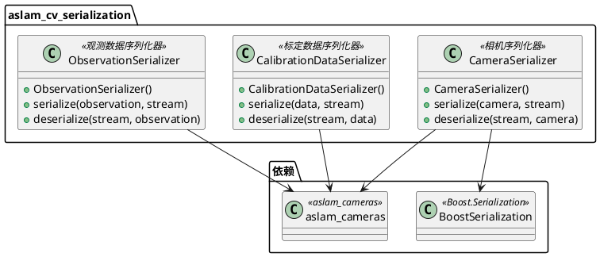
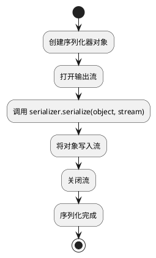

# aslam_cv_serialization 模块详细文档

> ASL 计算机视觉序列化库 - 提供相机模型、标定数据等的序列化功能，支持数据持久化

---

## 1. 📋 功能说明

### 1.1 定位

该模块是 Kalibr 系统中 aslam_cv 模块集群的序列化组件，专门为相机标定和视觉惯性校准提供数据序列化功能。它实现了相机模型、标定数据、观测数据等的序列化和反序列化，支持数据的持久化存储和加载，是 Kalibr 进行数据管理的关键基础设施。

### 1.2 核心能力

- 提供相机模型的序列化和反序列化
- 提供标定数据的序列化和反序列化
- 提供观测数据的序列化和反序列化
- 支持多种序列化格式：Boost.Serialization、文本、二进制等
- 高效的序列化算法，适用于大规模数据集
- 与 aslam_cameras、aslam_backend 等模块深度集成
- 支持跨平台数据兼容

---

## 2. 🏗️ 架构设计

### 2.1 主要组件



### 2.2 序列化流程



### 2.3 关键设计模式

- **序列化器模式**：各种数据类型的序列化封装为序列化器类
- **策略模式**：支持多种序列化格式策略
- **Boost.Serialization 集成模式**：利用 Boost.Serialization 库实现跨平台序列化

---

## 3. 🔑 关键方法

### 3.1 相机模型序列化

- **原理**：将相机模型的参数序列化到输出流
- **复杂度**：O(N)，N 为相机参数数量

### 3.2 标定数据序列化

- **原理**：将标定数据序列化到输出流
- **复杂度**：O(N)，N 为标定数据大小

---

## 4. 🔌 对外接口

### 4.1 主要类

#### 4.1.1 `CameraSerializer`

- **用途**：相机模型序列化器
- **关键方法**：
  - `CameraSerializer()` — 构造函数
  - `void serialize(const aslam::cameras::CameraGeometryBase & camera, std::ostream & stream)` — 序列化相机
  - `void deserialize(std::istream & stream, boost::shared_ptr<aslam::cameras::CameraGeometryBase> & camera)` — 反序列化相机

#### 4.1.2 `CalibrationDataSerializer`

- **用途**：标定数据序列化器
- **关键方法**：
  - `CalibrationDataSerializer()` — 构造函数
  - `void serialize(const CalibrationData & data, std::ostream & stream)` — 序列化标定数据
  - `void deserialize(std::istream & stream, CalibrationData & data)` — 反序列化标定数据

#### 4.1.3 `ObservationSerializer`

- **用途**：观测数据序列化器
- **关键方法**：
  - `ObservationSerializer()` — 构造函数
  - `void serialize(const Observation & observation, std::ostream & stream)` — 序列化观测
  - `void deserialize(std::istream & stream, Observation & observation)` — 反序列化观测

---

## 5. 📦 依赖关系

### 5.1 内部依赖

- **aslam_cameras** — 提供相机模型
- **sm_common** — 提供通用工具
- **sm_boost** — 提供 Boost 扩展

### 5.2 外部依赖

- **Boost.Serialization** — 用于序列化功能
- **C++11 及以上** — 用于现代 C++ 特性

---

## 6. 💡 使用示例

### 6.1 基本用法 - 相机模型序列化

```cpp
#include <aslam/cv_serialization/CameraSerializer.hpp>
#include <aslam/cameras/CameraGeometryBase.hpp>
#include <fstream>

// 创建相机模型
boost::shared_ptr<aslam::cameras::CameraGeometryBase> camera =
    createCameraModel();

// 创建序列化器
aslam::cv_serialization::CameraSerializer serializer;

// 序列化到文件
std::ofstream ofs("camera.yaml");
serializer.serialize(*camera, ofs);
ofs.close();

// 从文件反序列化
std::ifstream ifs("camera.yaml");
boost::shared_ptr<aslam::cameras::CameraGeometryBase> loadedCamera;
serializer.deserialize(ifs, loadedCamera);
ifs.close();
```

### 6.2 高级用法 - 标定数据序列化

```cpp
#include <aslam/cv_serialization/CalibrationDataSerializer.hpp>
#include <fstream>

// 创建标定数据
CalibrationData data = createCalibrationData();

// 创建序列化器
aslam::cv_serialization::CalibrationDataSerializer serializer;

// 序列化到文件
std::ofstream ofs("calibration.bin", std::ios::binary);
serializer.serialize(data, ofs);
ofs.close();

// 从文件反序列化
std::ifstream ifs("calibration.bin", std::ios::binary);
CalibrationData loadedData;
serializer.deserialize(ifs, loadedData);
ifs.close();
```

---

## 7. 🔗 相关模块

- [aslam_cameras](./aslam_cameras.md) — 相机模型模块
- [kalibr](../calibration/kalibr.md) — Kalibr 离线校准核心

---

## 8. 📄 核心文件列表

| 文件路径 | 文件类型 | 功能描述 |
|----------|----------|----------|
| `aslam_cv/aslam_cv_serialization/` | 模块目录 | 序列化模块 |

---
