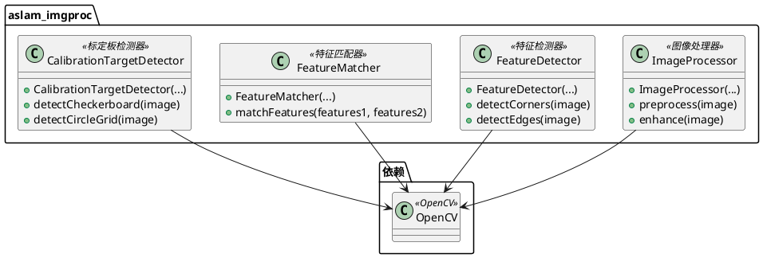
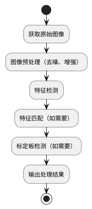

# aslam_imgproc 模块详细文档

> ASL 图像处理库 - 提供图像处理和计算机视觉算法，用于相机标定和视觉惯性校准

---

## 1. 📋 功能说明

### 1.1 定位

该模块是 Kalibr 系统中 aslam_cv 模块集群的图像处理组件，专门为相机标定和视觉惯性校准提供各种图像处理和计算机视觉算法。它实现了图像预处理、特征检测、特征匹配、图像增强等功能，是 Kalibr 进行视觉数据处理的关键基础设施。

### 1.2 核心能力

- 提供图像预处理功能：去噪、增强、归一化等
- 提供特征检测算法：角点检测、边缘检测等
- 提供特征匹配功能：用于多视图几何
- 提供图像变换功能：旋转、缩放、仿射变换等
- 提供标定板检测功能：棋盘格、圆点格等
- 高效的图像处理算法，适用于大规模标定数据集
- 与 OpenCV 深度集成，利用 OpenCV 的图像处理能力

---

## 2. 🏗️ 架构设计

### 2.1 主要组件



### 2.2 图像处理流程



### 2.3 关键设计模式

- **处理器模式**：各种图像处理算法封装为处理器类
- **检测器模式**：特征检测和标定板检测封装为检测器类
- **匹配器模式**：特征匹配封装为匹配器类
- **OpenCV 集成模式**：深度利用 OpenCV 的图像处理能力

---

## 3. 🔑 关键方法

### 3.1 图像预处理

- **原理**：对图像进行去噪、增强、归一化等预处理操作
- **复杂度**：O(W×H)，W 和 H 为图像宽度和高度

### 3.2 特征检测

- **原理**：检测图像中的特征点，如角点、边缘等
- **复杂度**：O(W×H)，W 和 H 为图像宽度和高度

### 3.3 标定板检测

- **原理**：检测图像中的标定板，如棋盘格、圆点格等
- **复杂度**：O(W×H)，W 和 H 为图像宽度和高度

---

## 4. 🔌 对外接口

### 4.1 主要类

#### 4.1.1 `ImageProcessor`

- **用途**：图像处理器，提供图像预处理功能
- **关键方法**：
  - `ImageProcessor()` — 构造函数
  - `cv::Mat preprocess(const cv::Mat & image)` — 图像预处理
  - `cv::Mat enhance(const cv::Mat & image)` — 图像增强

#### 4.1.2 `FeatureDetector`

- **用途**：特征检测器，提供特征检测功能
- **关键方法**：
  - `FeatureDetector()` — 构造函数
  - `std::vector<cv::Point2f> detectCorners(const cv::Mat & image)` — 角点检测
  - `cv::Mat detectEdges(const cv::Mat & image)` — 边缘检测

#### 4.1.3 `FeatureMatcher`

- **用途**：特征匹配器，提供特征匹配功能
- **关键方法**：
  - `FeatureMatcher()` — 构造函数
  - `std::vector<cv::DMatch> matchFeatures(const std::vector<cv::KeyPoint> & features1, const std::vector<cv::KeyPoint> & features2)` — 特征匹配

#### 4.1.4 `CalibrationTargetDetector`

- **用途**：标定板检测器，提供标定板检测功能
- **关键方法**：
  - `CalibrationTargetDetector()` — 构造函数
  - `bool detectCheckerboard(const cv::Mat & image, cv::Size patternSize, std::vector<cv::Point2f> & corners)` — 棋盘格检测
  - `bool detectCircleGrid(const cv::Mat & image, cv::Size patternSize, std::vector<cv::Point2f> & centers)` — 圆点格检测

---

## 5. 📦 依赖关系

### 5.1 内部依赖

- 无内部依赖，是独立的图像处理库

### 5.2 外部依赖

- **OpenCV** — 用于图像处理和计算机视觉算法
- **Eigen3** — 用于线性代数运算
- **C++11 及以上** — 用于现代 C++ 特性

---

## 6. 💡 使用示例

### 6.1 基本用法 - 图像预处理

```cpp
#include <aslam/imgproc/ImageProcessor.hpp>

// 创建图像处理器
aslam::imgproc::ImageProcessor processor;

// 加载图像
cv::Mat image = cv::imread("calibration_image.png");

// 图像预处理
cv::Mat preprocessed = processor.preprocess(image);

// 图像增强
cv::Mat enhanced = processor.enhance(image);
```

### 6.2 标定板检测

```cpp
#include <aslam/imgproc/CalibrationTargetDetector.hpp>

// 创建标定板检测器
aslam::imgproc::CalibrationTargetDetector detector;

// 加载图像
cv::Mat image = cv::imread("calibration_image.png");

// 检测棋盘格
cv::Size patternSize(8, 6);
std::vector<cv::Point2f> corners;
bool found = detector.detectCheckerboard(image, patternSize, corners);

if (found) {
    std::cout << "检测到棋盘格！" << std::endl;
    std::cout << "角点数量: " << corners.size() << std::endl;
}
```

---

## 7. 🔗 相关模块

- [aslam_cameras](./aslam_cameras.md) — 相机模型模块
- [kalibr](../calibration/kalibr.md) — Kalibr 离线校准核心
- [ethz_apriltag2](../aslam_offline_calibration/ethz_apriltag2.md) — AprilTag 检测库

---

## 8. 📄 核心文件列表

| 文件路径 | 文件类型 | 功能描述 |
|----------|----------|----------|
| `aslam_cv/aslam_imgproc/` | 模块目录 | 图像处理模块 |

---
