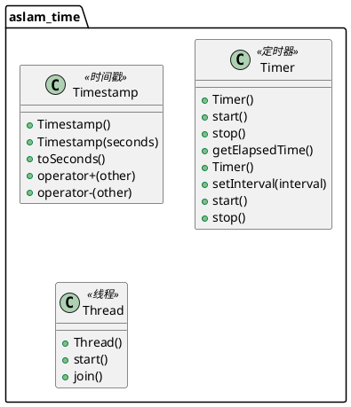
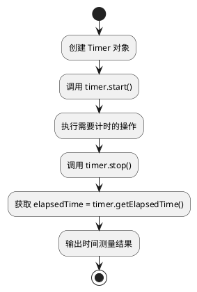

# aslam_time 模块详细文档

> ASL 时间库 - 提供时间戳、计时器、定时器等时间相关功能，用于多传感器时间同步

---

## 1. 📋 功能说明

### 1.1 定位

该模块是 Kalibr 系统中 aslam_cv 模块集群的时间管理组件，专门为相机标定和视觉惯性校准提供时间相关功能。它实现了时间戳、计时器、定时器等功能，是 Kalibr 进行多传感器时间同步的关键基础设施。

### 1.2 核心能力

- 提供时间戳（Timestamp）数据结构，用于表示时间点
- 提供计时器（Timer）功能，用于测量时间间隔
- 提供定时器（Threaded Timer）功能，用于定时任务调度
- 提供高精度时间测量功能
- 支持多传感器时间同步
- 高效的时间操作，适用于实时系统和离线校准

---

## 2. 🏗️ 架构设计

### 2.1 主要组件



### 2.2 时间测量流程



### 2.3 关键设计模式

- **时间戳模式**：封装时间点表示和操作
- **计时器模式**：封装时间间隔测量
- **线程模式**：提供多线程支持
- **RAII 模式**：利用 C++ 析构函数自动清理资源

---

## 3. 🔑 关键方法

### 3.1 时间戳表示

- **原理**：封装时间点的表示和算术运算
- **复杂度**：O(1)

### 3.2 时间测量

- **原理**：测量代码执行时间
- **复杂度**：O(1)

---

## 4. 🔌 对外接口

### 4.1 主要类

#### 4.1.1 `Timestamp`

- **用途**：时间戳数据结构，表示时间点
- **关键方法**：
  - `Timestamp()` — 默认构造函数
  - `Timestamp(double seconds)` — 从秒数构造
  - `double toSeconds() const` — 转换为秒数
  - `Timestamp operator+(const Timestamp & other) const` — 加法
  - `Timestamp operator-(const Timestamp & other) const` — 减法

#### 4.1.2 `Timer`

- **用途**：计时器，用于测量时间间隔
- **关键方法**：
  - `Timer()` — 构造函数
  - `void start()` — 开始计时
  - `void stop()` — 停止计时
  - `double getElapsedTime() const` — 获取经过的时间（秒）

#### 4.1.3 `Thread`

- **用途**：线程类，用于多线程编程
- **关键方法**：
  - `Thread()` — 构造函数
  - `void start()` — 启动线程
  - `void join()` — 等待线程结束

---

## 5. 📦 依赖关系

### 5.1 内部依赖

- **sm_common** — 提供通用工具和断言宏

### 5.2 外部依赖

- **Boost** — 用于线程和时间功能
- **C++11 及以上** — 用于现代 C++ 特性

---

## 6. 💡 使用示例

### 6.1 基本用法 - 时间戳操作

```cpp
#include <aslam/time/Timestamp.hpp>

// 创建时间戳
aslam::time::Timestamp t1(100.0);  // 100 秒
aslam::time::Timestamp t2(200.0);  // 200 秒

// 时间戳运算
aslam::time::Timestamp t3 = t2 - t1;
std::cout << "时间差: " << t3.toSeconds() << " 秒" << std::endl;

// 比较时间戳
if (t1 < t2) {
    std::cout << "t1 在 t2 之前" << std::endl;
}
```

### 6.2 高级用法 - 计时器

```cpp
#include <aslam/time/Timer.hpp>

// 创建计时器
aslam::time::Timer timer;

// 开始计时
timer.start();

// 执行一些操作
for (int i = 0; i < 1000000; ++i) {
    // 一些计算
}

// 停止计时
timer.stop();

// 获取经过的时间
double elapsed = timer.getElapsedTime();
std::cout << "执行时间: " << elapsed << " 秒" << std::endl;
```

---

## 7. 🔗 相关模块

- [kalibr](../calibration/kalibr.md) — Kalibr 离线校准核心
- [aslam_cameras](./aslam_cameras.md) — 相机模型模块

---

## 8. 📄 核心文件列表

| 文件路径 | 文件类型 | 功能描述 |
|----------|----------|----------|
| `aslam_cv/aslam_time/include/aslam/calibration/base/Timestamp.h` | 头文件 | 时间戳定义 |
| `aslam_cv/aslam_time/include/aslam/calibration/base/Timer.h` | 头文件 | 计时器定义 |
| `aslam_cv/aslam_time/include/aslam/calibration/base/Thread.h` | 头文件 | 线程定义 |
| `aslam_cv/aslam_time/include/aslam/calibration/base/Threads.h` | 头文件 | 线程管理定义 |
| `aslam_cv/aslam_time/include/aslam/calibration/base/Mutex.h` | 头文件 | 互斥锁定义 |

---
