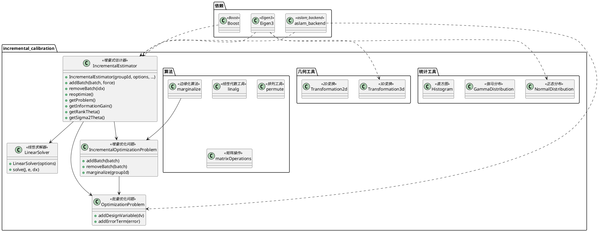
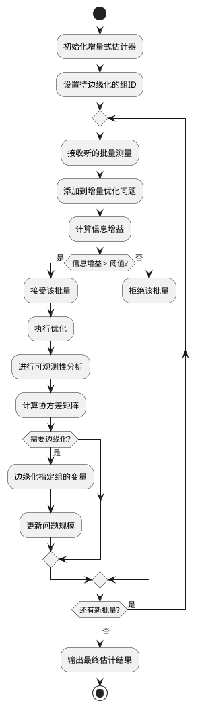

# incremental_calibration 模块详细文档

> 增量式校准库 - 提供用于机器人校准问题的增量式估计器，支持批量处理和状态边缘化

---

## 1. 📋 功能说明

### 1.1 定位

该模块是 Kalibr 系统中增量式校准模块集群的核心组件，提供了专门用于机器人和视觉惯性校准问题的增量式估计器。它实现了基于信息增益的批量接受机制和状态边缘化功能，能够在保持估计精度的同时，高效处理大规模数据集，是 SLAM 和视觉惯性里程计系统的重要基础设施。

### 1.2 核心能力

- 提供增量式估计器，支持批量数据的逐步添加
- 实现基于信息增益的批量接受机制，确保只添加有价值的测量
- 支持设计变量的边缘化，保持问题规模可控
- 提供可观测性分析工具，评估参数的可观测性
- 支持协方差计算和奇异值分解，进行不确定性量化
- 提供内存使用和计算量统计，便于性能分析
- 灵活的配置选项，支持线性求解器和优化器参数调整

---

## 2. 🏗️ 架构设计

### 2.1 主要组件



### 2.2 增量估计流程



### 2.3 关键设计模式

- **增量式模式**：通过逐步添加批量数据进行估计，而非一次性处理全部数据
- **边缘化模式**：保留旧状态的信息，同时移除变量以控制问题规模
- **信息增益模式**：基于信息论评估新测量的价值，决定是否接受
- **可观测性分析模式**：通过 SVD 分析参数的可观测性
- **策略模式**：通过选项配置不同的线性求解器和优化器行为

---

## 3. 🔑 关键方法

### 3.1 增量式批量添加

- **原理**：将新的批量测量添加到估计器中，计算信息增益并决定是否接受
- **实现位置**：`/home/xcandy/Workspace/kalibr/aslam_incremental_calibration/incremental_calibration/src/aslam/calibration/core/IncrementalEstimator.cpp`
- **复杂度**：O(N^3)，N 为设计变量维度

### 3.2 状态边缘化

- **原理**：通过 Schur 补将指定组的变量边缘化，保留其信息
- **实现位置**：`/home/xcandy/Workspace/kalibr/aslam_incremental_calibration/incremental_calibration/include/aslam/calibration/algorithms/marginalize.h`
- **复杂度**：O(N^3)，N 为设计变量维度

### 3.3 可观测性分析

- **原理**：通过 SVD 分解信息矩阵，分析参数的可观测性
- **实现位置**：`/home/xcandy/Workspace/kalibr/aslam_incremental_calibration/incremental_calibration/src/aslam/calibration/core/IncrementalEstimator.cpp`
- **复杂度**：O(N^3)，N 为设计变量维度

---

## 4. 🔌 对外接口

### 4.1 主要类

#### 4.1.1 `IncrementalEstimator`

- **用途**：增量式估计器核心类，管理批量添加、优化和边缘化
- **关键方法**：
  - `IncrementalEstimator(size_t groupId, const Options& options = Options(), const LinearSolverOptions& linearSolverOptions = LinearSolverOptions(), const OptimizerOptions& optimizerOptions = OptimizerOptions())` — 构造函数，指定待边缘化的组ID
  - `ReturnValue addBatch(const BatchSP& batch, bool force = false)` — 添加批量测量
  - `void removeBatch(size_t idx)` — 移除指定索引的批量
  - `void removeBatch(const BatchSP& batch)` — 移除指定的批量
  - `ReturnValue reoptimize()` — 重新执行优化
  - `size_t getNumBatches() const` — 获取批量数量
  - `const IncrementalOptimizationProblem* getProblem() const` — 获取优化问题
  - `double getInformationGain() const` — 获取信息增益
  - `std::ptrdiff_t getRankTheta() const` — 获取可观测参数的秩
  - `const Eigen::MatrixXd& getSigma2Theta(bool scaled = false) const` — 获取参数协方差
  - `const Eigen::MatrixXd& getNobsBasis(bool scaled = false) const` — 获取不可观测子空间基
  - `const Eigen::MatrixXd& getObsBasis(bool scaled = false) const` — 获取可观测子空间基
- **核心选项**：
  - `infoGainDelta` — 信息增益阈值
  - `checkValidity` — 是否检查解的有效性
  - `verbose` — 是否输出详细信息

#### 4.1.2 `IncrementalOptimizationProblem`

- **用途**：增量式优化问题管理类
- **关键方法**：
  - 添加和移除批量
  - 管理设计变量和误差项
  - 支持边缘化操作

#### 4.1.3 `OptimizationProblem`

- **用途**：批量优化问题管理类
- **关键方法**：
  - `addDesignVariable(DesignVariable* dv)` — 添加设计变量
  - `addErrorTerm(ErrorTerm* error)` — 添加误差项

### 4.2 主要函数

```cpp
// 添加批量测量
IncrementalEstimator::ReturnValue IncrementalEstimator::addBatch(
    const BatchSP& batch, bool force);

// 可观测性分析
const Eigen::MatrixXd& IncrementalEstimator::getSigma2Theta(bool scaled) const;
const Eigen::MatrixXd& IncrementalEstimator::getObsBasis(bool scaled) const;
```

### 4.3 核心数据结构

```cpp
// 增量估计器选项
struct IncrementalEstimator::Options {
    double infoGainDelta;  // 信息增益阈值
    bool checkValidity;    // 检查有效性
    bool verbose;          // 详细输出
};

// 批量添加返回值
struct IncrementalEstimator::ReturnValue {
    bool batchAccepted;
    double informationGain;
    std::ptrdiff_t rankPsi;
    std::ptrdiff_t rankTheta;
    Eigen::MatrixXd nobsBasis;
    Eigen::MatrixXd obsBasis;
    Eigen::MatrixXd sigma2Theta;
    Eigen::VectorXd singularValues;
    size_t numIterations;
    double JStart;
    double JFinal;
    double elapsedTime;
};
```

---

## 5. 📦 依赖关系

### 5.1 内部依赖

- **aslam_backend** — 提供优化后端核心功能
- **sm_common** — 提供通用工具和断言宏
- **sm_eigen** — 提供 Eigen 扩展工具

### 5.2 外部依赖

- **Eigen3** — 用于线性代数运算
- **Boost** — 用于智能指针和容器
- **C++11 及以上** — 用于现代 C++ 特性
- **catkin** (可选) — 用于 ROS 构建系统

---

## 6. 💡 使用示例

### 6.1 基本用法

```cpp
#include <aslam/calibration/core/IncrementalEstimator.h>
#include <aslam/calibration/core/OptimizationProblem.h>

// 创建增量估计器
size_t margGroupId = 1;  // 待边缘化的组ID
aslam::calibration::IncrementalEstimator::Options options;
options.infoGainDelta = 0.2;  // 信息增益阈值
options.verbose = true;

aslam::calibration::LinearSolverOptions linearSolverOptions;
aslam::backend::Optimizer2Options optimizerOptions;

aslam::calibration::IncrementalEstimator estimator(
    margGroupId, options, linearSolverOptions, optimizerOptions);

// 处理批量数据
for (size_t i = 0; i < numBatches; ++i) {
    // 创建批量优化问题
    boost::shared_ptr<aslam::calibration::OptimizationProblem> batch(
        new aslam::calibration::OptimizationProblem);

    // 添加设计变量
    batch->addDesignVariable(calibrationParams, false);
    batch->addDesignVariable(pose, true);  // true = 属于待边缘化组

    // 添加误差项
    batch->addErrorTerm(reprojectionError, true);

    // 添加到增量估计器
    aslam::calibration::IncrementalEstimator::ReturnValue result =
        estimator.addBatch(batch);

    if (result.batchAccepted) {
        std::cout << "批量 " << i << " 被接受" << std::endl;
        std::cout << "信息增益: " << result.informationGain << std::endl;
        std::cout << "可观测秩: " << result.rankTheta << std::endl;
        std::cout << "迭代次数: " << result.numIterations << std::endl;
        std::cout << "代价变化: " << result.JStart << " -> " << result.JFinal << std::endl;
    } else {
        std::cout << "批量 " << i << " 被拒绝（信息增益不足）" << std::endl;
    }
}

// 获取最终结果
const Eigen::MatrixXd& cov = estimator.getSigma2Theta();
std::cout << "参数协方差:\n" << cov << std::endl;
```

### 6.2 可观测性分析

```cpp
#include <aslam/calibration/core/IncrementalEstimator.h>

// ... 添加批量数据后 ...

// 获取可观测性分析结果
std::ptrdiff_t rankTheta = estimator.getRankTheta();
std::ptrdiff_t rankThetaDeficiency = estimator.getRankThetaDeficiency();

std::cout << "可观测参数秩: " << rankTheta << std::endl;
std::cout << "秩亏缺: " << rankThetaDeficiency << std::endl;

// 获取可观测和不可观测子空间
const Eigen::MatrixXd& obsBasis = estimator.getObsBasis();
const Eigen::MatrixXd& nobsBasis = estimator.getNobsBasis();

std::cout << "可观测子空间基维度: " << obsBasis.cols() << std::endl;
std::cout << "不可观测子空间基维度: " << nobsBasis.cols() << std::endl;

// 获取奇异值
const Eigen::VectorXd& singularValues = estimator.getSingularValues();
std::cout << "奇异值:\n" << singularValues.transpose() << std::endl;

// 获取协方差矩阵
const Eigen::MatrixXd& sigma2Theta = estimator.getSigma2Theta();
std::cout << "参数协方差:\n" << sigma2Theta << std::endl;

// 获取标准差
Eigen::VectorXd stdDev = sigma2Theta.diagonal().array().sqrt();
std::cout << "参数标准差:\n" << stdDev.transpose() << std::endl;
```

---

## 7. 🔗 相关模块

- [aslam_backend](../optimizer/aslam_backend.md) — 优化后端核心
- [kalibr](../calibration/kalibr.md) — Kalibr 离线校准核心
- [aslam_splines](../aslam_nonparametric_estimation/aslam_splines.md) — 样条曲线支持

---

## 8. 📄 核心文件列表

| 文件路径 | 文件类型 | 功能描述 |
|----------|----------|----------|
| `/home/xcandy/Workspace/kalibr/aslam_incremental_calibration/incremental_calibration/include/aslam/calibration/core/IncrementalEstimator.h` | 头文件 | 增量式估计器核心类定义 |
| `/home/xcandy/Workspace/kalibr/aslam_incremental_calibration/incremental_calibration/src/aslam/calibration/core/IncrementalEstimator.cpp` | 源代码 | 增量式估计器核心类实现 |
| `/home/xcandy/Workspace/kalibr/aslam_incremental_calibration/incremental_calibration/include/aslam/calibration/core/OptimizationProblem.h` | 头文件 | 优化问题管理类定义 |
| `/home/xcandy/Workspace/kalibr/aslam_incremental_calibration/incremental_calibration/include/aslam/calibration/core/IncrementalOptimizationProblem.h` | 头文件 | 增量优化问题管理类定义 |
| `/home/xcandy/Workspace/kalibr/aslam_incremental_calibration/incremental_calibration/include/aslam/calibration/core/LinearSolver.h` | 头文件 | 线性求解器定义 |
| `/home/xcandy/Workspace/kalibr/aslam_incremental_calibration/incremental_calibration/include/aslam/calibration/core/LinearSolverOptions.h` | 头文件 | 线性求解器选项定义 |
| `/home/xcandy/Workspace/kalibr/aslam_incremental_calibration/incremental_calibration/include/aslam/calibration/algorithms/marginalize.h` | 头文件 | 边缘化算法定义 |
| `/home/xcandy/Workspace/kalibr/aslam_incremental_calibration/incremental_calibration/include/aslam/calibration/algorithms/linalg.h` | 头文件 | 线性代数工具定义 |
| `/home/xcandy/Workspace/kalibr/aslam_incremental_calibration/incremental_calibration/include/aslam/calibration/algorithms/permute.h` | 头文件 | 排列工具定义 |
| `/home/xcandy/Workspace/kalibr/aslam_incremental_calibration/incremental_calibration/include/aslam/calibration/algorithms/matrixOperations.h` | 头文件 | 矩阵操作定义 |
| `/home/xcandy/Workspace/kalibr/aslam_incremental_calibration/incremental_calibration/include/aslam/calibration/statistics/NormalDistribution.h` | 头文件 | 正态分布定义 |
| `/home/xcandy/Workspace/kalibr/aslam_incremental_calibration/incremental_calibration/include/aslam/calibration/statistics/GammaDistribution.h` | 头文件 | 伽马分布定义 |
| `/home/xcandy/Workspace/kalibr/aslam_incremental_calibration/incremental_calibration/include/aslam/calibration/statistics/Histogram.h` | 头文件 | 直方图定义 |
| `/home/xcandy/Workspace/kalibr/aslam_incremental_calibration/incremental_calibration/include/aslam/calibration/geometry/Transformation3d.h` | 头文件 | 3D 变换定义 |
| `/home/xcandy/Workspace/kalibr/aslam_incremental_calibration/incremental_calibration/include/aslam/calibration/geometry/Transformation2d.h` | 头文件 | 2D 变换定义 |
| `/home/xcandy/Workspace/kalibr/aslam_incremental_calibration/incremental_calibration/include/aslam/calibration/base/Timestamp.h` | 头文件 | 时间戳定义 |
| `/home/xcandy/Workspace/kalibr/aslam_incremental_calibration/incremental_calibration/include/aslam/calibration/base/Thread.h` | 头文件 | 线程工具定义 |
| `/home/xcandy/Workspace/kalibr/aslam_incremental_calibration/incremental_calibration/include/aslam/calibration/base/Timer.h` | 头文件 | 计时器定义 |

---
