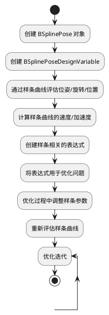

# aslam_splines 模块详细文档

> ASL 样条库 - 为优化框架提供样条曲线的设计变量和误差项支持

---

## 1. 📋 功能说明

### 1.1 定位

该模块是 Kalibr 系统中非参数估计模块集群的重要组成部分，为优化框架提供了样条曲线的设计变量和误差项支持。它允许将运动轨迹建模为 B 样条曲线，并将其作为优化变量参与到状态估计问题中。

### 1.2 核心能力

- 提供样条曲线作为设计变量的接口，支持位姿、旋转、位置等参数的估计
- 实现了样条曲线与优化后端的深度集成，允许直接在优化过程中调整样条参数
- 提供了多种样条相关的误差项，如运动误差、二次积分误差等
- 支持样条曲线的各种表达式形式，包括位姿、旋转、位置、速度、加速度等
- 提供了样条曲线的时间偏移表达式，支持时间同步校准

---

## 2. 🏗️ 架构设计

### 2.1 主要组件

```plantuml
@startuml aslam_splines_architecture

package "aslam_splines" {
    class BSplinePoseDesignVariable <<设计变量>>
    class BSplineDesignVariable <<设计变量>>
    class EuclideanBSplineDesignVariable <<设计变量>>

    package "表达式节点" {
        class BSplineTransformationExpressionNode <<表达式节点>>
        class BSplineRotationExpressionNode <<表达式节点>>
        class BSplinePositionExpressionNode <<表达式节点>>
        class BSplineVelocityExpressionNode <<表达式节点>>
        class BSplineAccelerationExpressionNode <<表达式节点>>
        class BSplineAccelerationBodyFrameExpressionNode <<表达式节点>>
        class BSplineAngularVelocityBodyFrameExpressionNode <<表达式节点>>
        class BSplineAngularAccelerationBodyFrameExpressionNode <<表达式节点>>
        class TransformationTimeOffsetExpressionNode <<表达式节点>>
        class BSplineEuclideanExpressionNode <<表达式节点>>
        class BSplineVectorExpressionNode <<表达式节点>>
    }

    package "误差项" {
        class BSplineMotionError <<误差项>>
        class QuadraticIntegralError <<误差项>>
        class SimpleSplineError <<误差项>>
        class BSplineMotionErrorFactory <<工厂类>>
    }
}

package "依赖模块" {
    class bsplines <<依赖模块>>
    class aslam_backend <<依赖模块>>
}

bsplines ..> BSplinePoseDesignVariable
aslam_backend ..> BSplinePoseDesignVariable
aslam_backend ..> BSplineTransformationExpressionNode
bsplines ..> BSplineTransformationExpressionNode
BSplinePoseDesignVariable --> BSplineTransformationExpressionNode
BSplinePoseDesignVariable --> BSplineRotationExpressionNode
BSplinePoseDesignVariable --> BSplinePositionExpressionNode
BSplinePoseDesignVariable --> BSplineVelocityExpressionNode
BSplinePoseDesignVariable --> BSplineAccelerationExpressionNode
BSplinePoseDesignVariable --> BSplineAccelerationBodyFrameExpressionNode
BSplinePoseDesignVariable --> BSplineAngularVelocityBodyFrameExpressionNode
BSplinePoseDesignVariable --> BSplineAngularAccelerationBodyFrameExpressionNode
BSplinePoseDesignVariable --> TransformationTimeOffsetExpressionNode
BSplinePoseDesignVariable --> BSplineMotionError
BSplinePoseDesignVariable --> QuadraticIntegralError
BSplinePoseDesignVariable --> SimpleSplineError

@enduml
```



### 2.2 数据流走向



### 2.3 关键设计模式

- **设计变量模式**：将样条曲线包装为优化后端的设计变量
- **表达式节点模式**：实现了各种样条曲线表达式的节点类，支持雅可比计算
- **误差项模式**：提供了多种样条相关的误差项，用于构建优化目标函数
- **工厂模式**：BSplineMotionErrorFactory 用于创建运动误差项

---

## 3. 🔑 关键方法

### 3.1 样条曲线评估

- **原理**：通过 B 样条曲线评估任意时刻的位姿、旋转、位置等参数
- **实现位置**：`/home/xcandy/Workspace/kalibr/aslam_nonparametric_estimation/aslam_splines/src/BSplineExpressions.cpp`
- **复杂度**：O(n)，n 为样条曲线的控制点数

### 3.2 雅可比计算

- **原理**：计算样条曲线评估对控制参数的雅可比矩阵
- **实现位置**：`/home/xcandy/Workspace/kalibr/aslam_nonparametric_estimation/aslam_splines/include/aslam/splines/implementation/BSplineExpressions.hpp`
- **复杂度**：O(n)，n 为样条曲线的控制点数

### 3.3 样条曲线调整

- **原理**：在优化过程中调整样条曲线的控制参数
- **实现位置**：`/home/xcandy/Workspace/kalibr/aslam_nonparametric_estimation/aslam_splines/include/aslam/splines/BSplinePoseDesignVariable.hpp`
- **复杂度**：O(n)，n 为样条曲线的控制点数

---

## 4. 🔌 对外接口

### 4.1 主要类

#### 4.1.1 `BSplinePoseDesignVariable`

- **用途**：将位姿样条曲线包装为优化后端的设计变量
- **关键方法**：
  - `BSplinePoseDesignVariable(const bsplines::BSplinePose & bsplinePose)` — 构造函数，接受位姿样条曲线
  - `spline()` — 获取样条曲线
  - `transformation(double tk)` — 获取位姿表达式
  - `orientation(double tk)` — 获取旋转表达式
  - `position(double tk)` — 获取位置表达式
  - `linearVelocity(double tk)` — 获取线速度表达式
  - `linearAcceleration(double tk)` — 获取线加速度表达式
  - `angularVelocityBodyFrame(double tk)` — 获取角速度表达式（机体坐标系）
  - `angularAccelerationBodyFrame(double tk)` — 获取角加速度表达式（机体坐标系）
  - `transformationAtTime(const aslam::backend::ScalarExpression & time)` — 获取时间偏移的位姿表达式
  - `addSegment(double t, Eigen::Matrix4d T)` — 添加样条段
  - `removeSegment()` — 删除样条段

#### 4.1.2 `BSplineMotionError`

- **用途**：计算样条曲线的运动误差
- **关键方法**：
  - `BSplineMotionError(const bsplines::BSplinePose & spline, double time, const aslam::backend::TransformationExpression & T)` — 构造函数
  - `evaluateError()` — 评估误差

#### 4.1.3 `QuadraticIntegralError`

- **用途**：计算样条曲线的二次积分误差
- **关键方法**：
  - `QuadraticIntegralError(const bsplines::BSplinePose & spline, double t0, double t1)` — 构造函数
  - `evaluateError()` — 评估误差

#### 4.1.4 `SimpleSplineError`

- **用途**：计算简单的样条曲线误差
- **关键方法**：
  - `SimpleSplineError(const bsplines::BSpline & spline, double time, const aslam::backend::VectorExpression<3> & v)` — 构造函数
  - `evaluateError()` — 评估误差

### 4.2 主要函数

```cpp
// 样条曲线表达式节点构造函数
BSplineTransformationExpressionNode(bsplines::BSplinePose * spline,
                                     const std::vector<aslam::backend::DesignVariable *> & designVariables,
                                     double time);

// 样条曲线表达式节点评估
virtual Eigen::Matrix4d toTransformationMatrixImplementation();
virtual void evaluateJacobiansImplementation(aslam::backend::JacobianContainer & outJacobians) const;
```

### 4.3 核心数据结构

```cpp
// 设计变量类型定义
typedef aslam::backend::DesignVariableMappedVector<6> dv_t;
```

---

## 5. 📦 依赖关系

### 5.1 内部依赖

- **bsplines** — 提供 B 样条曲线的核心实现
- **aslam_backend** — 提供优化后端的设计变量和表达式接口

### 5.2 外部依赖

- **Eigen3** — 用于线性代数运算
- **Boost** — 用于指针容器和序列化
- **C++11 及以上** — 用于现代 C++ 特性

---

## 6. 💡 使用示例

### 6.1 基本用法

```cpp
#include <aslam/splines/BSplinePoseDesignVariable.hpp>
#include <bsplines/BSplinePose.hpp>

// 创建位姿样条曲线
bsplines::BSplinePose spline = createSomeSpline();

// 创建样条设计变量
aslam::splines::BSplinePoseDesignVariable splineDv(spline);

// 获取位姿表达式
double time = 1.0;
aslam::backend::TransformationExpression T = splineDv.transformation(time);

// 使用表达式进行优化
// ...
```

### 6.2 高级用法

```cpp
#include <aslam/splines/BSplinePoseDesignVariable.hpp>
#include <aslam/splines/backend/BSplineMotionError.hpp>
#include <bsplines/BSplinePose.hpp>

// 创建位姿样条曲线
bsplines::BSplinePose spline = createSomeSpline();

// 创建样条设计变量
aslam::splines::BSplinePoseDesignVariable splineDv(spline);

// 创建位姿观测
double time = 1.0;
Eigen::Matrix4d T_obs = getObservedTransformation();
aslam::backend::TransformationExpression T_obs_expr(T_obs);

// 创建运动误差项
aslam::splines::BSplineMotionError error(splineDv.spline(), time, T_obs_expr);

// 添加到优化问题
optimizationProblem.addErrorTerm(error);
```

---

## 7. 🔗 相关模块

- [bsplines](../bsplines.md) — B 样条曲线核心实现
- [aslam_backend](../optimizer/aslam_backend.md) — 优化后端核心
- [incremental_calibration](../aslam_incremental_calibration/incremental_calibration.md) — 增量式校准模块
- [kalibr](../calibration/kalibr.md) — Kalibr 离线校准核心

---

## 8. 📄 核心文件列表

| 文件路径 | 文件类型 | 功能描述 |
|----------|----------|----------|
| `/home/xcandy/Workspace/kalibr/aslam_nonparametric_estimation/aslam_splines/include/aslam/splines/BSplinePoseDesignVariable.hpp` | 头文件 | 位姿样条设计变量类定义 |
| `/home/xcandy/Workspace/kalibr/aslam_nonparametric_estimation/aslam_splines/src/BSplinePoseDesignVariable.cpp` | 源代码 | 位姿样条设计变量类实现 |
| `/home/xcandy/Workspace/kalibr/aslam_nonparametric_estimation/aslam_splines/include/aslam/splines/BSplineExpressions.hpp` | 头文件 | 样条曲线表达式类定义 |
| `/home/xcandy/Workspace/kalibr/aslam_nonparametric_estimation/aslam_splines/src/BSplineExpressions.cpp` | 源代码 | 样条曲线表达式类实现 |
| `/home/xcandy/Workspace/kalibr/aslam_nonparametric_estimation/aslam_splines/include/aslam/splines/BSplineDesignVariable.hpp` | 头文件 | 样条设计变量基类定义 |
| `/home/xcandy/Workspace/kalibr/aslam_nonparametric_estimation/aslam_splines/include/aslam/splines/EuclideanBSplineDesignVariable.hpp` | 头文件 | 欧几里得样条设计变量类定义 |
| `/home/xcandy/Workspace/kalibr/aslam_nonparametric_estimation/aslam_splines/src/EuclideanBSplineDesignVariable.cpp` | 源代码 | 欧几里得样条设计变量类实现 |
| `/home/xcandy/Workspace/kalibr/aslam_nonparametric_estimation/aslam_splines/include/aslam/backend/BSplineMotionError.hpp` | 头文件 | 样条运动误差项类定义 |
| `/home/xcandy/Workspace/kalibr/aslam_nonparametric_estimation/aslam_splines/include/aslam/backend/QuadraticIntegralError.hpp` | 头文件 | 二次积分误差项类定义 |
| `/home/xcandy/Workspace/kalibr/aslam_nonparametric_estimation/aslam_splines/include/aslam/backend/SimpleSplineError.hpp` | 头文件 | 简单样条误差项类定义 |

---
