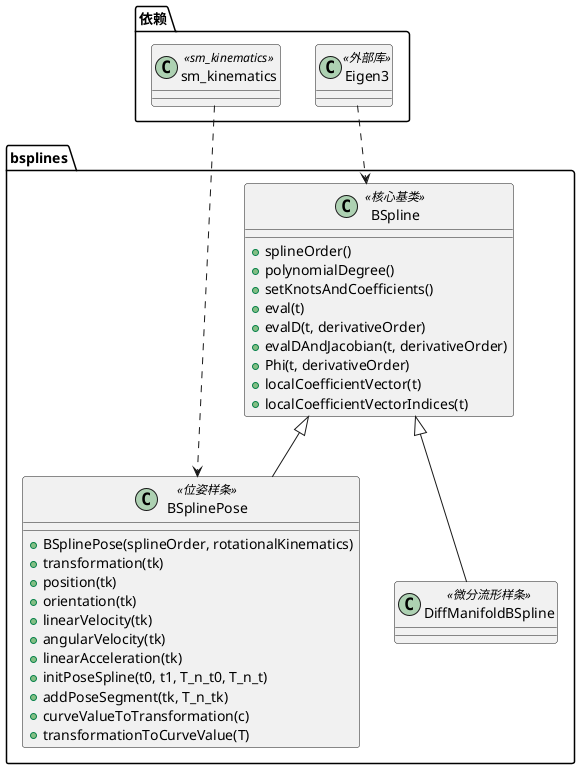
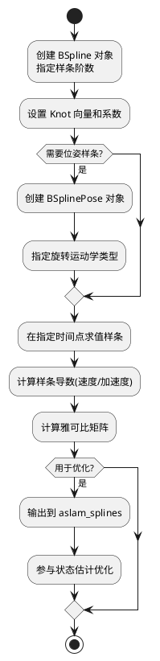

# bsplines 模块详细文档

> B 样条曲线库 - 提供用于状态估计的通用 B 样条曲线和位姿样条实现

---

## 1. 📋 功能说明

### 1.1 定位

该模块是 Kalibr 系统中非参数估计模块集群的基础核心模块，提供了用于机器人和自动驾驶领域的 B 样条曲线实现。它允许将运动轨迹建模为平滑的 B 样条曲线，支持欧几里得空间和微分流形上的插值，是 aslam_splines 模块的底层支撑库。

### 1.2 核心能力

- 提供通用 B 样条曲线实现，支持任意阶数的多项式样条
- 支持向量值样条系数，适用于多维状态估计
- 提供位姿样条（BSplinePose），专门用于 3D 位姿建模
- 支持微分流形上的样条插值，包括单位四元数表示的旋转
- 提供样条求值、导数求值、雅可比矩阵计算等数值计算功能
- 支持样条的初始化、Knot 向量和系数设置
- 提供积分和二次积分计算，用于轨迹优化

---

## 2. 🏗️ 架构设计

### 2.1 主要组件



### 2.2 数据流走向



### 2.3 关键设计模式

- **继承模式**：BSplinePose 继承自 BSpline，扩展位姿特定功能
- **模板方法模式**：基类定义通用样条算法，子类实现特定类型的插值
- **策略模式**：通过 sm_kinematics::RotationalKinematics 支持不同的旋转表示
- **基于 Qin 广义矩阵表示**：实现高效的 B 样条算法

---

## 3. 🔑 关键方法

### 3.1 B 样条曲线求值

- **原理**：基于 De Boor 算法和 Qin 广义矩阵表示，高效计算样条值
- **实现位置**：`/home/xcandy/Workspace/kalibr/aslam_nonparametric_estimation/bsplines/src/BSpline.cpp`
- **复杂度**：O(k)，k 为样条阶数

### 3.2 雅可比矩阵计算

- **原理**：计算样条值对控制系数的导数，用于优化问题
- **实现位置**：`/home/xcandy/Workspace/kalibr/aslam_nonparametric_estimation/bsplines/src/BSpline.cpp`
- **复杂度**：O(k)，k 为样条阶数

### 3.3 位姿样条变换

- **原理**：将样条曲线值转换为 4x4 变换矩阵，支持不同的旋转表示
- **实现位置**：`/home/xcandy/Workspace/kalibr/aslam_nonparametric_estimation/bsplines/src/BSplinePose.cpp`
- **复杂度**：O(1)

---

## 4. 🔌 对外接口

### 4.1 主要类

#### 4.1.1 `BSpline`

- **用途**：通用 B 样条曲线基类，支持任意维度的向量值样条
- **关键方法**：
  - `BSpline(int splineOrder)` — 构造函数，指定样条阶数
  - `splineOrder()` — 获取样条阶数
  - `polynomialDegree()` — 获取多项式次数（阶数-1）
  - `setKnotsAndCoefficients(const std::vector<double> & knots, const Eigen::MatrixXd & coefficients)` — 设置 Knot 向量和系数
  - `eval(double t)` — 在时间 t 处求值样条
  - `evalD(double t, int derivativeOrder)` — 求值指定阶数的导数
  - `evalDAndJacobian(double t, int derivativeOrder)` — 求值导数及雅可比矩阵
  - `Phi(double t, int derivativeOrder)` — 计算基函数矩阵
  - `localCoefficientVector(double t)` — 获取局部活跃系数向量
  - `localCoefficientVectorIndices(double t)` — 获取局部活跃系数索引

#### 4.1.2 `BSplinePose`

- **用途**：位姿样条类，专门用于 3D 位姿（位置+姿态）建模
- **关键方法**：
  - `BSplinePose(int splineOrder, const sm::kinematics::RotationalKinematics::Ptr & rotationalKinematics)` — 构造函数
  - `transformation(double tk)` — 获取变换矩阵
  - `position(double tk)` — 获取位置向量
  - `orientation(double tk)` — 获取旋转矩阵
  - `linearVelocity(double tk)` — 获取线速度
  - `linearVelocityBodyFrame(double tk)` — 获取机体坐标系下线速度
  - `angularVelocity(double tk)` — 获取角速度
  - `angularVelocityBodyFrame(double tk)` — 获取机体坐标系下角速度
  - `linearAcceleration(double tk)` — 获取线加速度
  - `initPoseSpline(double t0, double t1, const Eigen::Matrix4d & T_n_t0, const Eigen::Matrix4d & T_n_t)` — 初始化位姿样条
  - `initPoseSpline2(const Eigen::VectorXd & times, const Eigen::Matrix<double, 6, Eigen::Dynamic> & poses, int numSegments, double lambda)` — 初始化位姿样条（高级）
  - `addPoseSegment(double tk, const Eigen::Matrix4d & T_n_tk)` — 添加位姿段
  - `addPoseSegment2(double tk, const Eigen::Matrix4d & T_n_tk, double lambda)` — 添加位姿段（带正则化）
  - `curveValueToTransformation(const Eigen::VectorXd & c)` — 将曲线值转换为变换矩阵
  - `transformationToCurveValue(const Eigen::Matrix4d & T)` — 将变换矩阵转换为曲线值

### 4.2 主要函数

```cpp
// 基函数矩阵计算
Eigen::MatrixXd BSpline::Phi(double t, int derivativeOrder = 0) const;

// 局部系数向量获取
Eigen::VectorXd BSpline::localCoefficientVector(double t) const;
Eigen::VectorXi BSpline::localCoefficientVectorIndices(double t) const;

// 位姿样条初始化
void BSplinePose::initPoseSpline(double t0, double t1,
                                  const Eigen::Matrix4d & T_n_t0,
                                  const Eigen::Matrix4d & T_n_t);
```

### 4.3 核心数据结构

```cpp
// Knot 向量类型
typedef std::vector<double> KnotVector;

// 系数矩阵类型（每行一个维度，每列一个控制点）
typedef Eigen::MatrixXd CoefficientMatrix;
```

---

## 5. 📦 依赖关系

### 5.1 内部依赖

- **sm_kinematics** — 提供旋转运动学实现，支持不同的旋转表示
- **sm_eigen** — 提供 Eigen 扩展工具
- **sm_common** — 提供通用工具和断言宏

### 5.2 外部依赖

- **Eigen3** — 用于线性代数运算
- **C++11 及以上** — 用于现代 C++ 特性
- **catkin** (可选) — 用于 ROS 构建系统

---

## 6. 💡 使用示例

### 6.1 基本用法

```cpp
#include <bsplines/BSpline.hpp>

// 创建一个 4 阶 B 样条
int splineOrder = 4;
bsplines::BSpline spline(splineOrder);

// 设置 Knot 向量和系数
std::vector<double> knots = {0.0, 1.0, 2.0, 3.0, 4.0, 5.0};
Eigen::MatrixXd coefficients(3, 4);  // 3 维，4 个控制点
coefficients << 0, 1, 2, 3,
                0, 1, 0, -1,
                0, 0, 1, 1;

spline.setKnotsAndCoefficients(knots, coefficients);

// 在时间点 2.5 求值样条
double t = 2.5;
Eigen::VectorXd value = spline.eval(t);
Eigen::VectorXd derivative = spline.evalD(t, 1);  // 一阶导数

// 同时求值和计算雅可比
Eigen::VectorXd value2;
Eigen::MatrixXd jacobian;
std::tie(value2, jacobian) = spline.evalDAndJacobian(t, 0);
```

### 6.2 位姿样条高级用法

```cpp
#include <bsplines/BSplinePose.hpp>
#include <sm/kinematics/RotationalKinematics.hpp>

// 创建一个 4 阶的位姿样条
int splineOrder = 4;
sm::kinematics::RotationalKinematics::Ptr rotKin =
    sm::kinematics::RotationalKinematics::create();
bsplines::BSplinePose poseSpline(splineOrder, rotKin);

// 初始化位姿样条
double t0 = 0.0;
double t1 = 5.0;
Eigen::Matrix4d T_n_t0 = Eigen::Matrix4d::Identity();
Eigen::Matrix4d T_n_t1 = Eigen::Matrix4d::Identity();
T_n_t1(0, 3) = 1.0;  // x 方向平移 1 米

poseSpline.initPoseSpline(t0, t1, T_n_t0, T_n_t1);

// 在时间点 2.5 求值位姿
double t = 2.5;
Eigen::Matrix4d T = poseSpline.transformation(t);
Eigen::Vector3d pos = poseSpline.position(t);
Eigen::Matrix3d rot = poseSpline.orientation(t);
Eigen::Vector3d vel = poseSpline.linearVelocity(t);
Eigen::Vector3d omega = poseSpline.angularVelocityBodyFrame(t);
```

---

## 7. 🔗 相关模块

- [aslam_splines](./aslam_splines.md) — 样条曲线的优化后端集成
- [sm_kinematics](../schweizer-messer/sm_kinematics.md) — 旋转运动学实现
- [kalibr](../calibration/kalibr.md) — Kalibr 离线校准核心
- [incremental_calibration](../aslam_incremental_calibration/incremental_calibration.md) — 增量式校准模块

---

## 8. 📄 核心文件列表

| 文件路径 | 文件类型 | 功能描述 |
|----------|----------|----------|
| `/home/xcandy/Workspace/kalibr/aslam_nonparametric_estimation/bsplines/include/bsplines/BSpline.hpp` | 头文件 | 通用 B 样条基类定义 |
| `/home/xcandy/Workspace/kalibr/aslam_nonparametric_estimation/bsplines/src/BSpline.cpp` | 源代码 | 通用 B 样条基类实现 |
| `/home/xcandy/Workspace/kalibr/aslam_nonparametric_estimation/bsplines/include/bsplines/BSplinePose.hpp` | 头文件 | 位姿样条类定义 |
| `/home/xcandy/Workspace/kalibr/aslam_nonparametric_estimation/bsplines/src/BSplinePose.cpp` | 源代码 | 位姿样条类实现 |
| `/home/xcandy/Workspace/kalibr/aslam_nonparametric_estimation/bsplines/src/DiffManifoldBSpline.cpp` | 源代码 | 微分流形样条实现 |
| `/home/xcandy/Workspace/kalibr/aslam_nonparametric_estimation/bsplines/test/BSplinePoseTests.cpp` | 测试 | 位姿样条测试 |
| `/home/xcandy/Workspace/kalibr/aslam_nonparametric_estimation/bsplines/test/DiffManifoldBSplineTests.cpp` | 测试 | 微分流形样条测试 |
| `/home/xcandy/Workspace/kalibr/aslam_nonparametric_estimation/bsplines/test/EuclideanBSplineTests.cpp` | 测试 | 欧几里得样条测试 |
| `/home/xcandy/Workspace/kalibr/aslam_nonparametric_estimation/bsplines/test/UnitQuaternionBSplineTests.cpp` | 测试 | 单位四元数样条测试 |

---
