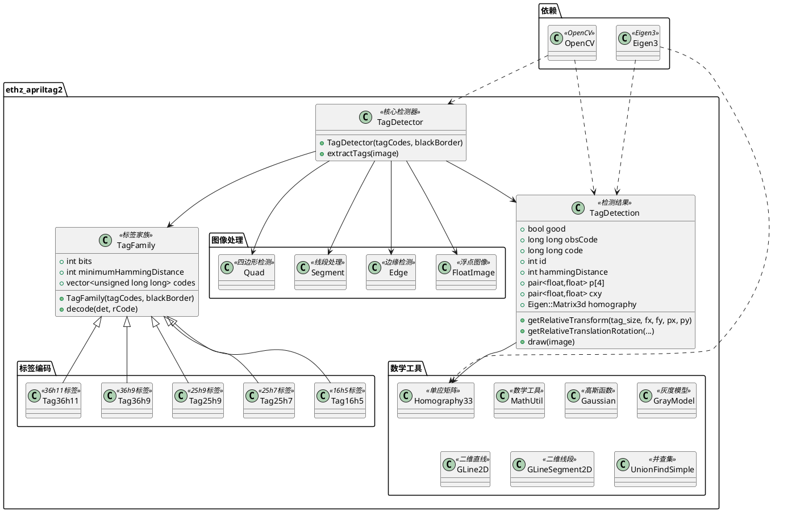
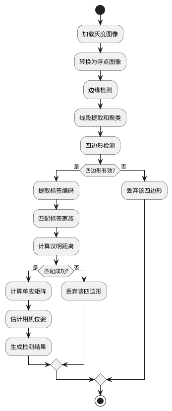

# ethz_apriltag2 模块详细文档

> ETHZ AprilTag2 检测库 - 高性能的 AprilTag 二维条形码检测和识别库

---

## 1. 📋 功能说明

### 1.1 定位

该模块是 Kalibr 系统中离线校准模块集群的视觉检测核心组件，提供了高性能的 AprilTag 检测和识别功能。AprilTag 是一种专门为机器人和增强现实应用设计的二维条形码系统，该模块实现了优化的检测算法，支持多种标签家族，是相机标定和视觉惯性校准的关键基础设施。

### 1.2 核心能力

- 提供高性能的 AprilTag 检测算法，支持实时检测
- 支持多种标签家族（16h5、25h7、25h9、36h9、36h11）
- 基于汉明距离的错误检测和纠正机制，提高鲁棒性
- 精确的位姿估计，基于单应矩阵和相机内参
- 提供从检测结果到 3D 位姿的转换接口
- 支持标签检测结果的可视化绘制
- 简洁的 API 设计，易于集成和使用

---

## 2. 🏗️ 架构设计

### 2.1 主要组件



### 2.2 检测流程



### 2.3 关键设计模式

- **工厂模式**：通过 TagFamily 创建不同的标签家族
- **策略模式**：支持多种标签编码策略
- **流水线模式**：图像预处理 → 边缘检测 → 线段提取 → 四边形检测 → 标签解码
- **错误纠正模式**：基于汉明距离的错误检测和纠正机制

---

## 3. 🔑 关键方法

### 3.1 AprilTag 检测算法

- **原理**：基于边缘检测、线段提取、四边形拟合和标签解码的完整流水线
- **实现位置**：`/home/xcandy/Workspace/kalibr/aslam_offline_calibration/ethz_apriltag2/src/TagDetector.cc`
- **复杂度**：O(W×H)，W 和 H 为图像宽度和高度

### 3.2 位姿估计算法

- **原理**：基于单应矩阵分解，结合相机内参和标签尺寸计算 3D 位姿
- **实现位置**：`/home/xcandy/Workspace/kalibr/aslam_offline_calibration/ethz_apriltag2/src/TagDetection.cc`
- **复杂度**：O(1)

### 3.3 汉明距离解码

- **原理**：计算观测编码与标签家族编码的汉明距离，寻找最佳匹配
- **实现位置**：`/home/xcandy/Workspace/kalibr/aslam_offline_calibration/ethz_apriltag2/src/TagFamily.cc`
- **复杂度**：O(N)，N 为标签家族中的标签数量

---

## 4. 🔌 对外接口

### 4.1 主要类

#### 4.1.1 `TagDetector`

- **用途**：AprilTag 检测器核心类，负责从图像中提取标签
- **关键方法**：
  - `TagDetector(const TagCodes& tagCodes, const size_t blackBorder=2)` — 构造函数，指定标签编码和黑边宽度
  - `std::vector<TagDetection> extractTags(const cv::Mat& image)` — 从图像中提取标签

#### 4.1.2 `TagDetection`

- **用途**：表示一个检测到的 AprilTag，包含检测结果和位姿估计
- **关键方法**：
  - `Eigen::Matrix4d getRelativeTransform(double tag_size, double fx, double fy, double px, double py) const` — 获取相对于相机的变换矩阵
  - `void getRelativeTranslationRotation(double tag_size, double fx, double fy, double px, double py, Eigen::Vector3d& trans, Eigen::Matrix3d& rot) const` — 获取相对平移和旋转
  - `float getXYOrientation() const` — 获取 XY 平面的方向
  - `std::pair<float,float> interpolate(float x, float y) const` — 插值计算
  - `bool overlapsTooMuch(const TagDetection &other) const` — 检测是否重叠过多
  - `void draw(cv::Mat& image) const` — 在图像上绘制检测结果
- **核心数据成员**：
  - `bool good` — 检测是否有效
  - `long long obsCode` — 观测到的编码
  - `long long code` — 匹配到的编码
  - `int id` — 标签 ID
  - `int hammingDistance` — 汉明距离
  - `std::pair<float,float> p[4]` — 四个角的像素坐标
  - `std::pair<float,float> cxy` — 中心坐标
  - `Eigen::Matrix3d homography` — 单应矩阵

#### 4.1.3 `TagFamily`

- **用途**：管理特定标签家族的编码和参数
- **关键方法**：
  - `TagFamily(const TagCodes& tagCodes, const size_t blackBorder)` — 构造函数
  - `void setErrorRecoveryBits(int b)` — 设置错误恢复位数
  - `void setErrorRecoveryFraction(float v)` — 设置错误恢复比例
  - `void decode(TagDetection& det, unsigned long long rCode) const` — 解码标签
- **核心数据成员**：
  - `int blackBorder` — 黑边宽度
  - `int bits` — 编码位数
  - `int dimension` — 标签维度
  - `int minimumHammingDistance` — 最小汉明距离
  - `std::vector<unsigned long long> codes` — 标签编码列表

### 4.2 主要函数

```cpp
// 标签检测
std::vector<TagDetection> TagDetector::extractTags(const cv::Mat& image);

// 位姿估计
Eigen::Matrix4d TagDetection::getRelativeTransform(
    double tag_size, double fx, double fy, double px, double py) const;

// 标签解码
void TagFamily::decode(TagDetection& det, unsigned long long rCode) const;
```

### 4.3 核心数据结构

```cpp
// 标签编码结构
struct TagCodes {
  int bits;
  int minHammingDistance;
  std::vector<unsigned long long> codes;
};

// 预定义的标签家族
extern const TagCodes tagCodes16h5;
extern const TagCodes tagCodes25h7;
extern const TagCodes tagCodes25h9;
extern const TagCodes tagCodes36h9;
extern const TagCodes tagCodes36h11;
```

---

## 5. 📦 依赖关系

### 5.1 内部依赖

- 无内部依赖，是独立的视觉检测库

### 5.2 外部依赖

- **OpenCV** — 用于图像处理和相机访问
- **Eigen3** — 用于线性代数计算和位姿表示
- **catkin** (可选) — 用于 ROS 构建系统
- **V4L2** (可选，仅 Linux) — 用于视频设备控制

---

## 6. 💡 使用示例

### 6.1 基本用法

```cpp
#include <apriltags/TagDetector.h>
#include <apriltags/Tag16h5.h>
#include <apriltags/Tag25h7.h>
#include <apriltags/Tag25h9.h>
#include <apriltags/Tag36h9.h>
#include <apriltags/Tag36h11.h>
#include <opencv2/opencv.hpp>

// 创建检测器（使用最常用的 36h11 标签家族）
AprilTags::TagDetector detector(AprilTags::tagCodes36h11);

// 加载图像（灰度图）
cv::Mat image = cv::imread("calibration_image.png", cv::IMREAD_GRAYSCALE);

// 检测标签
std::vector<AprilTags::TagDetection> detections = detector.extractTags(image);

// 处理检测结果
for (const auto& detection : detections) {
  if (detection.good) {
    std::cout << "检测到标签 ID: " << detection.id << std::endl;
    std::cout << "汉明距离: " << detection.hammingDistance << std::endl;

    // 在图像上绘制检测结果
    detection.draw(image);
  }
}

// 显示结果
cv::imshow("AprilTags Detection", image);
cv::waitKey(0);
```

### 6.2 位姿估计高级用法

```cpp
#include <apriltags/TagDetector.h>
#include <apriltags/Tag36h11.h>
#include <opencv2/opencv.hpp>
#include <Eigen/Core>

// 创建检测器
AprilTags::TagDetector detector(AprilTags::tagCodes36h11);

// 加载图像
cv::Mat image = cv::imread("calibration_image.png", cv::IMREAD_GRAYSCALE);

// 检测标签
std::vector<AprilTags::TagDetection> detections = detector.extractTags(image);

// 相机内参（需要根据实际相机标定结果设置）
double fx = 600.0;  // 焦距 x
double fy = 600.0;  // 焦距 y
double cx = 320.0;  // 主点 x
double cy = 240.0;  // 主点 y
double tagSize = 0.166;  // 标签实际尺寸（米）

// 处理检测结果并计算位姿
for (const auto& detection : detections) {
  if (detection.good) {
    std::cout << "标签 ID: " << detection.id << std::endl;

    // 方法 1：获取完整的 4x4 变换矩阵
    Eigen::Matrix4d T = detection.getRelativeTransform(tagSize, fx, fy, cx, cy);
    std::cout << "变换矩阵:\n" << T << std::endl;

    // 方法 2：分别获取平移和旋转
    Eigen::Vector3d translation;
    Eigen::Matrix3d rotation;
    detection.getRelativeTranslationRotation(tagSize, fx, fy, cx, cy,
                                             translation, rotation);
    std::cout << "平移: " << translation.transpose() << std::endl;
    std::cout << "旋转:\n" << rotation << std::endl;
  }
}
```

---

## 7. 🔗 相关模块

- [kalibr](../calibration/kalibr.md) — Kalibr 离线校准核心
- [aslam_cameras](../aslam_cv/aslam_cameras.md) — 相机模型模块
- [incremental_calibration](../aslam_incremental_calibration/incremental_calibration.md) — 增量式校准模块

---

## 8. 📄 核心文件列表

| 文件路径 | 文件类型 | 功能描述 |
|----------|----------|----------|
| `/home/xcandy/Workspace/kalibr/aslam_offline_calibration/ethz_apriltag2/include/apriltags/TagDetector.h` | 头文件 | 标签检测器类定义 |
| `/home/xcandy/Workspace/kalibr/aslam_offline_calibration/ethz_apriltag2/src/TagDetector.cc` | 源代码 | 标签检测器类实现 |
| `/home/xcandy/Workspace/kalibr/aslam_offline_calibration/ethz_apriltag2/include/apriltags/TagDetection.h` | 头文件 | 检测结果类定义 |
| `/home/xcandy/Workspace/kalibr/aslam_offline_calibration/ethz_apriltag2/src/TagDetection.cc` | 源代码 | 检测结果类实现 |
| `/home/xcandy/Workspace/kalibr/aslam_offline_calibration/ethz_apriltag2/include/apriltags/TagFamily.h` | 头文件 | 标签家族类定义 |
| `/home/xcandy/Workspace/kalibr/aslam_offline_calibration/ethz_apriltag2/src/TagFamily.cc` | 源代码 | 标签家族类实现 |
| `/home/xcandy/Workspace/kalibr/aslam_offline_calibration/ethz_apriltag2/include/apriltags/Tag16h5.h` | 头文件 | 16h5 标签家族定义 |
| `/home/xcandy/Workspace/kalibr/aslam_offline_calibration/ethz_apriltag2/include/apriltags/Tag25h7.h` | 头文件 | 25h7 标签家族定义 |
| `/home/xcandy/Workspace/kalibr/aslam_offline_calibration/ethz_apriltag2/include/apriltags/Tag25h9.h` | 头文件 | 25h9 标签家族定义 |
| `/home/xcandy/Workspace/kalibr/aslam_offline_calibration/ethz_apriltag2/include/apriltags/Tag36h9.h` | 头文件 | 36h9 标签家族定义 |
| `/home/xcandy/Workspace/kalibr/aslam_offline_calibration/ethz_apriltag2/include/apriltags/Tag36h11.h` | 头文件 | 36h11 标签家族定义 |
| `/home/xcandy/Workspace/kalibr/aslam_offline_calibration/ethz_apriltag2/include/apriltags/FloatImage.h` | 头文件 | 浮点图像处理定义 |
| `/home/xcandy/Workspace/kalibr/aslam_offline_calibration/ethz_apriltag2/src/FloatImage.cc` | 源代码 | 浮点图像处理实现 |
| `/home/xcandy/Workspace/kalibr/aslam_offline_calibration/ethz_apriltag2/include/apriltags/Homography33.h` | 头文件 | 3x3 单应矩阵定义 |
| `/home/xcandy/Workspace/kalibr/aslam_offline_calibration/ethz_apriltag2/src/Homography33.cc` | 源代码 | 3x3 单应矩阵实现 |
| `/home/xcandy/Workspace/kalibr/aslam_offline_calibration/ethz_apriltag2/src/example/apriltags_demo.cpp` | 示例 | 完整的检测演示程序 |

---
