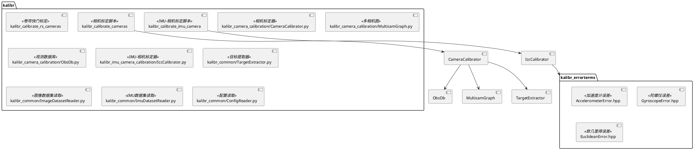
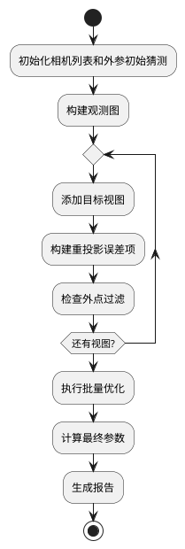

# kalibr 模块文档

> 相机和 IMU 标定工具链，提供多相机-IMU 系统标定的完整解决方案

---

## 1. 📋 功能说明

### 1.1 定位
kalibr 是 ASL 开发的相机和 IMU 标定工具箱，是 Kalibr 项目的核心模块。它提供了多相机内参标定、多相机外参标定、相机-IMU 时空标定等功能。

### 1.2 核心能力
- **多相机标定**：支持任意数量相机的联合标定
- **相机-IMU 标定**：时空联合标定（时间偏移 + 空间变换）
- **卷帘快门标定**：支持卷帘快门相机标定
- **多种相机模型**：针孔、全向、EUCm、双球等
- **多种标定目标**：AprilGrid、棋盘格、圆点格
- **批量优化**：基于 batch 非线性最小二乘
- **结果导出**：支持 OKVIS、ROVIO、MSF、maplab 等格式
- **报告生成**：PDF 标定报告生成
- **可视化工具**：畸变可视化、重投影误差可视化

---

## 2. 🏗️ 架构设计

kalibr 采用模块化设计，以相机标定器为核心，结合目标提取、图优化、报告生成等模块。



### 2.1 主要组件划分
1. **标定脚本层**：kalibr_calibrate_cameras、kalibr_calibrate_imu_camera
2. **标定器层**：CameraCalibrator、IccCalibrator
3. **数据管理层**：ObsDb、MulticamGraph
4. **数据集层**：ImageDatasetReader、ImuDatasetReader
5. **目标提取层**：TargetExtractor
6. **误差项层**：AccelerometerError、GyroscopeError、EuclideanError
7. **导出层**：OKVIS、ROVIO、MSF、maplab 配置导出

### 2.2 数据流走向
```
ROS bag → 数据集读取 → 目标提取 → 观测数据库 → 图优化 → 结果导出
            ↓
         IMU数据 → 预积分 → 误差项
```

### 2.3 关键设计模式
- **批处理优化**：Batch 非线性最小二乘
- **图模型**：多相机观测图
- **策略模式**：多种相机模型和畸变模型
- **工厂模式**：从配置创建相机几何

---

## 3. 🔑 关键方法

### 3.1 多相机标定流程

```python
class CameraCalibrator:
    def __init__(self, cameraList, baselineGuesses, verbose=False):
        self.cameras = cameraList
        self.baselines = baselineGuesses

    def addTargetView(self, timestamp, observations, T_tc_guess):
        # 添加目标观测到优化
        # 构建重投影误差项

    def optimize(self):
        # 执行批量优化
```

**原理**：基于重投影误差的批量非线性最小二乘优化

**重投影误差**：
\[
\min_{K, D, T} \sum_{i,j} \| u_{ij} - \pi(T_{cam_j}(T_{target} p_i) \|^2
\]

**实现位置**：`python/kalibr_camera_calibration/CameraCalibrator.py`



---

### 3.2 相机-IMU 标定流程

```python
class IccCalibrator:
    def calibrate(self, sensors, spline_order=6):
        # 使用 B-spline 表示运动
        # 构建 IMU 误差项
        # 构建相机重投影误差项
        # 联合优化
```

**原理**：使用 B-spline 表示连续时间运动，联合优化相机、IMU、时间偏移、空间变换

**实现位置**：`python/kalibr_imu_camera_calibration/IccCalibrator.py`

---

### 3.3 观测数据库

```python
class ObservationDatabase:
    def __init__(self, maxDeltaApproxSync=0.02):
        self.observations = dict()

    def addObservation(self, camId, observation):
        # 添加观测

    def getAllObsAtTimestamp(self, timestamp):
        # 获取时间戳处的所有观测
```

**原理**：存储和管理多相机的标定目标观测

**实现位置**：`python/kalibr_camera_calibration/ObsDb.py`

---

### 3.4 多相机图

```python
class MulticamCalibrationGraph:
    def __init__(self, obsdb):
        self.obsdb = obsdb

    def isGraphConnected(self):
        # 检查图连接性

    def getInitialGuesses(self, cameraList):
        # 获取初始猜测
```

**原理**：构建和管理多相机之间的观测连接图

**实现位置**：`python/kalibr_camera_calibration/MulticamGraph.py`

---

## 4. 🔌 对外接口

### 4.1 主要命令行工具

#### 4.1.1 `kalibr_calibrate_cameras`
**用途**：多相机内参和外参标定

**关键参数**：
- `--models` — 相机模型列表
- `--target` — 标定目标配置 YAML
- `--bag` — ROS bag 文件
- `--topics` — 图像话题列表
- `--bag-from-to` — bag 时间范围
- `--bag-freq` — 提取频率
- `--approx-sync` — 近似同步容差
- `--show-extraction` — 显示提取过程
- `--plot` — 绘制标定过程
- `--dont-show-report` — 不显示报告

**输入输出接口定义**：
```
输入:
  --models: 相机模型列表 (pinhole-radtan, omni-none 等)
  --target: 标定目标配置 YAML
  --bag: ROS bag 文件
  --topics: 图像话题列表

输出:
  -camchain.yaml: 相机链参数
  -results-cam.txt: 详细结果
  -report-cam.pdf: 标定报告
```

---

#### 4.1.2 `kalibr_calibrate_imu_camera`
**用途**：相机-IMU 时空联合标定

**关键参数**：
- `--cam` — 相机标定结果
- `--imu` — IMU 配置
- `--target` — 标定目标配置
- `--bag` — ROS bag 文件
- `--bag-from-to` — bag 时间范围

---

#### 4.1.3 `kalibr_calibrate_rs_cameras`
**用途**：卷帘快门相机标定

---

### 4.2 主要 Python 类

#### 4.2.1 `CameraCalibrator`
**用途**：多相机标定的核心类

**关键方法**：
- `__init__(cameraList, baselineGuesses, verbose)` — 初始化
- `addTargetView(timestamp, observations, T_tc_guess)` — 添加目标视图
- `optimize()` — 执行优化

---

#### 4.2.3 `ObservationDatabase`
**用途**：管理多相机观测

**关键方法**：
- `addObservation(camId, observation)` — 添加观测
- `getAllObsAtTimestamp(timestamp)` — 获取时间戳处的观测
- `getAllObsCam(camId)` — 获取相机的所有观测
- `getAllViewTimestamps()` — 获取所有视图时间戳

---

#### 4.2.4 `MulticamCalibrationGraph`
**用途**：多相机观测图

**关键方法**：
- `isGraphConnected()` — 检查图是否连通
- `getInitialGuesses(cameraList)` — 获取初始外参猜测
- `getTargetPoseGuess(timestamp, cameraList, estBaselines)` — 获取目标位姿猜测
- `plotGraph()` — 绘制观测图

---

### 4.3 C++ 误差项

#### 4.3.3 `EuclideanError`
```cpp
class EuclideanError : public aslam::backend::ErrorTermFs<2> {
public:
    EuclideanError(const Eigen::Vector2d & measurement,
                   const Eigen::Matrix2d & invR);
};
```
**用途**：2D 欧几里得重投影误差

---

#### 4.3.1 `AccelerometerError`
```cpp
class AccelerometerError : public aslam::backend::ErrorTermFs<3> {
public:
    AccelerometerError(const Eigen::Vector3d & measurement,
                      const Eigen::Matrix3d & invR);
};
```
**用途**：IMU 加速度计误差

---

#### 4.3.2 `GyroscopeError`
```cpp
class GyroscopeError : public aslam::backend::ErrorTermFs<3> {
public:
    GyroscopeError(const Eigen::Vector3d & measurement,
                   const Eigen::Matrix3d & invR);
};
```
**用途**：IMU 陀螺仪误差

---

### 4.4 核心数据结构

#### 标定目标配置 (YAML)
```yaml
target_type: 'aprilgrid'    # aprilgrid, checkerboard, circlegrid
tagCols: 6                    # 列数
tagRows: 6                    # 行数
tagSize: 0.088               # 标签大小 (m)
tagSpacing: 0.3                # 标签间距比例
```

#### 相机链结果 (camchain.yaml)
```yaml
cam0:
  camera_model: pinhole
  intrinsics: [fu, fv, cu, cv]
  distortion_model: radtan
  distortion_coeffs: [k1, k2, p1, p2]
  resolution: [640, 480]
  T_cn_cnm1: [4x4变换矩阵]  # 到前一个相机的变换
```

---

## 5. 📦 依赖关系

### 5.1 内部依赖
- aslam_cameras — 相机几何模型
- aslam_cv_backend — 后端优化
- sm_common, sm_kinematics, sm_eigen, sm_boost — 基础库

### 5.2 外部依赖
- ROS — ROS bag 读取
- OpenCV — 图像处理
- Eigen3 — 矩阵运算
- Boost — 序列化、文件系统
- Python — 标定脚本
- NumPy — 数值计算
- pylab/matplotlib — 可视化

---

## 6. 💡 使用示例

### 6.1 多相机标定
```bash
# 双相机标定示例
kalibr_calibrate_cameras \
    --models omni-radtan pinhole-equi \
    --target aprilgrid.yaml \
    --bag MYROSBAG.bag \
    --topics /cam0/image_raw /cam1/image_raw
```

### 6.2 AprilGrid 配置
```yaml
# aprilgrid.yaml
target_type: 'aprilgrid'
tagCols: 6
tagRows: 6
tagSize: 0.088
tagSpacing: 0.3
```

### 6.3 相机-IMU 标定
```bash
kalibr_calibrate_imu_camera \
    --cam camchain.yaml \
    --imu imu.yaml \
    --target aprilgrid.yaml \
    --bag MYROSBAG.bag
```

### 6.4 IMU 配置 (imu.yaml)
```yaml
# imu.yaml
accelerometer_noise_density: 0.01
accelerometer_random_walk: 0.0002
gyroscope_noise_density: 0.005
gyroscope_random_walk: 4.0e-05
update_rate: 200.0
```

### 6.5 使用 Bag 创建
```bash
# 创建标定数据 Bag
kalibr_bagcreater \
    --folder images_folder \
    --output dataset.bag
```

### 6.6 Bag 提取
```bash
# 从 Bag 提取图像和 IMU 数据
kalibr_bagextractor \
    --bag dataset.bag \
    --output-folder output \
    --image-topics /cam0/image_raw /cam1/image_raw \
    --imu-topic /imu0
```

### 6.7 可视化畸变
```bash
# 可视化相机畸变
kalibr_visualize_distortion \
    --cam camchain.yaml
```

---

## 7. 🔗 相关模块
- [aslam_cameras](../aslam_cv/aslam_cameras.md) — 相机几何模型
- [sm_kinematics](../schweizer-messer/sm_kinematics.md) — 几何变换

---

## 8. 📄 核心文件列表

| 文件 | 职责 |
|------|------|
| `python/kalibr_calibrate_cameras` | 相机标定主脚本 |
| `python/kalibr_calibrate_imu_camera` | IMU-相机标定主脚本 |
| `python/kalibr_calibrate_rs_cameras` | 卷帘快门标定脚本 |
| `python/kalibr_camera_calibration/CameraCalibrator.py` | 相机标定器 |
| `python/kalibr_camera_calibration/MulticamGraph.py` | 多相机图 |
| `python/kalibr_camera_calibration/ObsDb.py` | 观测数据库 |
| `python/kalibr_imu_camera_calibration/IccCalibrator.py` | IMU-相机标定器 |
| `python/kalibr_common/TargetExtractor.py` | 目标提取器 |
| `python/kalibr_common/ImageDatasetReader.py` | 图像数据集读取 |
| `python/kalibr_common/ImuDatasetReader.py` | IMU数据集读取 |
| `python/kalibr_common/ConfigReader.py` | 配置读取 |
| `include/kalibr_errorterms/AccelerometerError.hpp` | 加速度计误差 |
| `include/kalibr_errorterms/GyroscopeError.hpp` | 陀螺仪误差 |
| `include/kalibr_errorterms/EuclideanError.hpp` | 欧几里得误差 |
| `src/AccelerometerError.cpp` | 加速度计误差实现 |
| `src/GyroscopeError.cpp` | 陀螺仪误差实现 |
| `src/EuclideanError.cpp` | 欧几里得误差实现 |
