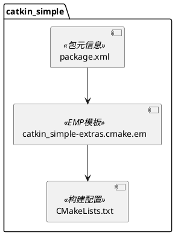
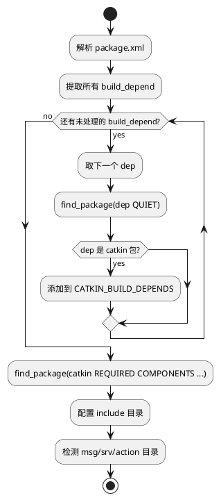

# catkin_simple 模块文档

> 简化 ROS catkin 构建系统的 CMake 宏封装包

---

## 1. 📋 功能说明

### 1.1 定位
catkin_simple 是 Kalibr 基础设施模块中的构建工具封装包，旨在简化 ROS catkin 构建系统的使用，通过提供更简洁的 CMake 宏接口，减少了编写 CMakeLists.txt 的复杂度和样板代码。

### 1.2 核心能力
- **自动依赖发现**：从 package.xml 自动解析并查找 catkin 包依赖
- **简化的目标创建**：提供 `cs_add_library()` 和 `cs_add_executable()` 等宏简化目标创建
- **自动消息生成**：自动检测并构建 msg、srv、action 文件
- **统一的安装接口**：提供 `cs_install()` 自动安装库、可执行文件和头文件
- **简化的导出配置**：提供 `cs_export()` 简化 catkin_package 配置

---

## 2. 🏗️ 架构设计

catkin_simple 采用 CMake 宏封装的设计模式，通过模板化的 CMake 脚本提供简化的构建接口。



### 2.1 主要组件划分
1. **初始化层**：`catkin_simple()` 宏负责环境设置和依赖发现
2. **目标创建层**：`cs_add_library()` 和 `cs_add_executable()` 封装目标创建
3. **安装层**：`cs_install()` 和 `cs_install_scripts()` 处理安装规则
4. **导出层**：`cs_export()` 处理 catkin 包导出配置

### 2.2 数据流走向
```
package.xml → 依赖解析 → find_package → 目标创建 → 安装配置 → 导出配置
```

### 2.3 关键设计模式
- **宏模板模式**：使用 CMake 宏封装重复逻辑
- **约定优于配置**：自动检测 msg/srv/action 目录
- **变量跟踪模式**：使用 PROJECT_NAME_* 变量跟踪目标

---

## 3. 🔑 关键方法

### 3.1 依赖发现机制
```cmake
foreach(dep ${${PROJECT_NAME}_BUILD_DEPENDS})
  find_package(${dep} QUIET)
  if(${dep}_FOUND_CATKIN_PROJECT)
    list(APPEND ${PROJECT_NAME}_CATKIN_BUILD_DEPENDS ${dep})
  endif()
endforeach()
find_package(catkin REQUIRED COMPONENTS ${${PROJECT_NAME}_CATKIN_BUILD_DEPENDS})
```
**原理**：从 package.xml 读取 build_depend，逐个 find_package，筛选出 catkin 包后批量传递给 catkin

**实现位置**：`cmake/catkin_simple-extras.cmake.em`



---

### 3.2 消息自动生成
**原理**：检测 msg/、srv/、action/ 目录是否存在，自动调用相应的 catkin 宏

**实现位置**：`cmake/catkin_simple-extras.cmake.em`

**功能**：
- 检测 action/ 目录并调用 `add_action_files()`
- 检测 msg/ 目录并调用 `add_message_files()`
- 检测 srv/ 目录并调用 `add_service_files()`
- 自动调用 `generate_messages()`

---

### 3.3 目标跟踪
**原理**：使用变量 `${PROJECT_NAME}_TARGETS` 和 `${PROJECT_NAME}_LIBRARIES` 跟踪所有创建的目标

**实现位置**：`cmake/catkin_simple-extras.cmake.em`

**作用**：
- 允许 cs_install() 自动安装所有目标
- 允许 cs_export() 自动导出所有库

---

## 4. 🔌 对外接口

### 4.1 主要 CMake 宏

#### 4.1.1 `catkin_simple()`
**用途**：初始化 catkin_simple 环境，自动发现并配置依赖

**功能**：
- 解析 package.xml 中的 build_depend
- 自动 find_package 所有 catkin 包依赖
- 配置 include 目录（如果存在 include/ 文件夹）
- 自动检测并生成消息、服务和动作文件

**输入输出接口定义**：
```
输入:
  - 无参数，自动读取 package.xml
  - 自动检测 include/、msg/、srv/、action/ 目录

输出:
  - 设置 ${catkin_INCLUDE_DIRS}
  - 设置 ${catkin_LIBRARIES}
  - 生成消息目标（如果有）
```

---

#### 4.1.2 `cs_add_library(_target [NO_AUTO_LINK] [NO_AUTO_DEP] [NO_AUTO_EXPORT] source1 [source2 ...])`
**用途**：创建库目标，自动链接 catkin 库

**参数**：
- `_target` — 库目标名称
- `NO_AUTO_LINK` — 不自动链接 catkin 库
- `NO_AUTO_DEP` — 不添加自动依赖
- `NO_AUTO_EXPORT` — 不自动导出此库

**功能**：
- 调用标准 CMake `add_library()`
- 自动链接 `${catkin_LIBRARIES}`
- 添加对消息生成目标的依赖
- 自动跟踪目标以便后续安装

**输入输出接口定义**：
```
输入:
  _target: 库目标名称
  NO_AUTO_LINK: (可选) 不自动链接 catkin 库
  NO_AUTO_DEP: (可选) 不添加自动依赖
  NO_AUTO_EXPORT: (可选) 不自动导出此库
  source1...: 源文件列表

输出:
  - 创建 CMake 库目标
  - 添加到 ${PROJECT_NAME}_TARGETS
  - 添加到 ${PROJECT_NAME}_LIBRARIES (除非 NO_AUTO_EXPORT)
```

---

#### 4.1.3 `cs_add_executable(_target [NO_AUTO_LINK] [NO_AUTO_DEP] source1 [source2 ...])`
**用途**：创建可执行目标，自动链接 catkin 库

**参数**：
- `_target` — 可执行目标名称
- `NO_AUTO_LINK` — 不自动链接 catkin 库
- `NO_AUTO_DEP` — 不添加自动依赖

**功能**：
- 调用标准 CMake `add_executable()`
- 自动链接 `${catkin_LIBRARIES}`
- 添加对消息生成目标的依赖
- 自动跟踪目标以便后续安装

**输入输出接口定义**：
```
输入:
  _target: 可执行目标名称
  NO_AUTO_LINK: (可选) 不自动链接 catkin 库
  NO_AUTO_DEP: (可选) 不添加自动依赖
  source1...: 源文件列表

输出:
  - 创建 CMake 可执行目标
  - 添加到 ${PROJECT_NAME}_TARGETS
```

---

#### 4.1.4 `cs_install([target1 [target2 ...]])`
**用途**：安装所有通过 cs_* 宏创建的目标和头文件

**参数**：
- 可选的额外目标列表

**功能**：
- 安装库到 `${CATKIN_PACKAGE_LIB_DESTINATION}`
- 安装可执行文件到 `${CATKIN_PACKAGE_BIN_DESTINATION}`
- 安装 include/ 目录下的头文件

**输入输出接口定义**：
```
输入:
  target1...: (可选) 额外的要安装的目标

输出:
  - 配置 CMake 安装规则
  - 安装库、可执行文件、头文件
```

---

#### 4.1.5 `cs_install_scripts(script1 [script2 ...])`
**用途**：安装脚本文件

**参数**：
- 脚本文件列表

**功能**：
- 安装脚本到 `${CATKIN_PACKAGE_BIN_DESTINATION}`

---

#### 4.1.6 `cs_export([INCLUDE_DIRS ...] [LIBRARIES ...] [CATKIN_DEPENDS ...] [DEPENDS ...] [CFG_EXTRAS ...])`
**用途**：配置并调用 catkin_package

**参数**：
- `INCLUDE_DIRS` — 额外的 include 目录
- `LIBRARIES` — 额外的库
- `CATKIN_DEPENDS` — 额外的 catkin 依赖
- `DEPENDS` — 额外的系统依赖
- `CFG_EXTRAS` — 额外的 CMake 配置文件

**功能**：
- 自动收集通过 cs_add_library 创建的库
- 自动从 package.xml 解析 run_depend
- 调用 catkin_package 进行最终配置

---

### 4.2 核心数据结构

#### 4.2.1 内部跟踪变量
```cmake
${PROJECT_NAME}_TARGETS          # 所有创建的目标
${PROJECT_NAME}_LIBRARIES        # 要导出的库
${PROJECT_NAME}_CATKIN_BUILD_DEPENDS  # catkin 构建依赖
```

---

## 5. 📦 依赖关系

### 5.1 内部依赖
无 - catkin_simple 是基础设施包，不依赖其他 Kalibr 模块

### 5.2 外部依赖
- **catkin** — ROS 构建系统核心，作为 buildtool_depend 和 run_depend

---

## 6. 💡 使用示例

### 6.1 基本用法
```cmake
cmake_minimum_required(VERSION 3.0.2)
project(my_package)

find_package(catkin_simple REQUIRED)
catkin_simple()

# 创建库
cs_add_library(my_lib src/my_lib.cpp)

# 创建可执行文件
cs_add_executable(my_exec src/main.cpp)
target_link_libraries(my_exec my_lib)

# 安装
cs_install()

# 导出
cs_export()
```

### 6.2 带消息和服务的包
```cmake
cmake_minimum_required(VERSION 3.0.2)
project(message_package)

find_package(catkin_simple REQUIRED)
catkin_simple()  # 自动检测 msg/ 和 srv/ 目录并生成

cs_install()
cs_export()
```

### 6.3 高级用法 - 自定义选项
```cmake
cmake_minimum_required(VERSION 3.0.2)
project(advanced_package)

find_package(catkin_simple REQUIRED)
catkin_simple()

# 不自动链接的库（用于纯头文件库）
cs_add_library(header_only_lib NO_AUTO_LINK src/dummy.cpp)

# 不自动添加依赖的可执行文件
cs_add_executable(special_exec NO_AUTO_DEP src/special.cpp)

# 安装额外目标
cs_install(special_exec)

# 安装脚本
cs_install_scripts(scripts/helper.py)

# 自定义导出
cs_export(
  INCLUDE_DIRS include third_party/include
  LIBRARIES external_lib
  CATKIN_DEPENDS roscpp std_msgs
  DEPENDS Boost
  CFG_EXTRAS my_package-extras.cmake
)
```

---

## 7. 🔗 相关模块
- [opencv2_catkin](./opencv2_catkin.md) — 使用 catkin_simple 封装的 OpenCV 包

---

## 8. 📄 核心文件列表

| 文件 | 职责 |
|------|------|
| `CMakeLists.txt` | catkin_simple 自身的构建配置 |
| `package.xml` | 包元信息和依赖声明 |
| `cmake/catkin_simple-extras.cmake.em` | 核心宏定义模板（EMP） |
