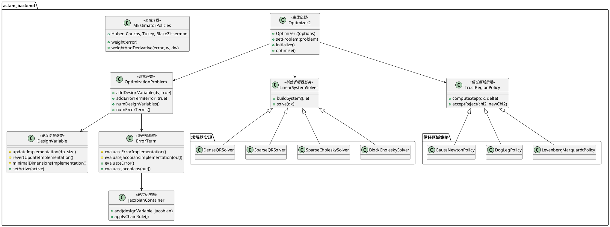
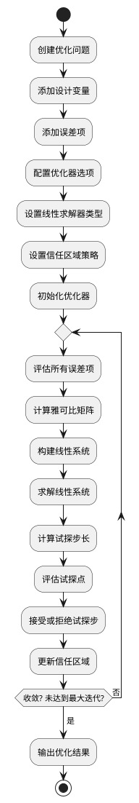

# aslam_backend 模块详细文档

> ASL 优化后端库 - 高性能的非线性优化框架，专为 SLAM 和视觉校准问题设计

---

## 1. 📋 功能说明

### 1.1 定位

该模块是 Kalibr 系统中优化器模块集群的核心组件，提供了一个高性能的非线性优化后端库。它采用基于因子图的优化框架，支持 Gauss-Newton、Levenberg-Marquardt、Dog-Leg 等多种优化算法，是 Kalibr 视觉校准工具链的核心优化引擎，广泛应用于学术和工业界的机器人视觉应用中。

### 1.2 核心能力

- 提供基于因子图的非线性优化框架
- 支持多种优化算法：Gauss-Newton、Levenberg-Marquardt、Dog-Leg
- 提供多种线性系统求解器：稠密和稀疏 Cholesky、稀疏 QR、稠密 QR
- 支持鲁棒 M 估计器，降低异常值影响
- 实现状态边缘化功能，适用于 SLAM 的增量优化
- 多线程支持，充分利用多核 CPU 加速计算
- 模块化架构设计，清晰的组件分离，易于扩展和维护
- 丰富的测试用例和示例代码，便于快速上手

---

## 2. 🏗️ 架构设计

### 2.1 主要组件



### 2.2 优化流程



### 2.3 关键设计模式

- **策略模式**：通过 LinearSystemSolver 和 TrustRegionPolicy 支持多种算法选择
- **模板方法模式**：DesignVariable 和 ErrorTerm 定义接口，子类实现具体逻辑
- **工厂模式**：通过配置选项创建不同的求解器和策略
- **因子图模式**：设计变量和误差项构成因子图，用于状态估计
- **雅可比传播模式**：通过 JacobianContainer 高效管理雅可比矩阵

---

## 3. 🔑 关键方法

### 3.1 非线性优化算法

- **原理**：基于 Gauss-Newton 类型的迭代优化，结合信任区域策略确保收敛
- **实现位置**：`/home/xcandy/Workspace/kalibr/aslam_optimizer/aslam_backend/src/Optimizer2.cpp`
- **复杂度**：每次迭代 O(N^3)，N 为设计变量维度

### 3.2 稀疏线性求解

- **原理**：利用问题的稀疏结构，高效求解线性系统
- **实现位置**：`/home/xcandy/Workspace/kalibr/aslam_optimizer/aslam_backend/src/SparseCholeskyLinearSystemSolver.cpp`
- **复杂度**：O(N^3) 最坏情况，实际通常更快

### 3.3 鲁棒 M 估计

- **原理**：通过重新加权误差项，降低异常值的影响
- **实现位置**：`/home/xcandy/Workspace/kalibr/aslam_optimizer/aslam_backend/src/MEstimatorPolicies.cpp`
- **复杂度**：O(1) 每个误差项

---

## 4. 🔌 对外接口

### 4.1 主要类

#### 4.1.1 `Optimizer2`

- **用途**：主优化器类，协调优化过程
- **关键方法**：
  - `Optimizer2(const Optimizer2Options& options)` — 构造函数，接受优化器选项
  - `void setProblem(const boost::shared_ptr<OptimizationProblemBase>& problem)` — 设置优化问题
  - `void initialize()` — 初始化优化器
  - `SolutionReturnValue optimize()` — 执行优化
- **核心选项**：
  - `verbose` — 详细输出
  - `linearSolver` — 线性求解器类型
  - `maxIterations` — 最大迭代次数
  - `convergenceGradientNormTolerance` — 收敛梯度范数容差

#### 4.1.2 `OptimizationProblem`

- **用途**：管理优化问题中的设计变量和误差项
- **关键方法**：
  - `void addDesignVariable(DesignVariable* dv, bool problemOwnsVariable)` — 添加设计变量
  - `void addErrorTerm(ErrorTerm* error, bool problemOwnsError)` — 添加误差项
  - `size_t numDesignVariables() const` — 获取设计变量数量
  - `size_t numErrorTerms() const` — 获取误差项数量

#### 4.1.3 `DesignVariable`

- **用途**：设计变量基类，用户需子类化实现具体参数
- **关键方法**：
  - `void update(const double* dp, int size)` — 更新设计变量
  - `void revertUpdate()` — 回滚更新
  - `void setActive(bool active)` — 设置是否活跃
  - `int minimalDimensions() const` — 获取最小维度
- **需子类实现的方法**：
  - `virtual void updateImplementation(const double* dp, int size)` — 更新实现
  - `virtual void revertUpdateImplementation()` — 回滚实现
  - `virtual int minimalDimensionsImplementation() const` — 最小维度实现

#### 4.1.4 `ErrorTerm`

- **用途**：误差项基类，用户需子类化实现具体误差
- **关键方法**：
  - `double evaluateError()` — 评估误差
  - `void evaluateJacobians(JacobianContainer& outJacobians)` — 评估雅可比
  - `double evaluateChiSquaredError()` — 评估卡方误差
- **需子类实现的方法**：
  - `virtual double evaluateErrorImplementation()` — 误差评估实现
  - `virtual void evaluateJacobiansImplementation(JacobianContainer& outJacobians) const` — 雅可比评估实现

#### 4.1.5 `JacobianContainer`

- **用途**：管理和存储雅可比矩阵
- **关键方法**：
  - `void add(DesignVariable* dv, const Eigen::MatrixXd& Jacobian)` — 添加雅可比
  - `void add(DesignVariable* dv, const Eigen::MatrixXd& Jacobian, int rowStart, int colStart)` — 添加分块雅可比
  - `void applyChainRule(const Eigen::MatrixXd& J)` — 应用链式法则

### 4.2 主要函数

```cpp
// 优化器选项配置
struct Optimizer2Options {
    bool verbose;
    std::string linearSolver;
    int maxIterations;
    double convergenceGradientNormTolerance;
    // ... 更多选项
};

// 优化结果
struct SolutionReturnValue {
    enum ReturnStatus {
        Converged,
        MaxIterations,
        // ... 更多状态
    };
    ReturnStatus status;
    int iterations;
    // ... 更多结果
};
```

### 4.3 核心数据结构

```cpp
// 设计变量指针
typedef DesignVariable* DesignVariablePointer;

// 误差项指针
typedef ErrorTerm* ErrorTermPointer;

// 设计变量集合
typedef std::vector<DesignVariable*> design_variable_vector_t;

// 误差项集合
typedef std::vector<ErrorTerm*> error_term_vector_t;
```

---

## 5. 📦 依赖关系

### 5.1 内部依赖

- **sm_common** — 提供通用工具和断言宏
- **sm_eigen** — 提供 Eigen 扩展工具
- **sm_boost** — 提供 Boost 扩展工具
- **sparse_block_matrix** — 提供稀疏块矩阵支持

### 5.2 外部依赖

- **Eigen3** — 用于线性代数运算
- **Boost** — 用于智能指针和容器
- **CHOLMOD** (可选) — 用于稀疏 Cholesky 分解
- **C++11 及以上** — 用于现代 C++ 特性
- **catkin** (可选) — 用于 ROS 构建系统

---

## 6. 💡 使用示例

### 6.1 基本用法 - 自定义设计变量和误差项

```cpp
#include <aslam/backend/Optimizer2.hpp>
#include <aslam/backend/OptimizationProblem.hpp>
#include <aslam/backend/DesignVariable.hpp>
#include <aslam/backend/ErrorTerm.hpp>
#include <Eigen/Core>

// 自定义 2D 点设计变量
class Point2d : public aslam::backend::DesignVariable {
public:
    EIGEN_MAKE_ALIGNED_OPERATOR_NEW
    Eigen::Vector2d _v;
    Eigen::Vector2d _p_v;

    Point2d(const Eigen::Vector2d& v) : _v(v), _p_v(v) {}

protected:
    virtual void revertUpdateImplementation() { _v = _p_v; }
    virtual void updateImplementation(const double* dp, int /* size */) {
        _p_v = _v;
        _v[0] += dp[0];
        _v[1] += dp[1];
    }
    virtual int minimalDimensionsImplementation() const { return 2; }
};

// 自定义线性误差项
class LinearErr : public aslam::backend::ErrorTermFs<2> {
public:
    EIGEN_MAKE_ALIGNED_OPERATOR_NEW
    typedef aslam::backend::ErrorTermFs<2> parent_t;
    Eigen::Vector2d _p;
    Eigen::Matrix2d _J;
    Point2d* _p2d;

    LinearErr(Point2d* p2d) : _p2d(p2d) {
        _p2d->setActive(true);
        _J.setRandom();
        _p = _J * _p2d->_v;
        parent_t::setDesignVariables(_p2d);
        setInvR(sm::eigen::randomCovariance<2>());
    }

protected:
    virtual double evaluateErrorImplementation() {
        setError(_p - _J * _p2d->_v);
        return evaluateChiSquaredError();
    }
    virtual void evaluateJacobiansImplementation(aslam::backend::JacobianContainer & outJ) const {
        outJ.add(_p2d, -_J);
    }
};

// 完整优化流程
int main() {
    // 创建优化问题
    boost::shared_ptr<aslam::backend::OptimizationProblem> problem(
        new aslam::backend::OptimizationProblem);

    // 添加设计变量
    Point2d* point = new Point2d(Eigen::Vector2d::Random());
    problem->addDesignVariable(point, true);

    // 添加误差项
    LinearErr* err = new LinearErr(point);
    problem->addErrorTerm(err, true);

    // 配置优化器
    aslam::backend::Optimizer2Options options;
    options.verbose = true;
    options.linearSolver = "dense";
    options.maxIterations = 20;
    aslam::backend::Optimizer2 optimizer(options);

    // 执行优化
    optimizer.setProblem(problem);
    optimizer.initialize();
    aslam::backend::SolutionReturnValue result = optimizer.optimize();

    std::cout << "优化状态: " << result.status << std::endl;
    std::cout << "迭代次数: " << result.iterations << std::endl;
    std::cout << "优化结果: " << point->_v.transpose() << std::endl;

    return 0;
}
```

### 6.2 高级用法 - 鲁棒优化

```cpp
#include <aslam/backend/Optimizer2.hpp>
#include <aslam/backend/MEstimatorPolicies.hpp>

// 配置鲁棒 M 估计器
aslam::backend::Optimizer2Options options;
options.verbose = true;
options.trustRegionPolicy = "levenberg_marquardt";
options.linearSolver = "block_cholesky";

// 设置 Huber M 估计器
aslam::backend::HuberMEstimator huber(1.0);
options.mEstimator = &huber;

// 或者使用 Cauchy M 估计器
aslam::backend::CauchyMEstimator cauchy(1.0);
// options.mEstimator = &cauchy;

// 创建优化器并执行
aslam::backend::Optimizer2 optimizer(options);
// ... 其余代码同基本用法
```

---

## 7. 🔗 相关模块

- [aslam_splines](../aslam_nonparametric_estimation/aslam_splines.md) — 样条曲线的优化后端集成
- [kalibr](../calibration/kalibr.md) — Kalibr 离线校准核心
- [sparse_block_matrix](./sparse_block_matrix.md) — 稀疏块矩阵支持
- [aslam_backend_expressions](./aslam_backend_expressions.md) — 后端表达式支持

---

## 8. 📄 核心文件列表

| 文件路径 | 文件类型 | 功能描述 |
|----------|----------|----------|
| `/home/xcandy/Workspace/kalibr/aslam_optimizer/aslam_backend/include/aslam/backend/backend.hpp` | 头文件 | 模块公共头文件 |
| `/home/xcandy/Workspace/kalibr/aslam_optimizer/aslam_backend/include/aslam/backend/DesignVariable.hpp` | 头文件 | 设计变量基类定义 |
| `/home/xcandy/Workspace/kalibr/aslam_optimizer/aslam_backend/src/DesignVariable.cpp` | 源代码 | 设计变量基类实现 |
| `/home/xcandy/Workspace/kalibr/aslam_optimizer/aslam_backend/include/aslam/backend/ErrorTerm.hpp` | 头文件 | 误差项基类定义 |
| `/home/xcandy/Workspace/kalibr/aslam_optimizer/aslam_backend/src/ErrorTerm.cpp` | 源代码 | 误差项基类实现 |
| `/home/xcandy/Workspace/kalibr/aslam_optimizer/aslam_backend/include/aslam/backend/Optimizer2.hpp` | 头文件 | 主优化器类定义 |
| `/home/xcandy/Workspace/kalibr/aslam_optimizer/aslam_backend/src/Optimizer2.cpp` | 源代码 | 主优化器类实现 |
| `/home/xcandy/Workspace/kalibr/aslam_optimizer/aslam_backend/include/aslam/backend/OptimizationProblem.hpp` | 头文件 | 优化问题管理类定义 |
| `/home/xcandy/Workspace/kalibr/aslam_optimizer/aslam_backend/src/OptimizationProblem.cpp` | 源代码 | 优化问题管理类实现 |
| `/home/xcandy/Workspace/kalibr/aslam_optimizer/aslam_backend/include/aslam/backend/JacobianContainer.hpp` | 头文件 | 雅可比容器定义 |
| `/home/xcandy/Workspace/kalibr/aslam_optimizer/aslam_backend/src/JacobianContainer.cpp` | 源代码 | 雅可比容器实现 |
| `/home/xcandy/Workspace/kalibr/aslam_optimizer/aslam_backend/include/aslam/backend/LinearSystemSolver.hpp` | 头文件 | 线性求解器基类定义 |
| `/home/xcandy/Workspace/kalibr/aslam_optimizer/aslam_backend/include/aslam/backend/MEstimatorPolicies.hpp` | 头文件 | M 估计器策略定义 |
| `/home/xcandy/Workspace/kalibr/aslam_optimizer/aslam_backend/src/MEstimatorPolicies.cpp` | 源代码 | M 估计器策略实现 |
| `/home/xcandy/Workspace/kalibr/aslam_optimizer/aslam_backend/test/TestOptimizer.cpp` | 测试 | 优化器测试 |
| `/home/xcandy/Workspace/kalibr/aslam_optimizer/aslam_backend/test/TestOptimizationProblem.cpp` | 测试 | 优化问题测试 |
| `/home/xcandy/Workspace/kalibr/aslam_optimizer/aslam_backend/test/SampleDvAndError.hpp` | 测试 | 测试用示例类 |

---
