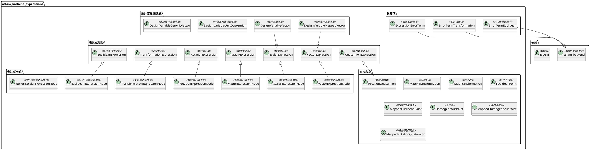
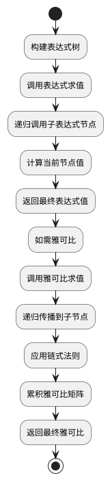

# aslam_backend_expressions 模块详细文档

> ASL 优化后端表达式库 - 提供标量、向量、矩阵、旋转、变换等表达式节点，用于构建优化问题

---

## 1. 📋 功能说明

### 1.1 定位

该模块是 Kalibr 系统中优化器模块集群的表达式组件，提供了一套完整的表达式节点系统，用于构建优化问题中的各种数学表达式。它实现了标量、向量、矩阵、旋转、变换、欧几里得点等多种表达式类型，支持雅可比自动传播，是 aslam_backend 的核心表达式基础设施。

### 1.2 核心能力

- 提供标量表达式（ScalarExpression）及其节点实现
- 提供向量表达式（VectorExpression）及其节点实现
- 提供矩阵表达式（MatrixExpression）及其节点实现
- 提供旋转表达式（RotationExpression）及其节点实现
- 提供变换表达式（TransformationExpression）及其节点实现
- 提供欧几里得表达式（EuclideanExpression）及其节点实现
- 提供四元数表达式（QuaternionExpression）及其节点实现
- 支持设计变量的表达式包装（DesignVariableVector、DesignVariableMappedVector 等）
- 实现雅可比自动传播机制，支持链式法则
- 提供表达式错误项（ExpressionErrorTerm），支持基于表达式的误差构建

---

## 2. 🏗️ 架构设计

### 2.1 主要组件



### 2.2 表达式求值和雅可比传播流程



### 2.3 关键设计模式

- **表达式树模式**：通过组合各种表达式节点构建复杂表达式
- **雅可比传播模式**：通过链式法则自动计算复合表达式的雅可比
- **映射模式**：通过 Mapped* 类支持设计变量的参数化表示
- **适配器模式**：通过 Vector2RotationQuaternionExpressionAdapter 等适配不同表达式类型

---

## 3. 🔑 关键方法

### 3.1 表达式求值

- **原理**：通过表达式树递归求值，计算最终表达式值
- **实现位置**：各表达式节点的 toValueImplementation() / toMatrixImplementation() 等方法
- **复杂度**：O(N)，N 为表达式树节点数

### 3.2 雅可比传播

- **原理**：通过链式法则自动传播雅可比，计算表达式对设计变量的导数
- **实现位置**：各表达式节点的 evaluateJacobiansImplementation() 方法
- **复杂度**：O(N)，N 为表达式树节点数

---

## 4. 🔌 对外接口

### 4.1 主要表达式类

#### 4.1.1 `ScalarExpression`

- **用途**：标量表达式基类，表示一个标量值
- **关键方法**：
  - `double toScalar() const` — 求值标量
  - `void evaluateJacobians(JacobianContainer & outJacobians) const` — 求值雅可比

#### 4.1.2 `VectorExpression<D>`

- **用途**：D 维向量表达式基类
- **关键方法**：
  - `Eigen::Matrix<double, D, 1> toVector() const` — 求值向量
  - `void evaluateJacobians(JacobianContainer & outJacobians) const` — 求值雅可比

#### 4.1.3 `MatrixExpression<D, D>`

- **用途**：D×D 矩阵表达式基类
- **关键方法**：
  - `Eigen::Matrix<double, D, D> toMatrix() const` — 求值矩阵
  - `void evaluateJacobians(JacobianContainer & outJacobians) const` — 求值雅可比

#### 4.1.4 `RotationExpression`

- **用途**：旋转表达式基类，表示 SO(3) 旋转
- **关键方法**：
  - `Eigen::Matrix3d toRotationMatrix() const` — 求值旋转矩阵
  - `void evaluateJacobians(JacobianContainer & outJacobians) const` — 求值雅可比

#### 4.1.5 `TransformationExpression`

- **用途**：变换表达式基类，表示 SE(3) 刚体变换
- **关键方法**：
  - `Eigen::Matrix4d toTransformationMatrix() const` — 求值变换矩阵
  - `void evaluateJacobians(JacobianContainer & outJacobians) const` — 求值雅可比

#### 4.1.6 `EuclideanExpression`

- **用途**：欧几里得点表达式基类，表示 3D 点
- **关键方法**：
  - `Eigen::Vector3d toEuclidean() const` — 求值欧几里得点
  - `void evaluateJacobians(JacobianContainer & outJacobians) const` — 求值雅可比

### 4.2 主要设计变量表达式类

#### 4.2.1 `DesignVariableVector`

- **用途**：将设计变量包装为向量表达式
- **关键方法**：
  - `DesignVariableVector(DesignVariable * dv)` — 构造函数

#### 4.2.2 `DesignVariableMappedVector<D>`

- **用途**：将映射的设计变量包装为向量表达式
- **关键方法**：
  - `DesignVariableMappedVector(DesignVariableMappedVector<D> * dv)` — 构造函数

#### 4.2.3 `DesignVariableUnitQuaternion`

- **用途**：将单位四元数设计变量包装为旋转表达式
- **关键方法**：
  - `DesignVariableUnitQuaternion(DesignVariableUnitQuaternion * dv)` — 构造函数

### 4.3 主要误差项类

#### 4.3.1 `ErrorTermEuclidean`

- **用途**：欧几里得点误差项
- **关键方法**：
  - `ErrorTermEuclidean(EuclideanExpression point, Eigen::Vector3d measurement, Eigen::Matrix3d invR)` — 构造函数

#### 4.3.2 `ErrorTermTransformation`

- **用途**：变换误差项
- **关键方法**：
  - `ErrorTermTransformation(TransformationExpression T, Eigen::Matrix4d measurement, Eigen::Matrix<double, 6, 6> invR)` — 构造函数

#### 4.3.3 `ExpressionErrorTerm`

- **用途**：通用表达式误差项
- **关键方法**：
  - `ExpressionErrorTerm(...)` — 构造函数

---

## 5. 📦 依赖关系

### 5.1 内部依赖

- **aslam_backend** — 提供优化后端核心和设计变量基类
- **sm_common** — 提供通用工具和断言宏
- **sm_eigen** — 提供 Eigen 扩展工具

### 5.2 外部依赖

- **Eigen3** — 用于线性代数运算
- **Boost** — 用于智能指针和容器
- **C++11 及以上** — 用于现代 C++ 特性和模板元编程

---

## 6. 💡 使用示例

### 6.1 基本用法 - 构建表达式

```cpp
#include <aslam/backend/ScalarExpression.hpp>
#include <aslam/backend/EuclideanExpression.hpp>
#include <aslam/backend/TransformationExpression.hpp>
#include <aslam/backend/RotationExpression.hpp>

// 创建设计变量
DesignVariableVector* dv = new DesignVariableVector(designVariable);

// 创建标量表达式
ScalarExpression s(dv->toScalarExpression(0));

// 创建欧几里得点表达式
EuclideanExpression p(dv->toEuclideanExpression());

// 创建变换表达式
TransformationExpression T = createTransformationExpression();

// 表达式组合
EuclideanExpression p_transformed = T * p;
ScalarExpression s_combined = s + ScalarExpression(1.0);

// 求值表达式
Eigen::Vector3d p_val = p_transformed.toEuclidean();
double s_val = s_combined.toScalar();
```

### 6.2 高级用法 - 基于表达式的误差项

```cpp
#include <aslam/backend/ErrorTermEuclidean.hpp>
#include <aslam/backend/ExpressionErrorTerm.hpp>

// 创建表达式
EuclideanExpression p_predicted = createPredictionExpression();
EuclideanExpression p_measured = createMeasurementExpression();

// 创建误差项
Eigen::Vector3d measurement(320, 240, 0);
Eigen::Matrix3d invR = Eigen::Matrix3d::Identity();
ErrorTermEuclidean* error = new ErrorTermEuclidean(
    p_predicted, measurement, invR);

// 添加到优化问题
problem->addErrorTerm(error, true);
```

---

## 7. 🔗 相关模块

- [aslam_backend](./aslam_backend.md) — 优化后端核心
- [aslam_splines](../aslam_nonparametric_estimation/aslam_splines.md) — 样条曲线表达式
- [kalibr](../calibration/kalibr.md) — Kalibr 离线校准核心

---

## 8. 📄 核心文件列表

| 文件路径 | 文件类型 | 功能描述 |
|----------|----------|----------|
| `/home/xcandy/Workspace/kalibr/aslam_optimizer/aslam_backend_expressions/include/aslam/backend/ScalarExpression.hpp` | 头文件 | 标量表达式定义 |
| `/home/xcandy/Workspace/kalibr/aslam_optimizer/aslam_backend_expressions/include/aslam/backend/ScalarExpressionNode.hpp` | 头文件 | 标量表达式节点定义 |
| `/home/xcandy/Workspace/kalibr/aslam_optimizer/aslam_backend_expressions/include/aslam/backend/VectorExpression.hpp` | 头文件 | 向量表达式定义 |
| `/home/xcandy/Workspace/kalibr/aslam_optimizer/aslam_backend_expressions/include/aslam/backend/VectorExpressionNode.hpp` | 头文件 | 向量表达式节点定义 |
| `/home/xcandy/Workspace/kalibr/aslam_optimizer/aslam_backend_expressions/include/aslam/backend/MatrixExpression.hpp` | 头文件 | 矩阵表达式定义 |
| `/home/xcandy/Workspace/kalibr/aslam_optimizer/aslam_backend_expressions/include/aslam/backend/MatrixExpressionNode.hpp` | 头文件 | 矩阵表达式节点定义 |
| `/home/xcandy/Workspace/kalibr/aslam_optimizer/aslam_backend_expressions/include/aslam/backend/RotationExpression.hpp` | 头文件 | 旋转表达式定义 |
| `/home/xcandy/Workspace/kalibr/aslam_optimizer/aslam_backend_expressions/include/aslam/backend/RotationExpressionNode.hpp` | 头文件 | 旋转表达式节点定义 |
| `/home/xcandy/Workspace/kalibr/aslam_optimizer/aslam_backend_expressions/include/aslam/backend/TransformationExpression.hpp` | 头文件 | 变换表达式定义 |
| `/home/xcandy/Workspace/kalibr/aslam_optimizer/aslam_backend_expressions/include/aslam/backend/TransformationExpressionNode.hpp` | 头文件 | 变换表达式节点定义 |
| `/home/xcandy/Workspace/kalibr/aslam_optimizer/aslam_backend_expressions/include/aslam/backend/EuclideanExpression.hpp` | 头文件 | 欧几里得表达式定义 |
| `/home/xcandy/Workspace/kalibr/aslam_optimizer/aslam_backend_expressions/include/aslam/backend/EuclideanExpressionNode.hpp` | 头文件 | 欧几里得表达式节点定义 |
| `/home/xcandy/Workspace/kalibr/aslam_optimizer/aslam_backend_expressions/include/aslam/backend/QuaternionExpression.hpp` | 头文件 | 四元数表达式定义 |
| `/home/xcandy/Workspace/kalibr/aslam_optimizer/aslam_backend_expressions/include/aslam/backend/DesignVariableVector.hpp` | 头文件 | 设计变量向量表达式定义 |
| `/home/xcandy/Workspace/kalibr/aslam_optimizer/aslam_backend_expressions/include/aslam/backend/DesignVariableMappedVector.hpp` | 头文件 | 映射设计变量向量表达式定义 |
| `/home/xcandy/Workspace/kalibr/aslam_optimizer/aslam_backend_expressions/include/aslam/backend/DesignVariableUnitQuaternion.hpp` | 头文件 | 单位四元数设计变量表达式定义 |
| `/home/xcandy/Workspace/kalibr/aslam_optimizer/aslam_backend_expressions/include/aslam/backend/ErrorTermEuclidean.hpp` | 头文件 | 欧几里得误差项定义 |
| `/home/xcandy/Workspace/kalibr/aslam_optimizer/aslam_backend_expressions/include/aslam/backend/ErrorTermTransformation.hpp` | 头文件 | 变换误差项定义 |
| `/home/xcandy/Workspace/kalibr/aslam_optimizer/aslam_backend_expressions/include/aslam/backend/ExpressionErrorTerm.hpp` | 头文件 | 表达式误差项定义 |
| `/home/xcandy/Workspace/kalibr/aslam_optimizer/aslam_backend_expressions/include/aslam/backend/MatrixTransformation.hpp` | 头文件 | 矩阵变换定义 |
| `/home/xcandy/Workspace/kalibr/aslam_optimizer/aslam_backend_expressions/include/aslam/backend/MapTransformation.hpp` | 头文件 | 映射变换定义 |
| `/home/xcandy/Workspace/kalibr/aslam_optimizer/aslam_backend_expressions/include/aslam/backend/EuclideanPoint.hpp` | 头文件 | 欧几里得点定义 |
| `/home/xcandy/Workspace/kalibr/aslam_optimizer/aslam_backend_expressions/include/aslam/backend/RotationQuaternion.hpp` | 头文件 | 旋转四元数定义 |

---
