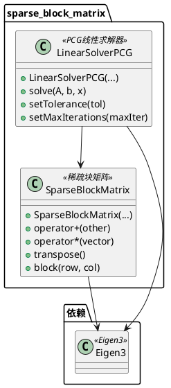
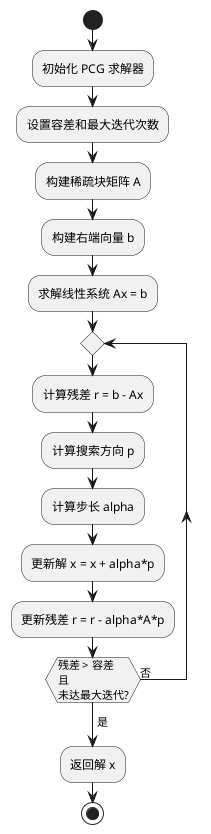

# sparse_block_matrix 模块详细文档

> 稀疏块矩阵库 - 提供高效的稀疏块矩阵数据结构和线性求解器，用于大规模优化问题

---

## 1. 📋 功能说明

### 1.1 定位

该模块是 Kalibr 系统中优化器模块集群的线性代数组件，专门为大规模稀疏优化问题提供高效的稀疏块矩阵数据结构和线性求解器。它实现了稀疏块矩阵的存储、操作和预条件共轭梯度（PCG）线性求解器，是 aslam_backend 处理大规模优化问题的关键基础设施。

### 1.2 核心能力

- 提供稀疏块矩阵（SparseBlockMatrix）数据结构，高效存储块稀疏矩阵
- 支持稀疏块矩阵的各种操作：加法、乘法、转置等
- 实现预条件共轭梯度（PCG）线性求解器，用于大规模稀疏线性系统求解
- 支持矩阵-向量乘法、块级操作等高效计算
- 为 aslam_backend 的稀疏线性求解器提供底层支持
- 优化的内存布局和计算模式，充分利用块结构

---

## 2. 🏗️ 架构设计

### 2.1 主要组件



### 2.2 线性求解流程



### 2.3 关键设计模式

- **稀疏矩阵模式**：利用块结构高效存储稀疏矩阵
- **迭代求解模式**：PCG 迭代方法求解大规模线性系统
- **预条件模式**：支持预条件器加速收敛
- **块操作模式**：以块为单位进行矩阵操作，提高效率

---

## 3. 🔑 关键方法

### 3.1 稀疏块矩阵存储

- **原理**：利用块结构存储稀疏矩阵，只存储非零块
- **实现位置**：`/home/xcandy/Workspace/kalibr/aslam_optimizer/sparse_block_matrix/include/sparse_block_matrix/implementation/sparse_block_matrix.hpp`
- **复杂度**：O(N) 存储，N 为非零块数量

### 3.2 PCG 线性求解

- **原理**：预条件共轭梯度迭代法求解线性系统 Ax = b
- **实现位置**：`/home/xcandy/Workspace/kalibr/aslam_optimizer/sparse_block_matrix/include/sparse_block_matrix/implementation/linear_solver_pcg.hpp`
- **复杂度**：O(N*K)，N 为问题规模，K 为迭代次数

---

## 4. 🔌 对外接口

### 4.1 主要类

#### 4.1.1 `SparseBlockMatrix`

- **用途**：稀疏块矩阵数据结构，用于存储和操作块稀疏矩阵
- **关键方法**：
  - `SparseBlockMatrix(int numBlockRows, int numBlockCols, int blockSize)` — 构造函数
  - `SparseBlockMatrix operator+(const SparseBlockMatrix & other) const` — 矩阵加法
  - `Eigen::VectorXd operator*(const Eigen::VectorXd & v) const` — 矩阵-向量乘法
  - `SparseBlockMatrix transpose() const` — 矩阵转置
  - `Eigen::MatrixXd & block(int row, int col)` — 获取块引用
  - `const Eigen::MatrixXd & block(int row, int col) const` — 获取块常量引用

#### 4.1.2 `LinearSolverPCG`

- **用途**：预条件共轭梯度线性求解器
- **关键方法**：
  - `LinearSolverPCG()` — 构造函数
  - `bool solve(const SparseBlockMatrix & A, const Eigen::VectorXd & b, Eigen::VectorXd & x)` — 求解线性系统
  - `void setTolerance(double tolerance)` — 设置收敛容差
  - `void setMaxIterations(int maxIterations)` — 设置最大迭代次数
  - `int getIterations() const` — 获取实际迭代次数

---

## 5. 📦 依赖关系

### 5.1 内部依赖

- 无内部依赖，是独立的线性代数库

### 5.2 外部依赖

- **Eigen3** — 用于密集矩阵和向量运算
- **C++11 及以上** — 用于现代 C++ 特性和模板元编程

---

## 6. 💡 使用示例

### 6.1 基本用法 - 稀疏块矩阵操作

```cpp
#include <sparse_block_matrix/implementation/sparse_block_matrix.hpp>

// 创建稀疏块矩阵
int numBlockRows = 10;
int numBlockCols = 10;
int blockSize = 6;  // 每个块 6x6
sparse_block_matrix::SparseBlockMatrix A(
    numBlockRows, numBlockCols, blockSize);

// 设置某些块
Eigen::MatrixXd block = Eigen::MatrixXd::Identity(blockSize, blockSize);
A.block(0, 0) = block;
A.block(1, 1) = block * 2.0;
A.block(2, 2) = block * 3.0;

// 创建向量
Eigen::VectorXd x(numBlockRows * blockSize);
x.setRandom();

// 矩阵-向量乘法
Eigen::VectorXd Ax = A * x;

// 矩阵加法
sparse_block_matrix::SparseBlockMatrix B = A + A;

// 矩阵转置
sparse_block_matrix::SparseBlockMatrix At = A.transpose();
```

### 6.2 高级用法 - PCG 线性求解

```cpp
#include <sparse_block_matrix/implementation/sparse_block_matrix.hpp>
#include <sparse_block_matrix/implementation/linear_solver_pcg.hpp>

// 创建稀疏块矩阵
int numBlockRows = 100;
int numBlockCols = 100;
int blockSize = 6;
sparse_block_matrix::SparseBlockMatrix A(
    numBlockRows, numBlockCols, blockSize);

// 填充矩阵（创建正定矩阵）
for (int i = 0; i < numBlockRows; ++i) {
    A.block(i, i) = Eigen::MatrixXd::Identity(blockSize, blockSize) * 10.0;
    if (i > 0) {
        A.block(i, i-1) = Eigen::MatrixXd::Identity(blockSize, blockSize) * -1.0;
    }
    if (i < numBlockRows - 1) {
        A.block(i, i+1) = Eigen::MatrixXd::Identity(blockSize, blockSize) * -1.0;
    }
}

// 创建右端向量
Eigen::VectorXd b(numBlockRows * blockSize);
b.setOnes();

// 创建初始解
Eigen::VectorXd x(numBlockRows * blockSize);
x.setZero();

// 创建 PCG 求解器
sparse_block_matrix::LinearSolverPCG solver;
solver.setTolerance(1e-6);
solver.setMaxIterations(1000);

// 求解线性系统
bool success = solver.solve(A, b, x);

if (success) {
    std::cout << "求解成功！" << std::endl;
    std::cout << "迭代次数: " << solver.getIterations() << std::endl;

    // 验证解
    Eigen::VectorXd Ax = A * x;
    double residual = (Ax - b).norm();
    std::cout << "残差: " << residual << std::endl;
} else {
    std::cout << "求解失败！" << std::endl;
}
```

---

## 7. 🔗 相关模块

- [aslam_backend](./aslam_backend.md) — 优化后端核心
- [kalibr](../calibration/kalibr.md) — Kalibr 离线校准核心

---

## 8. 📄 核心文件列表

| 文件路径 | 文件类型 | 功能描述 |
|----------|----------|----------|
| `/home/xcandy/Workspace/kalibr/aslam_optimizer/sparse_block_matrix/include/sparse_block_matrix/implementation/sparse_block_matrix.hpp` | 头文件 | 稀疏块矩阵定义和实现 |
| `/home/xcandy/Workspace/kalibr/aslam_optimizer/sparse_block_matrix/include/sparse_block_matrix/implementation/linear_solver_pcg.hpp` | 头文件 | PCG 线性求解器定义和实现 |

---
