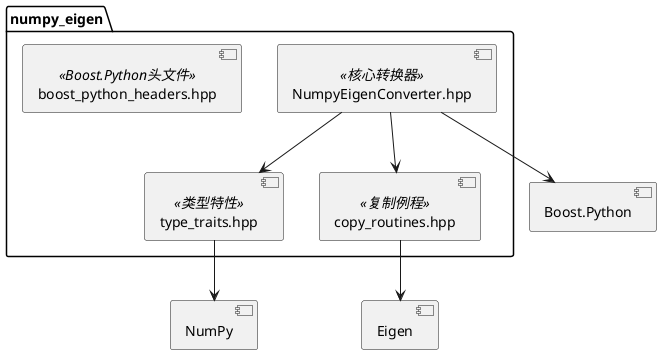
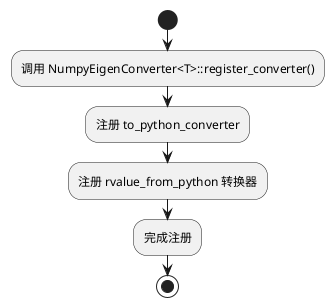

# numpy_eigen 模块文档

> NumPy 和 Eigen3 矩阵的双向转换工具，为 Python/C++ 互操作提供支持

---

## 1. 📋 功能说明

### 1.1 定位
numpy_eigen 是 Schweizer-Messer 库的 Python 绑定模块，提供了 NumPy 数组和 Eigen3 矩阵之间的自动双向转换功能，是构建 Python/C++ 混合系统的关键基础设施。

### 1.2 核心能力
- **Eigen → NumPy 转换**：自动将 Eigen3 矩阵转换为 NumPy 数组
- **NumPy → Eigen 转换**：自动将 NumPy 数组转换为 Eigen3 矩阵
- **类型安全转换**：编译时类型检查，运行时维度验证
- **向量/矩阵支持**：支持 1D 向量和 2D 矩阵
- **动态/固定大小**：支持 Eigen::Dynamic 和固定大小矩阵
- **对齐内存处理**：自动处理 Eigen 的 16 字节对齐要求
- **多种标量类型**：支持 double、float 等多种数值类型

---

## 2. 🏗️ 架构设计

numpy_eigen 采用 Boost.Python 转换器模式，通过模板特化实现类型适配。



### 2.1 主要组件划分
1. **核心转换器层**：NumpyEigenConverter 模板类
2. **类型特性层**：type_traits.hpp 类型映射
3. **复制例程层**：copy_routines.hpp 内存复制
4. **头文件层**：boost_python_headers.hpp 统一头文件

### 2.2 数据流走向
```
C++ Eigen 矩阵 → to_python_converter → NumPy array
                    ↑
Python NumPy array → rvalue_from_python → C++ Eigen 矩阵
```

### 2.3 关键设计模式
- **转换器模式**：Boost.Python to_python_converter
- **模板特化**：为不同 Eigen 类型特化转换器
- **类型萃取**：TypeToNumPy 类型映射
- **SFINAE**：编译时类型检查

---

## 3. 🔑 关键方法

### 3.1 转换器注册
```cpp
template<typename EIGEN_MATRIX_T>
struct NumpyEigenConverter {
    static void register_converter();
};
```
**原理**：注册 to_python 和 from_python 转换器

**实现位置**：`include/numpy_eigen/NumpyEigenConverter.hpp:303-311`



---

### 3.2 Eigen → NumPy 转换
```cpp
template<typename EIGEN_MATRIX_T>
static PyObject * convert(const matrix_t & M);
```
**原理**：将 Eigen 矩阵转换为 NumPy 数组

**实现位置**：`include/numpy_eigen/NumpyEigenConverter.hpp:89-115`

---

### 3.3 NumPy → Eigen 转换
```cpp
template<typename EIGEN_MATRIX_T>
static void* convertible(PyObject *obj_ptr);

template<typename EIGEN_MATRIX_T>
static void construct(PyObject *obj_ptr,
    boost::python::converter::rvalue_from_python_stage1_data *data);
```
**原理**：检查可转换性并构造 Eigen 矩阵

**实现位置**：`include/numpy_eigen/NumpyEigenConverter.hpp:195-299`

---

### 3.4 类型映射
```cpp
template<typename Scalar>
struct TypeToNumPy {
    enum { NpyType = ... };
    static const char * typeString();
    static bool canConvert(int npyType);
};
```
**原理**：将 C++ 类型映射到 NumPy 类型

**实现位置**：`include/numpy_eigen/type_traits.hpp`

---

## 4. 🔌 对外接口

### 4.1 主要类

#### 4.1.1 `NumpyEigenConverter<EIGEN_MATRIX_T>`
**用途**：NumPy 和 Eigen 矩阵的双向转换器

**关键方法**：
- `register_converter()` — 注册转换器
- `convert(const matrix_t & M)` — Eigen → NumPy
- `convertible(PyObject *obj_ptr)` — 检查可转换性
- `construct(obj_ptr, data)` — 构造 Eigen 矩阵
- `toString()` — 获取类型字符串描述

**模板参数**：
- `EIGEN_MATRIX_T` — Eigen 矩阵类型（如 Eigen::MatrixXd、Eigen::Vector3d 等）

**输入输出接口定义**：
```
输入:
  register_converter(): 无参数
  convert(): const matrix_t & (Eigen 矩阵)
  convertible(): PyObject * (NumPy 数组)
  construct(): PyObject *, rvalue_from_python_stage1_data *

输出:
  convert(): PyObject * (新的 NumPy 数组)
  convertible(): void * (可转换返回 obj_ptr，否则返回 0)
```

---

### 4.2 类型特性

#### 4.2.1 `TypeToNumPy<Scalar>`
**用途**：C++ 标量类型到 NumPy 类型的映射

**关键成员**：
- `NpyType` — NumPy 类型枚举（如 NPY_DOUBLE）
- `typeString()` — 类型名称字符串
- `canConvert(npyType)` — 检查 NumPy 类型是否可转换

---

### 4.3 辅助函数

#### 4.3.1 `castSizeOption`
```cpp
static std::string castSizeOption(int option);
```
**用途**：将 Eigen 大小选项（如 Eigen::Dynamic）转换为字符串

**参数**：
- `option` — Eigen 大小选项

**返回值**：字符串描述

---

### 4.4 核心数据结构

#### 4.4.1 转换器内部枚举
```cpp
enum {
    RowsAtCompileTime = matrix_t::RowsAtCompileTime,
    ColsAtCompileTime = matrix_t::ColsAtCompileTime,
    MaxRowsAtCompileTime = matrix_t::MaxRowsAtCompileTime,
    MaxColsAtCompileTime = matrix_t::MaxColsAtCompileTime,
    NpyType = TypeToNumPy<scalar_t>::NpyType,
    Options = matrix_t::Options
};
```

---

## 5. 📦 依赖关系

### 5.1 内部依赖
无 - 这是独立模块

### 5.2 外部依赖
- Eigen3 — 矩阵库
- Boost.Python — Python/C++ 绑定
- NumPy (Python) — NumPy C API
- Python (C API) — Python C 扩展

---

## 6. 💡 使用示例

### 6.1 基本转换器注册
```cpp
#include <numpy_eigen/NumpyEigenConverter.hpp>
#include <boost/python.hpp>

BOOST_PYTHON_MODULE(libmy_module_python)
{
    // 必须在第一个转换器之前调用！
    import_array();

    // 注册固定大小向量
    NumpyEigenConverter<Eigen::Matrix<double, 2, 1>>::register_converter();
    NumpyEigenConverter<Eigen::Matrix<double, 3, 1>>::register_converter();

    // 注册固定大小矩阵
    NumpyEigenConverter<Eigen::Matrix<double, 3, 3>>::register_converter();

    // 注册动态大小矩阵/向量
    NumpyEigenConverter<Eigen::MatrixXd>::register_converter();
    NumpyEigenConverter<Eigen::VectorXd>::register_converter();
}
```

### 6.2 在函数中使用转换
```cpp
#include <numpy_eigen/NumpyEigenConverter.hpp>
#include <Eigen/Core>

// C++ 函数接受 Eigen 矩阵
Eigen::MatrixXd processMatrix(const Eigen::MatrixXd & input) {
    Eigen::MatrixXd output = input * 2.0;
    return output;
}

// 注册到 Python
BOOST_PYTHON_MODULE(libmy_module_python)
{
    import_array();
    NumpyEigenConverter<Eigen::MatrixXd>::register_converter();

    boost::python::def("process_matrix", &processMatrix);
}

// Python 中使用:
// import numpy as np
// import libmy_module_python
// a = np.array([[1, 2], [3, 4]])
// b = libmy_module_python.process_matrix(a)
// print(b)  # [[2, 4], [6, 8]]
```

### 6.3 使用固定大小类型
```cpp
#include <numpy_eigen/NumpyEigenConverter.hpp>
#include <Eigen/Core>

// 3D 向量处理
Eigen::Vector3d transformVector(const Eigen::Vector3d & v) {
    Eigen::Vector3d result;
    result << v[0] + 1, v[1] + 1, v[2] + 1;
    return result;
}

BOOST_PYTHON_MODULE(libmy_module_python)
{
    import_array();
    NumpyEigenConverter<Eigen::Vector3d>::register_converter();

    boost::python::def("transform_vector", &transformVector);
}

// Python 中使用:
// import numpy as np
// v = np.array([1.0, 2.0, 3.0])
// v2 = libmy_module_python.transform_vector(v)
// print(v2)  # [2.0, 3.0, 4.0]
```

### 6.4 同时注册多种类型
```cpp
#include <numpy_eigen/NumpyEigenConverter.hpp>
#include <boost/python.hpp>

BOOST_PYTHON_MODULE(libmy_module_python)
{
    import_array();

    // 注册多种 double 类型
    NumpyEigenConverter<Eigen::Matrix<double, 1, 1>>::register_converter();
    NumpyEigenConverter<Eigen::Matrix<double, 2, 1>>::register_converter();
    NumpyEigenConverter<Eigen::Matrix<double, 3, 1>>::register_converter();
    NumpyEigenConverter<Eigen::Matrix<double, 4, 1>>::register_converter();
    NumpyEigenConverter<Eigen::Matrix<double, 6, 1>>::register_converter();

    NumpyEigenConverter<Eigen::Matrix<double, 2, 2>>::register_converter();
    NumpyEigenConverter<Eigen::Matrix<double, 3, 3>>::register_converter();
    NumpyEigenConverter<Eigen::Matrix<double, 4, 4>>::register_converter();
    NumpyEigenConverter<Eigen::Matrix<double, 6, 6>>::register_converter();

    NumpyEigenConverter<Eigen::VectorXd>::register_converter();
    NumpyEigenConverter<Eigen::MatrixXd>::register_converter();

    // 也可以注册 float 类型
    NumpyEigenConverter<Eigen::VectorXf>::register_converter();
    NumpyEigenConverter<Eigen::MatrixXf>::register_converter();
}
```

---

## 7. 🔗 相关模块
- [sm_python](./sm_python.md) — Python 绑定辅助工具
- [sm_boost](./sm_boost.md) — Boost 支持

---

## 8. 📄 核心文件列表

| 文件 | 职责 |
|------|------|
| `include/numpy_eigen/NumpyEigenConverter.hpp` | 核心转换器类 |
| `include/numpy_eigen/type_traits.hpp` | 类型特性映射 |
| `include/numpy_eigen/copy_routines.hpp` | 内存复制例程 |
| `include/numpy_eigen/boost_python_headers.hpp` | Boost.Python 头文件 |
