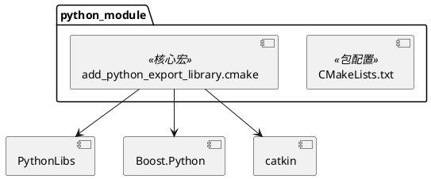
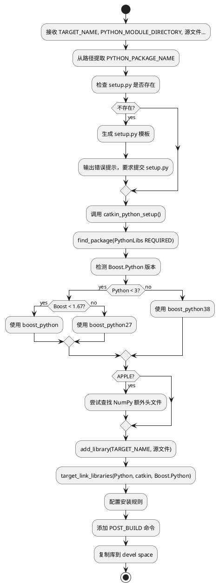

# python_module 模块文档

> Python 模块构建的 CMake 工具，简化 Boost.Python 绑定库的创建

---

## 1. 📋 功能说明

### 1.1 定位
python_module 是 Schweizer-Messer 库的 Python 构建工具模块，提供了 CMake 宏 `add_python_export_library`，大幅简化了在 ROS/catkin 环境中创建 Boost.Python 绑定库的复杂度。

### 1.2 核心能力
- **一键创建 Python 绑定库**：单个 CMake 宏完成所有配置
- **自动 Python 发现**：自动查找 Python 库和头文件
- **智能 Boost.Python 版本检测**：自动处理 Boost 1.67+ 的库名变更
- **Apple 平台支持**：自动处理 macOS 的 NumPy 头文件路径
- **setup.py 自动生成**：检测并提示创建 setup.py
- **catkin 集成**：完美集成 catkin 构建系统
- **自动安装规则**：配置正确的安装路径
- **Devel space 同步**：构建后自动复制到 devel space

---

## 2. 🏗️ 架构设计

python_module 是一个纯 CMake 工具模块，提供 `add_python_export_library` 宏。



### 2.1 主要组件划分
1. **CMake 宏层**：add_python_export_library 主宏
2. **Python 发现层**：find_package(PythonLibs)
3. **Boost.Python 适配层**：版本检测和库名适配
4. **Apple 特殊处理层**：NumPy 头文件路径处理
5. **catkin 集成层**：setup.py、catkin_python_setup、安装规则

### 2.2 数据流走向
```
CMake 调用宏 → Python 发现 → Boost.Python 检测 → 创建库目标 → 链接 → 安装规则 → devel space 复制
```

### 2.3 关键设计模式
- **宏模式**：CMake 宏封装复杂逻辑
- **策略模式**：不同 Boost 版本的不同处理
- **平台适配模式**：Apple 平台特殊处理
- **约定优于配置**：自动推断 Python 包名

---

## 3. 🔑 关键方法

### 3.1 add_python_export_library 宏
```cmake
FUNCTION(add_python_export_library TARGET_NAME PYTHON_MODULE_DIRECTORY)
    # ... 实现 ...
ENDFUNCTION()
```
**原理**：封装所有 Python 绑定库创建的复杂逻辑

**实现位置**：`cmake/add_python_export_library.cmake:17-149`



---

### 3.2 Python 包名提取
```cmake
get_filename_component(TMP "${PYTHON_MODULE_DIRECTORY}/garbage.txt" PATH)
get_filename_component(PYTHON_PACKAGE_NAME "${TMP}.txt" NAME_WE)
get_filename_component(PYTHON_MODULE_DIRECTORY_PREFIX "${TMP}.txt" PATH)
```
**原理**：使用 CMake 的 get_filename_component 技巧提取路径的叶节点作为包名

**实现位置**：`cmake/add_python_export_library.cmake:22-26`

---

### 3.3 Boost.Python 版本适配
```cmake
if(PYTHONLIBS_VERSION_STRING VERSION_LESS 3)
    find_package(Boost QUIET)
    if(Boost_VERSION LESS 106700)
        list(APPEND BOOST_COMPONENTS python)
    else()
        list(APPEND BOOST_COMPONENTS python27)
    endif()
else()
    list(APPEND BOOST_COMPONENTS python38)
endif()
```
**原理**：根据 Python 版本和 Boost 版本选择正确的 Boost.Python 库名

**实现位置**：`cmake/add_python_export_library.cmake:74-90`

---

## 4. 🔌 对外接口

### 4.1 主要 CMake 宏

#### 4.1.1 `add_python_export_library`
```cmake
add_python_export_library(
    TARGET_NAME
    PYTHON_MODULE_DIRECTORY
    source1.cpp
    source2.cpp
    ...
)
```
**用途**：创建 Python 导出库

**参数**：
- `TARGET_NAME` — 目标库名称
- `PYTHON_MODULE_DIRECTORY` — Python 模块目录（包含 __init__.py 的目录）
- `source1...` — 源文件列表

**输入输出接口定义**：
```
输入:
  TARGET_NAME: CMake 目标名称
  PYTHON_MODULE_DIRECTORY: Python 模块目录路径
  ARGN: C++ 源文件列表

输出:
  创建 CMake 库目标
  配置链接 Python、catkin、Boost.Python
  配置安装规则
  添加 POST_BUILD 命令复制到 devel space
```

---

### 4.2 生成的 setup.py 模板

#### 4.2.1 自动生成的 setup.py
```python
## ! DO NOT MANUALLY INVOKE THIS setup.py, USE CATKIN INSTEAD

from distutils.core import setup
from catkin_pkg.python_setup import generate_distutils_setup

# fetch values from package.xml
setup_args = generate_distutils_setup(
    packages=['${PYTHON_PACKAGE_NAME}'],
    package_dir={'':'${PYTHON_MODULE_DIRECTORY_PREFIX}'})

setup(**setup_args)
```

---

### 4.3 核心变量

#### 4.3.1 内部变量
```cmake
PYTHON_PACKAGE_NAME          # 从路径提取的包名
PYTHON_MODULE_DIRECTORY_PREFIX  # 模块目录前缀
SETUP_PY                     # setup.py 路径
BOOST_COMPONENTS             # Boost 组件列表
PYTHON_LIB_DIR               # Python 库输出目录
```

---

## 5. 📦 依赖关系

### 5.1 内部依赖
无 - 这是独立的 CMake 工具模块

### 5.2 外部依赖
- **catkin** — ROS catkin 构建系统
- **PythonLibs** — Python C API 库
- **Boost.Python** — Boost Python 绑定库
- **NumPy** — （可选，Apple 平台）

---

## 6. 💡 使用示例

### 6.1 基本用法
```cmake
cmake_minimum_required(VERSION 3.0.2)
project(my_python_package)

find_package(catkin REQUIRED)
find_package(python_module REQUIRED)

# 包含宏
include(${python_module_PACKAGE_PATH}/cmake/add_python_export_library.cmake)

# 创建 Python 绑定库
# 假设目录结构:
#   src/
#     my_python_package/
#       __init__.py
#     bindings.cpp
add_python_export_library(
    ${PROJECT_NAME}_python
    ${PROJECT_SOURCE_DIR}/src/${PROJECT_NAME}
    src/bindings.cpp
)
```

### 6.2 使用 numpy_eigen
```cmake
cmake_minimum_required(VERSION 3.0.2)
project(my_eigen_package)

find_package(catkin REQUIRED)
find_package(python_module REQUIRED)
find_package(numpy_eigen REQUIRED)

# 包含两个宏
include(${python_module_PACKAGE_PATH}/cmake/add_python_export_library.cmake)
include(${numpy_eigen_PACKAGE_PATH}/cmake/add_python_export_library.cmake)

add_python_export_library(
    ${PROJECT_NAME}_python
    ${PROJECT_SOURCE_DIR}/src/${PROJECT_NAME}
    src/bindings.cpp
)

# 链接 numpy_eigen
target_link_libraries(${PROJECT_NAME}_python
    ${numpy_eigen_LIBRARIES}
)
```

### 6.3 目录结构示例
```
my_package/
├── CMakeLists.txt
├── package.xml
├── setup.py              # 自动生成或手动创建
└── src/
    ├── bindings.cpp       # C++ 绑定代码
    └── my_package/
        └── __init__.py    # Python 包初始化
```

### 6.4 C++ 绑定代码示例
```cpp
#include <boost/python.hpp>
#include <string>

std::string hello() {
    return "Hello from C++!";
}

int add(int a, int b) {
    return a + b;
}

BOOST_PYTHON_MODULE(libmy_package_python)
{
    using namespace boost::python;

    def("hello", &hello);
    def("add", &add);
}
```

### 6.5 Python 中使用
```python
import my_package.libmy_package_python

print(my_package.libmy_package_python.hello())
# 输出: Hello from C++!

print(my_package.libmy_package_python.add(2, 3))
# 输出: 5
```

---

## 7. 🔗 相关模块
- [numpy_eigen](./numpy_eigen.md) — NumPy/Eigen 转换器（常一起使用）
- [sm_python](./sm_python.md) — Python 绑定辅助工具

---

## 8. 📄 核心文件列表

| 文件 | 职责 |
|------|------|
| `CMakeLists.txt` | 包配置，导出 CFG_EXTRAS |
| `cmake/add_python_export_library.cmake` | 核心宏实现 |
