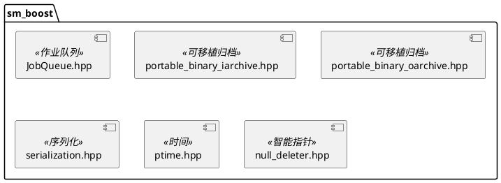

# sm_boost 模块文档

> Boost 库的扩展和封装

---

## 1. 🏗️ 架构设计

sm_boost 提供 Boost 库的扩展和封装，主要是可移植二进制归档和作业队列。



### 主要组件划分
1. **可移植二进制归档**：跨平台二进制序列化
2. **作业队列**：线程安全任务队列
3. **Boost 扩展**：时间、智能指针等工具

---

## 2. 🔑 关键方法

### 2.1 作业队列
```cpp
class JobQueue {
public:
    JobQueue(int numThreads);
    void schedule(boost::function<void()> job);
    void waitForEmptyQueue();
    void stopProcessingJobs();
};
```
**原理**：线程池 + 任务队列模式

**实现位置**：`include/sm/boost/JobQueue.hpp` + `src/JobQueue.cpp`

---

### 2.2 可移植二进制归档
```cpp
boost::archive::portable_binary_iarchive
boost::archive::portable_binary_oarchive
```
**原理**：处理字节序，实现跨平台兼容性

**实现位置**：`include/boost/portable_binary_iarchive.hpp` + `include/boost/portable_binary_oarchive.hpp`

---

## 3. 🔌 外部接口

### 3.1 JobQueue 类
```cpp
JobQueue::JobQueue(int numThreads);
void JobQueue::schedule(boost::function<void()> job);
void JobQueue::waitForEmptyQueue();
void JobQueue::stopProcessingJobs();
```
**用途**：线程安全的作业队列

**输入输出接口定义**：
```
输入:
  - 构造: numThreads (工作线程数)
  - schedule: job (要执行的函数)

输出:
  - 无返回值，异步执行
```

---

## 4. 📋 功能说明

### 4.1 定位
sm_boost 模块提供了对 Boost 库的扩展和封装，包括可移植二进制归档、作业队列和其他 Boost 相关的工具。

### 4.2 核心能力
- **可移植二进制归档**：跨平台的二进制序列化
- **作业队列**：线程安全的任务队列
- **Boost 序列化扩展**：增强的序列化功能
- **时间工具**：Boost.DateTime 的辅助工具

---

## 5. 📦 依赖关系

### 5.1 内部依赖
- sm_common — 基础工具

### 5.2 外部依赖
- Boost (system, serialization, thread) — 核心 Boost 库

---

## 6. 💡 使用示例

### 6.1 使用可移植二进制归档
```cpp
#include <boost/portable_binary_oarchive.hpp>
#include <fstream>

std::ofstream ofs("data.bin");
boost::archive::portable_binary_oarchive oa(ofs);
oa << my_object;
```

### 6.2 使用作业队列
```cpp
#include <sm/boost/JobQueue.hpp>

sm::JobQueue queue(4);
queue.schedule([](){ /* 作业 */ });
queue.waitForEmptyQueue();
```

---

## 7. 🔗 相关模块
- [sm_common](./sm_common.md) — 基础依赖

---

## 8. 📄 核心文件列表

| 文件 | 职责 |
|------|------|
| `include/sm/boost/JobQueue.hpp` | 作业队列接口 |
| `src/JobQueue.cpp` | 作业队列实现 |
| `include/boost/portable_binary_iarchive.hpp` | 可移植二进制输入归档 |
| `include/boost/portable_binary_oarchive.hpp` | 可移植二进制输出归档 |
| `include/sm/boost/serialization.hpp` | 序列化工具 |
| `include/sm/boost/ptime.hpp` | 时间工具 |
| `include/sm/boost/null_deleter.hpp` | 空删除器 |

