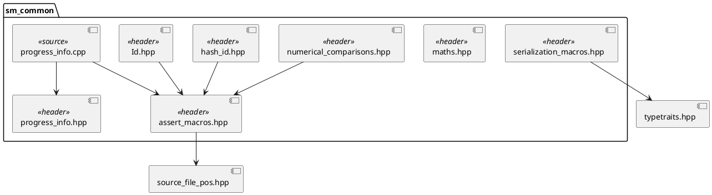
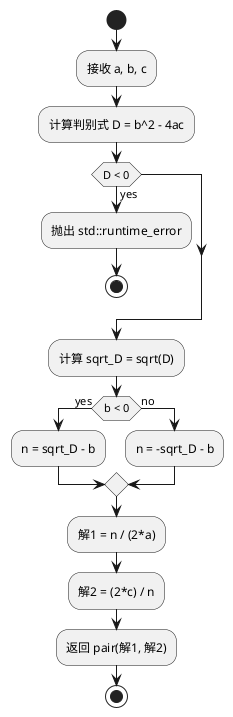
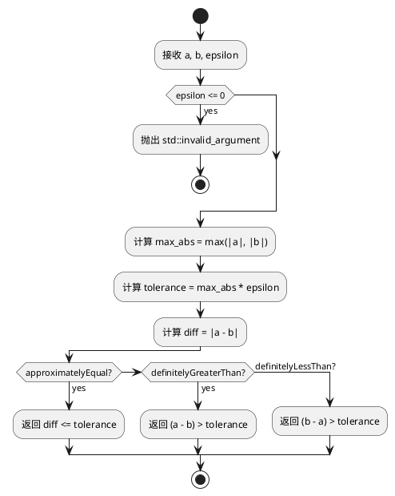
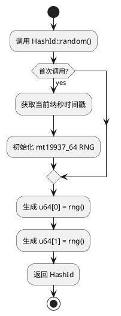
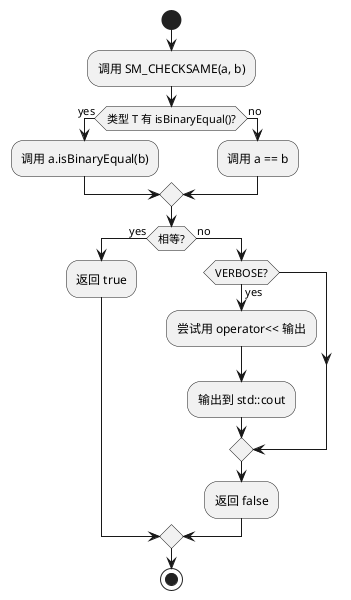

# sm_common 模块文档

> 基础工具和通用功能模块，为整个 Schweizer-Messer 库提供底层支持

---

## 1. 📋 功能说明

### 1.1 定位
sm_common 是 Schweizer-Messer 库的核心基础模块，提供了通用的工具类、宏定义和辅助功能。它是其他所有 sm_* 模块的基础，不依赖于其他 sm_* 模块。

### 1.2 核心能力
- **断言和异常宏**：提供强大的断言机制和异常定义工具
- **类型安全的 ID**：强类型的 ID 类，避免 ID 混淆
- **数学工具**：二次方程求解、符号函数等基础数学功能
- **序列化辅助**：用于序列化的比较宏和工具
- **进度显示**：简单的进度条显示功能
- **数值比较**：浮点数相对误差比较
- **128位 Hash ID**：用于无序容器的高性能键
- **对齐内存分配**：Eigen 库所需的对齐内存分配工具

---

## 2. 🏗️ 架构设计

sm_common 采用纯头文件加少量实现文件的结构。大部分功能通过头文件提供，只有 `progress_info.cpp` 包含实际的实现代码。



### 主要组件划分
1. **断言系统**：assert_macros.hpp + source_file_pos.hpp
2. **ID 系统**：Id.hpp + hash_id.hpp
3. **数学工具**：maths.hpp + numerical_comparisons.hpp
4. **序列化辅助**：serialization_macros.hpp + typetraits.hpp
5. **进度显示**：progress_info.hpp + progress_info.cpp

### 数据流走向
```
用户代码 → 宏展开 → 编译时检查 → 运行时断言/异常 → 错误信息输出
```

### 关键设计模式
- **宏模板模式**：断言和 ID 定义使用宏生成代码
- **SFINAE 模式**：序列化比较使用模板元编程选择方法
- **单例模式**：VerboseChecker 使用单例
- **策略模式**：isSame 模板特化选择比较策略

---

## 3. 🔑 关键方法

### 3.1 二次方程求解
```cpp
std::pair<double, double> solveQuadratic(double a, double b, double c);
```
**原理**：使用数值稳定的算法避免精度损失，参考维基百科中关于 Loss of significance 的讨论

**避免精度损失的关键**：
- 当 b > 0 时，避免计算 `-b + sqrt(b²-4ac)`（两个接近的数相减）
- 当 b < 0 时，避免计算 `-b - sqrt(b²-4ac)`（同样问题）
- 使用替代公式：\( x_1 = \frac{n}{2a}, x_2 = \frac{2c}{n} \)，其中 \( n = \pm\sqrt{D} - b \)

**实现位置**：`include/sm/maths.hpp:21-39`

**复杂度**：O(1)



---

### 3.2 浮点数相对误差比较
```cpp
template<typename ValueType_>
static bool approximatelyEqual(const ValueType_ a, const ValueType_ b, ValueType_ epsilon);

template<typename ValueType_>
static bool definitelyGreaterThan(const ValueType_ a, const ValueType_ b, ValueType_ epsilon);

template<typename ValueType_>
static bool definitelyLessThan(const ValueType_ a, const ValueType_ b, ValueType_ epsilon);
```
**原理**：比较 \( |a - b| \leq \max(|a|, |b|) \times \epsilon \)

**实现位置**：`include/sm/numerical_comparisons.hpp:61-93`

**复杂度**：O(1)



---

### 3.3 HashId 随机生成
```cpp
static HashId random();
void randomize();
```
**原理**：使用 mt19937_64 随机数生成器，种子来自首次调用时的纳秒级时间戳

**种子安全性**：
- 使用 `std::chrono::high_resolution_clock` 纳秒级时间戳
- 584 年周期内不会重复（假设没有两个 agent 在同一纳秒初始化）

**实现位置**：`include/sm/hash_id.hpp:75-79, 119-126`

**复杂度**：O(1)



---

### 3.4 序列化比较 SFINAE 选择
```cpp
SM_CHECKSAME(THIS, OTHER)
SM_CHECKSAME(THIS, OTHER, VERBOSE)
```
**原理**：使用模板元编程在编译时选择比较方法

**关键 SFINAE 结构**：
- `HasIsBinaryEqual<T>` — 检测是否有 `isBinaryEqual()` 成员
- `HasOStreamOperator<Stream, T>` — 检测是否有 `operator<<`
- `isSame<hasIsBinaryEqual, T>` — 特化选择比较方法
- `streamIf<hasOStream, T>` — 特化选择输出方法

**实现位置**：`include/sm/serialization_macros.hpp:89-286`



---

## 4. 🔌 对外接口

### 4.1 主要类

#### `Id`
**用途**：类型安全的 ID 基类，用于创建强类型的 ID

**关键方法**：
- `Id(id_type id)` — 构造函数，接受 uint64 类型的 ID
- `Id()` — 默认构造函数，初始化为无效值 (-1)
- `getId()` — 获取底层的 uint64 值
- `isSet()` — 检查 ID 是否已设置（非 -1）
- `isBinaryEqual(const Id & rhs)` — 二进制比较
- `clear()` — 清除为无效值
- `setRandom()` — 设置为随机值
- `value()` — 获取值的别名
- 完整的比较运算符：`==`, `!=`, `<`, `>`, `<=`, `>=`
- 自增运算符：前缀和后缀 `++`

**输入输出接口定义**：
```
输入:
  - 构造时: id_type (uint64)
  - 比较时: const Id & rhs

输出:
  - getId(): id_type (uint64)
  - isSet(): bool
  - isBinaryEqual(): bool
  - 比较运算符: bool
```

---

#### `HashId`
**用途**：128 位哈希 ID，可用作无序容器的键

**关键方法**：
- `HashId()` — 默认构造，初始化为无效
- `HashId(const HashId& other)` — 拷贝构造
- `static random()` — 静态工厂方法，生成随机 ID
- `hexString()` — 获取十六进制字符串表示
- `fromHexString(hexString)` — 从十六进制字符串反序列化
- `randomize()` — 随机化当前 ID
- `isValid()` — 检查是否有效
- `setInvalid()` — 设置为无效
- 完整的比较运算符：`==`, `!=`, `<`, `>`

**输入输出接口定义**：
```
输入:
  - fromHexString(): const std::string & (32字符十六进制)

输出:
  - random(): HashId
  - hexString(): std::string (32字符)
  - isValid(): bool
  - 比较运算符: bool
```

---

#### `ProgressInfo`
**用途**：显示进度信息的工具类

**关键静态方法**：
- `showProgress(double progress)` — 显示 0-1 之间的进度
- `showProgress(T1 done, T2 all)` — 显示完成数量和总数

**输入输出接口定义**：
```
输入:
  - showProgress(double): double (范围 [0.0, 1.0])
  - showProgress(T1, T2): T1 (已完成), T2 (总数 > 0)

输出:
  - 无返回值，直接输出到 stdout
  - 进度格式: "XX.XX% complete" (回车刷新)
  - 完成格式: "Complete!" (换行)
```

---

### 4.2 主要宏

#### 异常定义宏
```cpp
SM_DEFINE_EXCEPTION(exceptionName, exceptionParent)
```
**用途**：定义新的异常类
**参数**：
- `exceptionName` — 新异常类名
- `exceptionParent` — 父异常类（通常为 std::runtime_error）

**示例**：
```cpp
SM_DEFINE_EXCEPTION(MyException, std::runtime_error);
// 等价于定义:
// class MyException : public std::runtime_error { ... };
```

---

#### ID 定义宏
```cpp
SM_DEFINE_ID(IdTypeName)
```
**用途**：快速定义类型安全的 ID 类
**参数**：
- `IdTypeName` — 新 ID 类名

**示例**：
```cpp
SM_DEFINE_ID(VertexId);
SM_DEFINE_ID(EdgeId);
// VertexId 和 EdgeId 不能混用，类型安全
```

#### ID Hash 定义宏
```cpp
SM_DEFINE_ID_HASH(FullyQualifiedIdTypeName)
```
**用途**：为自定义 ID 类型定义 std::hash 和 boost::hash 特化
**参数**：
- `FullyQualifiedIdTypeName` — 完全限定的 ID 类型名

---

#### 断言宏系列

**真值断言**：
```cpp
SM_ASSERT_TRUE(exceptionType, condition, message)
SM_ASSERT_FALSE(exceptionType, condition, message)
```

**相等性断言**：
```cpp
SM_ASSERT_EQ(exceptionType, value, testValue, message)
SM_ASSERT_NE(exceptionType, value, testValue, message)
```

**范围断言**：
```cpp
SM_ASSERT_LT(exceptionType, value, upperBound, message)   // value < upperBound
SM_ASSERT_LE(exceptionType, value, upperBound, message)   // value <= upperBound
SM_ASSERT_GT(exceptionType, value, lowerBound, message)   // value > lowerBound
SM_ASSERT_GE(exceptionType, value, lowerBound, message)   // value >= lowerBound
SM_ASSERT_GE_LT(exceptionType, value, lowerBound, upperBound, message)  // 区间 [lb, ub)
```

**近似断言**：
```cpp
SM_ASSERT_NEAR(exceptionType, value, testValue, abs_error, message)
```

**抛出异常宏**：
```cpp
SM_THROW(exceptionType, message)
SM_THROW_SFP(exceptionType, SourceFilePos, message)
```

**调试版本**（以上所有宏都有 `_DBG` 后缀版本，在 `NDEBUG` 定义时禁用）：
```cpp
SM_ASSERT_TRUE_DBG(exceptionType, condition, message)
// ... 其他 _DBG 版本
```

**输入输出接口定义**：
```
输入:
  - exceptionType: 异常类类型
  - condition: bool 表达式
  - message: std::string 或可流式输出的表达式
  - value/testValue: 要比较的值
  - abs_error: 绝对误差容限

输出:
  - 断言失败: 抛出 exceptionType 异常
  - 异常信息格式: "[exceptionType] FUNCTION FILE:LINE assert(...) failed: message"
  - 断言成功: 无输出，继续执行
```

---

#### 序列化比较宏
```cpp
SM_CHECKSAME(THIS, OTHER)
SM_CHECKSAME(THIS, OTHER, VERBOSE)
SM_CHECKMEMBERSSAME(OTHER, MEMBER)
SM_CHECKMEMBERSSAME(OTHER, MEMBER, VERBOSE)
SET_CHECKSAME_VERBOSE
SET_CHECKSAME_SILENT
SET_CHECKSAME_VERBOSITY(verbose)
```

**用途**：比较对象是否相等，自动选择 `isBinaryEqual()` 或 `operator==`

**输入输出接口定义**：
```
输入:
  - THIS: 当前对象
  - OTHER: 要比较的对象
  - MEMBER: 成员变量名
  - VERBOSE: bool (是否输出详细信息)

输出:
  - 返回 bool (相等返回 true，不等返回 false)
  - VERBOSE=true 时: 输出差异到 std::cout
```

---

### 4.3 主要函数

#### 二次方程求解
```cpp
std::pair<double, double> solveQuadratic(double a, double b, double c);
```
**用途**：求解二次方程 \( ax^2 + bx + c = 0 \)，使用数值稳定算法

**参数**：
- `a` — 二次项系数
- `b` — 一次项系数
- `c` — 常数项

**返回值**：包含两个解的 pair，按顺序为 [解1, 解2]

**异常**：
- `std::runtime_error` — 当 \( b^2 - 4ac < 0 \) 时抛出（不支持复数解）

**输入输出接口定义**：
```
输入:
  a: double (二次项系数，不能为 0)
  b: double (一次项系数)
  c: double (常数项)

输出:
  std::pair<double, double>:
    first:  double (第一个解)
    second: double (第二个解)

异常:
  std::runtime_error: 当判别式 b^2 - 4ac < 0 时
```

---

#### 符号函数
```cpp
template <typename T> int sgn(T val);
```
**用途**：符号函数

**参数**：
- `val` — 输入值

**返回值**：
- `-1` — 负数
- `0` — 零
- `+1` — 正数

**输入输出接口定义**：
```
输入:
  val: T (任意可比较的数值类型)

输出:
  int: -1, 0, 或 +1
```

---

#### 浮点数比较函数
```cpp
template<typename ValueType_>
static bool approximatelyEqual(
    const ValueType_ a,
    const ValueType_ b,
    ValueType_ epsilon = std::numeric_limits<ValueType_>::epsilon());

template<typename ValueType_>
static bool definitelyGreaterThan(
    const ValueType_ a,
    const ValueType_ b,
    ValueType_ epsilon = std::numeric_limits<ValueType_>::epsilon());

template<typename ValueType_>
static bool definitelyLessThan(
    const ValueType_ a,
    const ValueType_ b,
    ValueType_ epsilon = std::numeric_limits<ValueType_>::epsilon());
```

**用途**：使用相对误差比较浮点数

**参数**：
- `a` — 第一个数
- `b` — 第二个数
- `epsilon` — 相对误差容限（可选，默认使用类型精度）

**返回值**：比较结果的 bool 值

**输入输出接口定义**：
```
输入:
  a: ValueType_ (第一个数)
  b: ValueType_ (第二个数)
  epsilon: ValueType_ (相对误差，> 0，可选)

输出:
  approximatelyEqual(): bool (|a-b| <= max(|a|,|b|) * epsilon)
  definitelyGreaterThan(): bool (a > b + max(|a|,|b|) * epsilon)
  definitelyLessThan(): bool (a < b - max(|a|,|b|) * epsilon)

异常:
  std::invalid_argument: 当 epsilon <= 0 时
```

---

### 4.4 核心数据结构

#### Id 内部存储
```cpp
typedef boost::uint64_t id_type;

class Id {
protected:
    id_type _id;  // 底层存储，-1 表示无效
};
```

#### HashId 内部存储
```cpp
union HashVal {
    unsigned char c[16];    // 字节访问
    uint_fast64_t u64[2];   // 64位字访问
};
HashVal val_;
```

#### 对齐内存分配辅助
```cpp
template<template<typename, typename> class Container, typename Type>
struct Aligned {
    typedef Container<Type, Eigen::aligned_allocator<Type> > type;
};
```
**用途**：为 STL 容器提供 Eigen 兼容的对齐分配器

---

## 5. 📦 依赖关系

### 5.1 内部依赖
无 - 这是基础模块

### 5.2 外部依赖
- **Boost (system)** — 用于基础功能
- **Boost (cstdint)** — 整数类型定义
- **Boost (functional/hash)** — 哈希支持
- **Boost (serialization)** — 序列化支持（ID 序列化）
- **Boost (chrono)** — 高精度时钟（HashId）
- **Boost (random)** — 随机数生成（HashId）
- **Eigen3** — 用于对齐内存分配辅助（可选）

---

## 6. 💡 使用示例

### 6.1 定义类型安全的 ID
```cpp
#include <sm/Id.hpp>

// 定义类型安全的 ID
SM_DEFINE_ID(VertexId);
SM_DEFINE_ID(EdgeId);

// 使用
VertexId v1(0);
VertexId v2(1);
EdgeId e(0);

// 类型安全 - 不能混用
// v1 == e; // 编译错误！

// 比较和自增
if (v1 < v2) {
    ++v1;
}

// 检查有效性
if (v1.isSet()) {
    std::cout << "Vertex ID: " << v1.getId() << std::endl;
}
```

### 6.2 使用 HashId
```cpp
#include <sm/hash_id.hpp>
#include <unordered_map>

// 生成随机 ID
sm::HashId id1 = sm::HashId::random();
sm::HashId id2 = sm::HashId::random();

// 作为无序容器的键
std::unordered_map<sm::HashId, std::string> map;
map[id1] = "object1";
map[id2] = "object2";

// 序列化
std::string hex = id1.hexString();
std::cout << "Hash: " << hex << std::endl;

// 反序列化
sm::HashId id3;
if (id3.fromHexString(hex)) {
    assert(id3 == id1);
}

// 比较
if (id1 != id2) {
    std::cout << "Different IDs" << std::endl;
}
```

### 6.3 使用断言
```cpp
#include <sm/assert_macros.hpp>

// 定义异常
SM_DEFINE_EXCEPTION(MyException, std::runtime_error);

void processValue(double value) {
    // 基本断言
    SM_ASSERT_GE(MyException, value, 0.0, "Value must be non-negative");
    SM_ASSERT_LT(MyException, value, 100.0, "Value too large");

    // 相等性断言
    SM_ASSERT_NEAR(MyException, value, 50.0, 0.001, "Value not near expected");
}

// 直接抛出异常
void criticalError() {
    SM_THROW(MyException, "Something went horribly wrong");
}

// 调试版本断言（Release 模式下禁用）
void debugCheck(int index) {
    SM_ASSERT_GE_DBG(MyException, index, 0, "Index negative");
}
```

### 6.4 求解二次方程
```cpp
#include <sm/maths.hpp>

try {
    // 求解 x^2 - 3x + 2 = 0
    auto solutions = sm::solveQuadratic(1.0, -3.0, 2.0);
    std::cout << "Solutions: " << solutions.first
              << ", " << solutions.second << std::endl;
    // 输出: Solutions: 2, 1
} catch (const std::runtime_error & e) {
    std::cout << "No real solutions: " << e.what() << std::endl;
}

// 符号函数
std::cout << sm::sgn(-5.0) << std::endl;  // -1
std::cout << sm::sgn(0.0) << std::endl;   // 0
std::cout << sm::sgn(5.0) << std::endl;   // 1
```

### 6.5 浮点数比较
```cpp
#include <sm/numerical_comparisons.hpp>

double a = 1.0;
double b = 1.000000001;

// 近似相等（相对误差）
if (sm::approximatelyEqual(a, b, 1e-6)) {
    std::cout << "Values are approximately equal" << std::endl;
}

// 明确大于
double c = 1.001;
if (sm::definitelyGreaterThan(c, a, 1e-6)) {
    std::cout << "c is definitely greater than a" << std::endl;
}

// 明确小于
double d = 0.999;
if (sm::definitelyLessThan(d, a, 1e-6)) {
    std::cout << "d is definitely less than a" << std::endl;
}
```

### 6.6 进度显示
```cpp
#include <sm/progress_info.hpp>

// 处理循环
for (int i = 0; i <= 100; ++i) {
    // 显示进度 (0.0 到 1.0)
    sm::showProgress(static_cast<double>(i) / 100.0);

    // 或者用两个参数
    // sm::showProgress(i, 100);

    // 模拟工作
    std::this_thread::sleep_for(std::chrono::milliseconds(10));
}
// 完成时自动输出 "Complete!"
```

### 6.7 序列化比较
```cpp
#include <sm/serialization_macros.hpp>

class MyClass {
public:
    int value_;

    // 可选: 定义 isBinaryEqual 进行自定义比较
    bool isBinaryEqual(const MyClass& other) const {
        return value_ == other.value_;
    }
};

MyClass a, b;
a.value_ = 42;
b.value_ = 42;

// 比较对象（自动选择 isBinaryEqual 或 operator==）
if (SM_CHECKSAME(a, b)) {
    std::cout << "Objects are equal" << std::endl;
}

// 详细模式（失败时输出）
SET_CHECKSAME_VERBOSE;
b.value_ = 43;
SM_CHECKSAME(a, b);  // 输出详细差异信息

// 比较成员变量
SM_CHECKMEMBERSSAME(b, value_);
```

---

## 7. 🔗 相关模块
- [sm_eigen](./sm_eigen.md) — Eigen 扩展，依赖 sm_common
- [sm_boost](./sm_boost.md) — Boost 扩展，依赖 sm_common
- 所有其他 sm_* 模块都依赖 sm_common

---

## 8. 📄 核心文件列表

| 文件 | 职责 | 行数 |
|------|------|------|
| `include/sm/assert_macros.hpp` | 断言和异常宏定义 | 300 |
| `include/sm/Id.hpp` | 类型安全的 ID 类 | 216 |
| `include/sm/hash_id.hpp` | 128位哈希 ID 类 | 160 |
| `include/sm/maths.hpp` | 基础数学工具 | 57 |
| `include/sm/numerical_comparisons.hpp` | 浮点数比较 | 97 |
| `include/sm/serialization_macros.hpp` | 序列化辅助宏 | 404 |
| `include/sm/progress_info.hpp` | 进度显示工具 | 23 |
| `src/progress_info.cpp` | 进度显示实现 | 32 |
| `include/sm/source_file_pos.hpp` | 源文件位置 | - |
| `include/sm/typetraits.hpp` | 类型特性 | - |
| `include/sm/aligned_allocation.h` | Eigen 对齐内存分配 | - |
| `include/sm/round.hpp` | 舍入工具 | - |
| `include/sm/string_routines.hpp` | 字符串工具 | - |
| `include/sm/is_binary_equal.hpp` | 二进制比较 | - |
