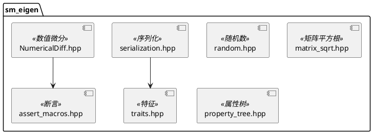

# sm_eigen 模块文档

> Eigen 矩阵库的扩展和增强功能

---

## 1. 📋 功能说明

### 1.1 定位
sm_eigen 模块为 Eigen3 线性代数库提供了扩展功能，包括序列化、随机数生成、数值微分、矩阵平方根等实用工具。

### 1.2 核心能力
- **Eigen 矩阵序列化**：使用 Boost.Serialization 序列化/反序列化 Eigen 矩阵
- **随机向量生成**：生成正态分布的随机向量
- **矩阵平方根**：计算矩阵的平方根
- **数值微分**：数值雅可比矩阵计算
- **属性树集成**：与 sm_property_tree 集成
- **Eigen 断言宏**：Eigen 专用的断言工具

---

## 2. 🏗️ 架构设计

sm_eigen 提供 Eigen3 线性代数库的扩展功能，主要是头文件库。



### 2.1 主要组件划分
1. **序列化**：Eigen 矩阵 Boost 序列化
2. **随机数**：随机向量生成
3. **矩阵平方根**：矩阵平方根计算
4. **数值微分**：数值雅可比计算
5. **属性树集成**：与 sm_property_tree 集成
6. **断言宏**：Eigen 专用断言

### 2.2 数据流走向
```
Eigen 矩阵 → 序列化 → Boost 归档 → 存储/传输
                    ↓
              反序列化 → Eigen 矩阵
```

### 2.3 关键设计模式
- **模板特化**：为不同 Eigen 类型提供序列化特化
- **SFINAE**：编译时类型检查
- **策略模式**：数值微分的不同步长策略

---

## 3. 🔑 关键方法

### 3.1 随机向量生成
```cpp
Eigen::VectorXd randn(unsigned dim);
```
**原理**：生成标准正态分布的随机向量

**实现位置**：`include/sm/eigen/random.hpp` + `src/random.cpp`

**复杂度**：O(n)，n 为向量维度

```plantuml
@startuml
start
:接收维度 dim;
:创建 VectorXd(dim);
for (i = 0; i < dim; i++)
    :生成 N(0,1) 随机数;
    :赋值给 vec[i];
endforeach
:返回 vec;
stop
@enduml
```

---

### 3.2 矩阵平方根
```cpp
void matrixSqrt(const Eigen::MatrixXd & A,
                Eigen::MatrixXd & sqrtA,
                Eigen::MatrixXd & sqrtAinv);
```
**原理**：计算矩阵的平方根及其逆

**实现位置**：`include/sm/eigen/matrix_sqrt.hpp`

---

### 3.3 数值微分
```cpp
template<typename Functor>
class NumericalDiff {
public:
    void estimateJacobian(const Eigen::VectorXd & x,
                          Eigen::MatrixXd & J);
};
```
**原理**：用有限差分估计雅可比矩阵

**实现位置**：`include/sm/eigen/NumericalDiff.hpp`

---

## 4. 🔌 对外接口

### 4.1 主要函数

#### 4.1.1 随机向量生成
```cpp
Eigen::VectorXd randn(unsigned dim);
```
**用途**：生成指定维度的正态分布随机向量

**参数**：
- `dim` — 向量维度

**返回值**：dim 维随机向量，每个元素 ~ N(0,1)

**输入输出接口定义**：
```
输入:
  dim: unsigned 向量维度

输出:
  VectorXd: dim维随机向量，元素~N(0,1)
```

---

#### 4.1.2 矩阵平方根
```cpp
void matrixSqrt(const Eigen::MatrixXd & A,
                Eigen::MatrixXd & sqrtA,
                Eigen::MatrixXd & sqrtAinv);
```
**用途**：计算矩阵的平方根及其逆

**参数**：
- `A` — 输入矩阵
- `sqrtA` — 输出矩阵平方根
- `sqrtAinv` — 输出矩阵平方根的逆

---

### 4.2 主要类

#### 4.2.1 `NumericalDiff<Functor>`
**用途**：数值雅可比矩阵计算

**关键方法**：
- `NumericalDiff(Functor & functor, double eps = 1e-6)` — 构造函数
- `estimateJacobian(const Eigen::VectorXd & x, Eigen::MatrixXd & J)` — 估计雅可比

---

### 4.3 核心数据结构

#### 4.3.1 序列化支持
```cpp
// 自动为 Eigen::Matrix 提供 Boost.Serialization 支持
// 支持: MatrixXd, VectorXd, Matrix3d, Vector3d 等
```

---

## 5. 📦 依赖关系

### 5.1 内部依赖
- sm_common — 基础工具和断言

### 5.2 外部依赖
- Eigen3 — 核心矩阵库
- Boost (system, serialization) — 序列化支持

---

## 6. 💡 使用示例

### 6.1 序列化 Eigen 矩阵
```cpp
#include <sm/eigen/serialization.hpp>
#include <boost/archive/text_oarchive.hpp>
#include <boost/archive/text_iarchive.hpp>
#include <sstream>

// 序列化
Eigen::Matrix3d mat = Eigen::Matrix3d::Random();
std::stringstream ss;
boost::archive::text_oarchive oa(ss);
oa << mat;

// 反序列化
Eigen::Matrix3d mat2;
boost::archive::text_iarchive ia(ss);
ia >> mat2;
```

### 6.2 生成随机向量
```cpp
#include <sm/eigen/random.hpp>

Eigen::VectorXd vec = sm::eigen::randn(3);
// vec = [N(0,1), N(0,1), N(0,1)]
```

### 6.3 数值雅可比计算
```cpp
#include <sm/eigen/NumericalDiff.hpp>

// 定义函数
struct MyFunctor {
    Eigen::VectorXd operator()(const Eigen::VectorXd & x) const {
        Eigen::VectorXd y(2);
        y(0) = x(0) * x(0);
        y(1) = x(1) * x(1);
        return y;
    }
};

// 计算数值雅可比
MyFunctor f;
sm::eigen::NumericalDiff<MyFunctor> numDiff(f);

Eigen::VectorXd x(2);
x << 1.0, 2.0;

Eigen::MatrixXd J;
numDiff.estimateJacobian(x, J);
// J ≈ [[2, 0], [0, 4]]
```

### 6.4 矩阵平方根
```cpp
#include <sm/eigen/matrix_sqrt.hpp>

Eigen::MatrixXd A(2, 2);
A << 4, 0,
     0, 9;

Eigen::MatrixXd sqrtA, sqrtAinv;
sm::eigen::matrixSqrt(A, sqrtA, sqrtAinv);
// sqrtA = [[2, 0], [0, 3]]
// sqrtAinv = [[0.5, 0], [0, 1/3]]
```

---

## 7. 🔗 相关模块
- [sm_common](./sm_common.md) — 基础依赖
- [sm_kinematics](./sm_kinematics.md) — 运动学库，依赖 sm_eigen

---

## 8. 📄 核心文件列表

| 文件 | 职责 |
|------|------|
| `include/sm/eigen/serialization.hpp` | Eigen 矩阵序列化 |
| `include/sm/eigen/random.hpp` | 随机向量生成 |
| `src/random.cpp` | 随机数实现 |
| `include/sm/eigen/matrix_sqrt.hpp` | 矩阵平方根 |
| `include/sm/eigen/NumericalDiff.hpp` | 数值微分 |
| `include/sm/eigen/property_tree.hpp` | 属性树集成 |
| `include/sm/eigen/assert_macros.hpp` | Eigen 断言 |
| `include/sm/eigen/traits.hpp` | Eigen 特征 |
