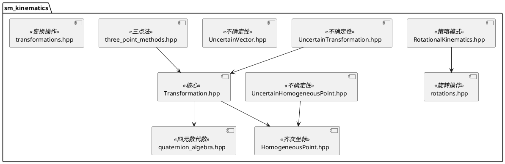
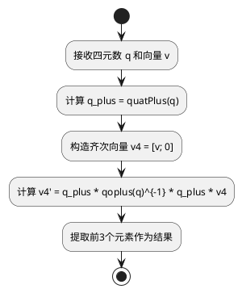
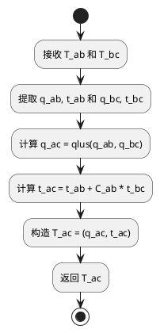

# sm_kinematics 模块文档

> 3D运动学和变换库，为整个Kalibr系统提供几何基础

---

## 1. 📋 功能说明

### 1.1 定位
sm_kinematics 是 Schweizer-Messer 库的核心运动学模块，提供了完整的 3D 几何变换和旋转表示功能。它是相机标定、状态估计等应用的几何基础。

### 1.2 核心能力
- **多种旋转表示**：四元数、旋转矩阵、欧拉角（ZYX、YawPitchRoll、ZXY）、旋转向量、Euler-Rodriguez 参数
- **刚体变换**：6 自由度变换表示，支持组合和逆
- **不确定性处理**：带不确定性的变换和点
- **齐次坐标**：齐次点表示和操作
- **插值**：变换和旋转的球面线性插值
- **三点法**：使用三点计算变换

---

## 2. 🏗️ 架构设计

sm_kinematics 采用分层设计，以 Transformation 类为核心，结合多种旋转表示和不确定性处理。



### 2.1 主要组件划分
1. **核心变换层**：Transformation + quaternion_algebra
2. **旋转表示层**：RotationalKinematics 策略模式 + 多种实现
3. **齐次坐标层**：HomogeneousPoint + homogeneous_coordinates
4. **不确定性层**：UncertainTransformation + UncertainHomogeneousPoint + UncertainVector
5. **工具算法层**：three_point_methods + rotations + transformations

### 2.2 数据流走向
```
旋转参数 → 四元数/旋转矩阵 → 变换组合 → 点变换 → 结果输出
          ↓
      不确定性传播
```

### 2.3 关键设计模式
- **策略模式**：RotationalKinematics 抽象基类，多种旋转表示
- **组合模式**：Transformation 操作符重载实现变换组合
- **值语义**：Transformation 等类设计为值类型，支持拷贝
- **模板方法模式**：序列化使用 save/load 分离

---

## 3. 🔑 关键方法

### 3.1 四元数代数

```cpp
Eigen::Matrix3d quat2r(Eigen::Vector4d const & q);
Eigen::Vector4d r2quat(Eigen::Matrix3d const & C);
Eigen::Vector4d axisAngle2quat(Eigen::Vector3d const & a);
Eigen::Vector3d quat2AxisAngle(Eigen::Vector4d const & q);
Eigen::Matrix4d quatPlus(Eigen::Vector4d const & q);
Eigen::Matrix4d quatOPlus(Eigen::Vector4d const & q);
Eigen::Vector4d quatInv(Eigen::Vector4d const & q);
Eigen::Vector3d quatRotate(Eigen::Vector4d const & q_a_b, Eigen::Vector3d const & v_b);
Eigen::Vector4d quatRandom();
Eigen::Vector4d quatIdentity();
Eigen::Vector4d updateQuat(Eigen::Vector4d const & q, Eigen::Vector3d const & dq);
Eigen::Vector4d qslerp(const Eigen::Vector4d & q0, const Eigen::Vector4d & q1, double t);
```

**原理**：基于论文 "Pose Estimation using Linearized Rotations and Quaternion Algebra" (Barfoot et al., 2010)

**关键创新**：
- 使用 \( q_+ \) 和 \( q_\oplus \) 运算符实现线性化
- 球面线性插值 (SLERP) 支持
- 约束敏感的最小参数更新

**实现位置**：`include/sm/kinematics/quaternion_algebra.hpp` + `src/quaternion_algebra.cpp`

**复杂度**：大部分操作 O(1)



---

### 3.2 Transformation 变换操作

```cpp
Transformation();
Transformation(const Eigen::Matrix4d & T_a_b);
Transformation(const Eigen::Vector4d & q_a_b, const Eigen::Vector3d & t_a_b_a);
Eigen::Matrix4d T() const;
Eigen::Matrix3d C() const;
const Eigen::Vector3d & t() const;
const Eigen::Vector4d & q() const;
Transformation inverse() const;
Transformation operator*(const Transformation & rhs) const;
Eigen::Vector3d operator*(const Eigen::Vector3d & rhs) const;
HomogeneousPoint operator*(const HomogeneousPoint & rhs) const;
void setIdentity();
void setRandom();
void oplus(const Eigen::Matrix<double,6,1> & dt);
Eigen::Matrix<double,6,6> S() const;
```

**原理**：使用四元数 + 平移向量表示 SE(3) 变换

**变换含义**：\( T_{ab} \) 将点从坐标系 b 变换到坐标系 a

**实现位置**：`include/sm/kinematics/Transformation.hpp` + `src/Transformation.cpp`

**复杂度**：变换组合 O(1)



---

### 3.3 三点法计算变换

```cpp
Transformation three_point_method(
    const std::vector<Eigen::Vector3d> & p_a,
    const std::vector<Eigen::Vector3d> & p_b);
```

**原理**：使用三个非共线点对计算刚体变换

**实现位置**：`include/sm/kinematics/three_point_methods.hpp` + `src/three_point_methods.cpp`

---

### 3.4 变换插值

```cpp
Transformation interpolateTransformations(
    const Transformation & T0, double s0,
    const Transformation & T1, double s1,
    double si);

Transformation slerpTransformations(
    const Transformation & T0,
    const Transformation & T1,
    double si);
```

**原理**：四元数球面线性插值 + 平移线性插值

**实现位置**：`include/sm/kinematics/transformations.hpp` + `src/transformations.cpp`

---

## 4. 🔌 对外接口

### 4.1 主要类

#### `Transformation`
**用途**：表示 3D 刚体变换 \( T_{ab} \)，将点从坐标系 b 变换到坐标系 a

**关键方法**：
- `Transformation()` — 默认构造，单位变换
- `Transformation(const Eigen::Matrix4d & T_ab)` — 从 4x4 矩阵构造
- `Transformation(const Eigen::Vector4d & q_ab, const Eigen::Vector3d & t_ab_a)` — 从四元数和平移构造
- `T()` — 获取 4x4 变换矩阵
- `C()` — 获取 3x3 旋转矩阵
- `t()` — 获取平移向量
- `q()` — 获取四元数
- `inverse()` — 返回逆变换
- `operator*` — 变换组合、点变换
- `setIdentity()` — 设置为单位变换
- `setRandom()` — 设置为随机变换
- `oplus(dt)` — 从最小更新更新变换
- `S()` — 获取 oplus 操作的 S 矩阵

**输入输出接口定义**：
```
输入:
  - 构造(Matrix4d): 4x4变换矩阵
  - 构造(q, t): 四元数[w,x,y,z] + 平移向量
  - operator*(Transformation): 右侧变换
  - operator*(Vector3d): 要变换的3D点
  - oplus(dt): 6维最小更新向量

输出:
  - T(): Matrix4d 4x4变换矩阵
  - C(): Matrix3d 旋转矩阵
  - t(): Vector3d 平移向量
  - q(): Vector4d 四元数
  - inverse(): Transformation 逆变换
  - operator*(Transformation): Transformation 组合变换
  - operator*(Vector3d): Vector3d 变换后的点
```

---

#### `HomogeneousPoint`
**用途**：齐次坐标表示的 3D 点

**关键方法**：
- `HomogeneousPoint()` — 默认构造
- `HomogeneousPoint(const Eigen::Vector3d & p)` — 从欧几里得点构造
- `HomogeneousPoint(const Eigen::Vector4d & p)` — 从齐次向量构造
- `toEuclidean()` — 转换为欧几里得坐标
- `operator*` — 变换齐次点

---

#### `RotationalKinematics`（抽象基类）
**用途**：旋转表示的抽象接口

**关键方法**（纯虚）：
- `parametersToRotationMatrix(parameters, S)` — 参数转旋转矩阵
- `rotationMatrixToParameters(C)` — 旋转矩阵转参数
- `parametersToSMatrix(parameters)` — 参数转 S 矩阵

**派生类**：
- `RotationVector` — 旋转向量
- `EulerAnglesZYX` — ZYX 欧拉角
- `EulerAnglesYawPitchRoll` — Yaw-Pitch-Roll 欧拉角
- `EulerAnglesZXY` — ZXY 欧拉角
- `EulerRodriguez` — Euler-Rodriguez 参数

---

#### `UncertainTransformation`
**用途**：带不确定性的刚体变换

**关键方法**：
- 继承 Transformation 的所有方法
- `U()` — 获取不确定性（6x6 协方差矩阵）

---

#### `UncertainHomogeneousPoint`
**用途**：带不确定性的齐次点

**关键方法**：
- 继承 HomogeneousPoint 的所有方法
- `U()` — 获取不确定性（4x4 协方差矩阵）

---

### 4.2 主要函数

#### 四元数代数函数
```cpp
Eigen::Matrix3d quat2r(Eigen::Vector4d const & q);
Eigen::Vector4d r2quat(Eigen::Matrix3d const & C);
Eigen::Vector4d axisAngle2quat(Eigen::Vector3d const & a);
Eigen::Vector3d quat2AxisAngle(Eigen::Vector4d const & q);
Eigen::Matrix4d quatPlus(Eigen::Vector4d const & q);
Eigen::Vector4d qplus(Eigen::Vector4d const & q, Eigen::Vector4d const & p);
Eigen::Matrix4d quatOPlus(Eigen::Vector4d const & q);
Eigen::Vector4d qoplus(Eigen::Vector4d const & q, Eigen::Vector4d const & p);
Eigen::Vector4d quatInv(Eigen::Vector4d const & q);
Eigen::Vector3d quatRotate(Eigen::Vector4d const & q_a_b, Eigen::Vector3d const & v_b);
Eigen::Vector4d quatRandom();
Eigen::Vector4d quatIdentity();
void invertQuat(Eigen::Vector4d & q);
Eigen::Vector3d qeps(Eigen::Vector4d const & q);
double qeta(Eigen::Vector4d const & q);
Eigen::Matrix<double,4,3> quatJacobian(Eigen::Vector4d const & q);
Eigen::Vector4d updateQuat(Eigen::Vector4d const & q, Eigen::Vector3d const & dq);
Eigen::Matrix<double,3,4> quatS(Eigen::Vector4d q);
Eigen::Matrix<double,4,3> quatInvS(Eigen::Vector4d q);
Eigen::Vector4d qslerp(const Eigen::Vector4d & q0, const Eigen::Vector4d & q1, double t);
Eigen::VectorXd lerp(const Eigen::VectorXd & p0, const Eigen::VectorXd & p1, double t);
```

**用途**：完整的四元数代数运算集

**输入输出接口定义**：
```
输入:
  - quat2r(): Vector4d 四元数 [w,x,y,z]
  - r2quat(): Matrix3d 旋转矩阵
  - quatRotate(): q(四元数), v(3D点)
  - qslerp(): q0, q1, t(插值参数 [0,1])

输出:
  - quat2r(): Matrix3d 旋转矩阵
  - r2quat(): Vector4d 四元数
  - quatRotate(): Vector3d 旋转后的点
  - qslerp(): Vector4d 插值后的四元数
```

---

#### 变换操作函数
```cpp
Transformation interpolateTransformations(
    const Transformation & T0, double s0,
    const Transformation & T1, double s1,
    double si);

Transformation slerpTransformations(
    const Transformation & T0,
    const Transformation & T1,
    double si);
```

**用途**：在两个变换之间插值

**输入输出接口定义**：
```
输入:
  - T0, T1: 两个变换
  - s0, s1: 对应的时间/参数值
  - si: 要插值的时间/参数值

输出:
  - Transformation: 插值后的变换
```

---

#### 三点法函数
```cpp
Transformation three_point_method(
    const std::vector<Eigen::Vector3d> & p_a,
    const std::vector<Eigen::Vector3d> & p_b);
```

**用途**：使用三个对应点对计算刚体变换

**输入输出接口定义**：
```
输入:
  - p_a: 坐标系a中的3个点
  - p_b: 坐标系b中的3个对应点

输出:
  - Transformation: 将点从b变换到a的变换 T_ab
```

---

### 4.3 核心数据结构

#### Transformation 内部存储
```cpp
class Transformation {
protected:
    Eigen::Vector4d _q_a_b;   // 四元数 [w,x,y,z]
    Eigen::Vector3d _t_a_b_a;  // 平移向量，在a中表示
};
```

#### 四元数约定
```
四元数格式: q = [w, x, y, z]
  w: 实部
  x,y,z: 虚部
满足: w² + x² + y² + z² = 1
```

---

## 5. 📦 依赖关系

### 5.1 内部依赖
- sm_common — 基础工具和断言
- sm_eigen — Eigen 扩展和序列化
- sm_boost — Boost 扩展（序列化）
- sm_random — 随机数生成

### 5.2 外部依赖
- Eigen3 — 矩阵运算
- Boost (system, serialization, filesystem) — 序列化和文件系统

---

## 6. 💡 使用示例

### 6.1 基本变换操作
```cpp
#include <sm/kinematics/Transformation.hpp>
#include <sm/kinematics/quaternion_algebra.hpp>

// 创建单位变换
sm::kinematics::Transformation T;

// 创建随机变换
T.setRandom();

// 从四元数和平移创建
Eigen::Vector4d q = sm::kinematics::quatIdentity();
Eigen::Vector3d t(1.0, 2.0, 3.0);
sm::kinematics::Transformation T_ab(q, t);

// 变换点
Eigen::Vector3d p_b(0.0, 0.0, 0.0);
Eigen::Vector3d p_a = T_ab * p_b;

// 变换组合
sm::kinematics::Transformation T_bc;
sm::kinematics::Transformation T_ac = T_ab * T_bc;

// 逆变换
sm::kinematics::Transformation T_ba = T_ab.inverse();
```

### 6.2 旋转插值
```cpp
#include <sm/kinematics/quaternion_algebra.hpp>

Eigen::Vector4d q0 = sm::kinematics::quatIdentity();
Eigen::Vector4d q1 = sm::kinematics::quatRandom();

// 在 q0 和 q1 之间插值，t ∈ [0,1]
Eigen::Vector4d q_interp = sm::kinematics::qslerp(q0, q1, 0.5);
```

### 6.3 变换插值
```cpp
#include <sm/kinematics/transformations.hpp>

sm::kinematics::Transformation T0, T1;
// ... 初始化 T0 和 T1

// 球面线性插值
double t = 0.5;
sm::kinematics::Transformation T_interp =
    sm::kinematics::slerpTransformations(T0, T1, t);
```

### 6.4 使用不同的旋转表示
```cpp
#include <sm/kinematics/RotationalKinematics.hpp>
#include <sm/kinematics/EulerAnglesZYX.hpp>

// 创建 ZYX 欧拉角运动学
sm::kinematics::RotationalKinematics::Ptr rotKin(
    new sm::kinematics::EulerAnglesZYX());

// 参数转旋转矩阵
Eigen::Vector3d params(0.1, 0.2, 0.3);  // ZYX 欧拉角
Eigen::Matrix3d C = rotKin->parametersToRotationMatrix(params);

// 旋转矩阵转参数
Eigen::Vector3d params2 = rotKin->rotationMatrixToParameters(C);
```

### 6.5 三点法计算变换
```cpp
#include <sm/kinematics/three_point_methods.hpp>

std::vector<Eigen::Vector3d> p_a, p_b;
p_a.push_back(Eigen::Vector3d(0, 0, 0));
p_a.push_back(Eigen::Vector3d(1, 0, 0));
p_a.push_back(Eigen::Vector3d(0, 1, 0));

p_b.push_back(Eigen::Vector3d(0, 0, 0));
p_b.push_back(Eigen::Vector3d(1, 0, 0));
p_b.push_back(Eigen::Vector3d(0, 1, 0));

// 计算变换
sm::kinematics::Transformation T_ab =
    sm::kinematics::three_point_method(p_a, p_b);
```

### 6.6 使用齐次点
```cpp
#include <sm/kinematics/HomogeneousPoint.hpp>

// 从欧几里得点创建
Eigen::Vector3d p(1.0, 2.0, 3.0);
sm::kinematics::HomogeneousPoint hp(p);

// 变换
sm::kinematics::Transformation T;
// ... 初始化 T
sm::kinematics::HomogeneousPoint hp2 = T * hp;

// 转回欧几里得
Eigen::Vector3d p2 = hp2.toEuclidean();
```

### 6.7 四元数旋转点
```cpp
#include <sm/kinematics/quaternion_algebra.hpp>

// 创建随机四元数
Eigen::Vector4d q = sm::kinematics::quatRandom();

// 点
Eigen::Vector3d v(1.0, 0.0, 0.0);

// 旋转
Eigen::Vector3d v_rot = sm::kinematics::quatRotate(q, v);
```

---

## 7. 🔗 相关模块
- [sm_common](./sm_common.md) — 基础依赖
- [sm_eigen](./sm_eigen.md) — Eigen 支持
- [sm_boost](./sm_boost.md) — Boost 支持
- [sm_python](./sm_python.md) — Python 绑定

---

## 8. 📄 核心文件列表

| 文件 | 职责 |
|------|------|
| `include/sm/kinematics/Transformation.hpp` | 变换类主接口 |
| `src/Transformation.cpp` | 变换类实现 |
| `include/sm/kinematics/quaternion_algebra.hpp` | 四元数代数 |
| `src/quaternion_algebra.cpp` | 四元数代数实现 |
| `include/sm/kinematics/RotationalKinematics.hpp` | 旋转运动学抽象接口 |
| `src/RotationalKinematics.cpp` | 旋转运动学实现 |
| `include/sm/kinematics/RotationVector.hpp` | 旋转向量 |
| `src/RotationVector.cpp` | 旋转向量实现 |
| `include/sm/kinematics/EulerAnglesZYX.hpp` | ZYX欧拉角 |
| `src/EulerAnglesZYX.cpp` | ZYX欧拉角实现 |
| `include/sm/kinematics/EulerAnglesYawPitchRoll.hpp` | YPR欧拉角 |
| `src/EulerAnglesYawPitchRoll.cpp` | YPR欧拉角实现 |
| `include/sm/kinematics/EulerRodriguez.hpp` | Euler-Rodriguez参数 |
| `src/EulerRodriguez.cpp` | Euler-Rodriguez实现 |
| `include/sm/kinematics/HomogeneousPoint.hpp` | 齐次点 |
| `src/HomogeneousPoint.cpp` | 齐次点实现 |
| `include/sm/kinematics/UncertainTransformation.hpp` | 不确定变换 |
| `src/UncertainTransformation.cpp` | 不确定变换实现 |
| `include/sm/kinematics/UncertainHomogeneousPoint.hpp` | 不确定齐次点 |
| `src/UncertainHomogeneousPoint.cpp` | 不确定齐次点实现 |
| `include/sm/kinematics/UncertainVector.hpp` | 不确定向量 |
| `include/sm/kinematics/three_point_methods.hpp` | 三点法 |
| `src/three_point_methods.cpp` | 三点法实现 |
| `include/sm/kinematics/rotations.hpp` | 旋转操作 |
| `src/rotations.cpp` | 旋转操作实现 |
| `include/sm/kinematics/transformations.hpp` | 变换操作 |
| `src/transformations.cpp` | 变换操作实现 |
| `include/sm/kinematics/homogeneous_coordinates.hpp` | 齐次坐标工具 |
| `src/homogeneous_coordinates.cpp` | 齐次坐标实现 |
