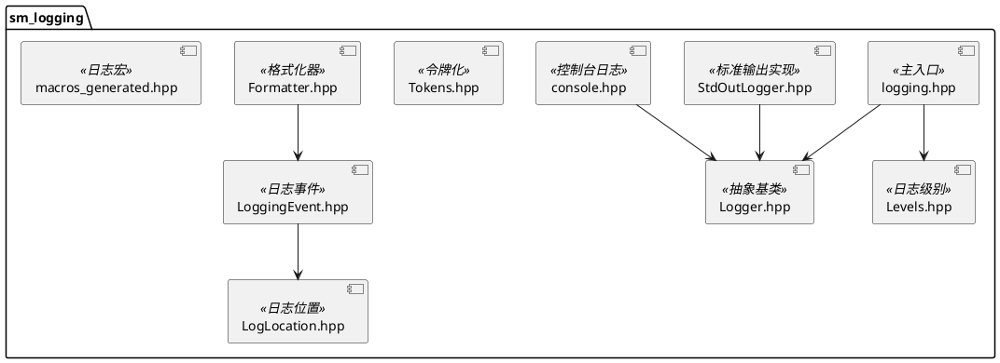
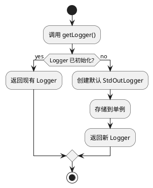

# sm_logging 模块文档

> 灵活的日志系统，提供多级别、可配置的日志记录功能

---

## 1. 📋 功能说明

### 1.1 定位
sm_logging 是 Schweizer-Messer 库的日志模块，提供了灵活的日志记录系统，支持多种日志级别、命名日志流和自定义日志格式。

### 1.2 核心能力
- **多种日志级别**：DEBUG、INFO、WARN、ERROR、FATAL 等
- **命名日志流**：支持启用/禁用特定命名的日志流
- **可插拔 Logger**：支持自定义 Logger 实现
- **日志格式化**：灵活的日志消息格式化
- **标准输出日志**：内置 StdOutLogger 实现
- **日志位置记录**：自动记录文件名、行号、函数名

---

## 2. 🏗️ 架构设计

sm_logging 采用分层设计，以 Logger 抽象为核心，结合日志级别、格式化器和日志事件。



### 2.1 主要组件划分
1. **核心接口层**：Logger 抽象基类
2. **实现层**：StdOutLogger 具体实现
3. **级别层**：Levels 日志级别定义
4. **事件层**：LoggingEvent 封装日志信息
5. **位置层**：LogLocation 记录源代码位置
6. **格式化层**：Formatter 处理日志输出格式
7. **宏层**：macros_generated 提供便捷的日志宏

### 2.2 数据流走向
```
日志宏 → LogLocation → LoggingEvent → Formatter → Logger → 输出
```

### 2.3 关键设计模式
- **策略模式**：Logger 抽象基类，可插拔实现
- **单例模式**：全局 Logger 实例管理
- **工厂模式**：Logger 创建和配置
- **装饰器模式**：Formatter 装饰 LoggingEvent

---

## 3. 🔑 关键方法

### 3.1 全局日志管理
```cpp
sm::logging::levels::Level getLevel();
void setLevel(sm::logging::levels::Level level);
void setLogger(boost::shared_ptr<Logger> logger);
boost::shared_ptr<Logger> getLogger();
```
**原理**：使用单例模式管理全局 Logger 实例和日志级别

**实现位置**：`include/sm/logging.hpp`



---

### 3.2 命名日志流控制
```cpp
bool isNamedStreamEnabled(const std::string & name);
void enableNamedStream(const std::string & name);
void disableNamedStream(const std::string & name);
```
**原理**：使用字符串集合管理启用/禁用的命名日志流

**实现位置**：`include/sm/logging.hpp`

---

### 3.3 日志初始化宏
```cpp
#define SM_INIT_LOGGING() \
  sm::logging::enableNamedStream(SMCONSOLE_NAME_PREFIX);
```
**用途**：初始化日志系统，启用默认控制台日志流

**实现位置**：`include/sm/logging.hpp`

---

## 4. 🔌 对外接口

### 4.1 主要全局函数

#### 4.1.1 日志级别管理
```cpp
sm::logging::levels::Level getLevel();
void setLevel(sm::logging::levels::Level level);
```
**用途**：获取/设置全局日志级别

**参数**：
- `level` — 日志级别（DEBUG、INFO、WARN、ERROR、FATAL）

**输入输出接口定义**：
```
输入:
  setLevel(): Level 枚举值

输出:
  getLevel(): 当前 Level 枚举值
```

---

#### 4.1.2 Logger 管理
```cpp
void setLogger(boost::shared_ptr<Logger> logger);
boost::shared_ptr<Logger> getLogger();
```
**用途**：设置/获取全局 Logger 实例

**参数**：
- `logger` — 自定义 Logger 实现的共享指针

**输入输出接口定义**：
```
输入:
  setLogger(): boost::shared_ptr<Logger>

输出:
  getLogger(): boost::shared_ptr<Logger>
```

---

#### 4.1.3 命名流控制
```cpp
bool isNamedStreamEnabled(const std::string & name);
void enableNamedStream(const std::string & name);
void disableNamedStream(const std::string & name);
```
**用途**：检查/启用/禁用特定命名的日志流

**参数**：
- `name` — 日志流名称

**输入输出接口定义**：
```
输入:
  name: std::string 日志流名称

输出:
  isNamedStreamEnabled(): bool (是否启用)
```

---

### 4.2 主要类

#### 4.2.1 `Logger`（抽象基类）
**用途**：日志记录器的抽象接口

**关键方法**（纯虚）：
- `log(const LoggingEvent & event)` — 记录日志事件

**派生类**：
- `StdOutLogger` — 输出到标准输出

---

#### 4.2.2 `LogLocation`
**用途**：记录日志发生的源代码位置

**关键成员**：
- `file` — 文件名
- `line` — 行号
- `function` — 函数名

---

#### 4.2.3 `LoggingEvent`
**用途**：封装完整的日志事件信息

**关键成员**：
- `level` — 日志级别
- `location` — 源代码位置
- `message` — 日志消息
- `timestamp` — 时间戳

---

### 4.3 日志级别枚举

#### 4.3.1 Level 枚举
```cpp
namespace levels {
    enum Level {
        DEBUG,
        INFO,
        WARN,
        ERROR,
        FATAL
    };
}
```

---

### 4.4 核心宏

#### 4.4.1 日志记录宏
```cpp
SM_LOG_DEBUG(message)
SM_LOG_INFO(message)
SM_LOG_WARN(message)
SM_LOG_ERROR(message)
SM_LOG_FATAL(message)
```
**用途**：便捷的日志记录宏

**参数**：
- `message` — 日志消息（支持流式输出）

---

## 5. 📦 依赖关系

### 5.1 内部依赖
- sm_common — 基础工具和断言

### 5.2 外部依赖
- Boost (system) — 基础功能
- Boost (date_time) — 时间戳支持

---

## 6. 💡 使用示例

### 6.1 基本日志记录
```cpp
#include <sm/logging.hpp>

int main() {
    // 初始化日志
    SM_INIT_LOGGING();

    // 设置日志级别
    sm::logging::setLevel(sm::logging::levels::INFO);

    // 记录日志
    SM_LOG_INFO("Application started");
    SM_LOG_DEBUG("Debug information");  // 不会显示，因为级别是 INFO

    // 流式输出
    int value = 42;
    SM_LOG_INFO("The value is: " << value);

    return 0;
}
```

### 6.2 使用命名日志流
```cpp
#include <sm/logging.hpp>

// 启用特定的命名流
sm::logging::enableNamedStream("my_module");

// 检查是否启用
if (sm::logging::isNamedStreamEnabled("my_module")) {
    // 记录到该流（通过自定义宏）
}

// 禁用不再需要的流
sm::logging::disableNamedStream("my_module");
```

### 6.3 自定义 Logger
```cpp
#include <sm/logging.hpp>
#include <sm/logging/Logger.hpp>

class MyLogger : public sm::logging::Logger {
public:
    virtual void log(const sm::logging::LoggingEvent & event) override {
        // 自定义日志处理
        std::cout << "[" << event.level << "] " << event.message << std::endl;
    }
};

// 使用自定义 Logger
sm::logging::setLogger(boost::make_shared<MyLogger>());
```

---

## 7. 🔗 相关模块
- [sm_common](./sm_common.md) — 基础依赖
- [sm_boost](./sm_boost.md) — Boost 支持

---

## 8. 📄 核心文件列表

| 文件 | 职责 |
|------|------|
| `include/sm/logging.hpp` | 主入口，全局日志管理 |
| `include/sm/logging/Logger.hpp` | Logger 抽象基类 |
| `include/sm/logging/StdOutLogger.hpp` | 标准输出 Logger 实现 |
| `include/sm/logging/Levels.hpp` | 日志级别定义 |
| `include/sm/logging/LogLocation.hpp` | 日志位置记录 |
| `include/sm/logging/LoggingEvent.hpp` | 日志事件封装 |
| `include/sm/logging/Formatter.hpp` | 日志格式化器 |
| `include/sm/logging/Tokens.hpp` | 令牌化工具 |
| `include/sm/logging/console.hpp` | 控制台日志 |
| `include/sm/logging/macros_generated.hpp` | 日志宏定义 |
