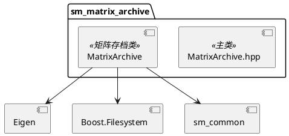
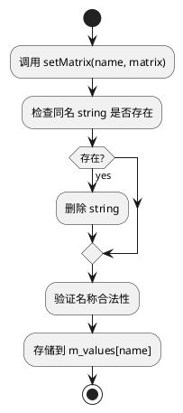

# sm_matrix_archive 模块文档

> Eigen 矩阵的二进制文件存储格式，用于高效读写矩阵数据

---

## 1. 📋 功能说明

### 1.1 定位
sm_matrix_archive 是 Schweizer-Messer 库的矩阵存储模块，提供了 Eigen 矩阵的二进制文件存储格式（.ama），支持高效读写多个命名矩阵和字符串。

### 1.2 核心能力
- **二进制矩阵存储**：高效的二进制格式存储 Eigen 矩阵
- **命名矩阵管理**：通过字符串名称管理多个矩阵
- **字符串存储**：支持存储字符串元数据
- **跨平台兼容**：自动处理字节序（Little/Big Endian）
- **增量追加**：支持向现有文件追加矩阵
- **类型安全**：编译时检查 double 大小（8字节）
- **迭代器访问**：支持 STL 风格的迭代器访问

---

## 2. 🏗️ 架构设计

sm_matrix_archive 采用自定义二进制格式设计，使用魔数标识块类型。



### 2.1 主要组件划分
1. **MatrixArchive 类**：主接口类
2. **矩阵存储层**：std::map<std::string, Eigen::MatrixXd>
3. **字符串存储层**：std::map<std::string, std::string>
4. **二进制 I/O 层**：块读写、字节序处理
5. **文件格式层**：魔数、固定名称大小

### 2.2 数据流走向
```
MatrixArchive → setMatrix() → 内存 map → save() → 二进制文件
                         ↓
                    load() ← 二进制文件
```

### 2.3 关键设计模式
- **值语义**：MatrixArchive 设计为值类型
- **映射模式**：使用 std::map 存储命名矩阵
- **模板模式**：setMatrix/setVector 支持任意 Eigen 类型
- **工厂模式**：createMatrix() 创建指定大小的矩阵

---

## 3. 🔑 关键方法

### 3.1 矩阵设置
```cpp
template<typename Derived>
void setMatrix(std::string const & matrixName, Eigen::MatrixBase<Derived> const & matrix);

template<typename Derived>
void setVector(std::string const & matrixName, Eigen::MatrixBase<Derived> const & matrix);

void setMatrixXd(std::string const & matrixName, Eigen::MatrixXd const & matrix);
void setVectorXd(std::string const & vectorName, Eigen::VectorXd const & vector);
void setScalar(std::string const & scalarName, double scalar);
```
**原理**：将矩阵存储到内存 map 中

**实现位置**：`include/sm/MatrixArchive.hpp:61-139`



---

### 3.2 矩阵获取
```cpp
void getMatrix(std::string const & matrixName, Eigen::MatrixXd & outMatrix) const;
const Eigen::MatrixXd & getMatrix(std::string const & matrixName) const;
Eigen::MatrixXd & getMatrix(std::string const & matrixName);
Eigen::MatrixXd & createMatrix(std::string const & matrixName, int rows, int cols, bool overwriteExisting = false);
void getVector(std::string const & vectorName, Eigen::VectorXd & outVector) const;
void getScalar(std::string const & scalarName, double & outScalar) const;
double getScalar(std::string const & scalarName) const;
```
**原理**：从内存 map 中获取矩阵

**实现位置**：`include/sm/MatrixArchive.hpp:72-79`

---

### 3.3 文件 I/O
```cpp
void load(const std::string & amaFilePath);
void load(boost::filesystem::path const & amaFilePath);
void save(const std::string & amaFilePath) const;
void save(boost::filesystem::path const & amaFilePath) const;
void append(std::string const & amaFilePath) const;
```
**原理**：读写二进制 .ama 文件

**实现位置**：`include/sm/MatrixArchive.hpp:46-59`

---

### 3.4 字符串操作
```cpp
void setString(std::string const & stringName, const std::string & value);
void getString(std::string const & stringName, std::string & stringValue) const;
const std::string & getString(std::string const & stringName) const;
std::string & getString(std::string const & stringName);
const string_map_t & getStrings() const;
```
**原理**：存储和获取字符串元数据

**实现位置**：`include/sm/MatrixArchive.hpp:70-82`

---

### 3.5 迭代器和查询
```cpp
matrix_map_t::const_iterator begin() const;
matrix_map_t::const_iterator end() const;
matrix_map_t::const_iterator find(std::string const & name) const;
size_t size() const;
size_t sizeMatrices() const;
size_t sizeStrings() const;
void clear();
void clear(std::string const & entryName);
```
**原理**：STL 风格的容器访问

**实现位置**：`include/sm/MatrixArchive.hpp:31-34, 41-42`

---

## 4. 🔌 对外接口

### 4.1 主要类

#### 4.1.1 `MatrixArchive`
**用途**：矩阵存档的主接口类

**关键方法**：
- `MatrixArchive()` — 默认构造
- `clear()` — 清空所有矩阵和字符串
- `clear(entryName)` — 清空指定条目
- `size()` — 获取总条目数
- `sizeMatrices()` — 获取矩阵数量
- `sizeStrings()` — 获取字符串数量
- `begin()/end()` — 迭代器访问
- `find(name)` — 查找矩阵
- `load(path)` — 从文件加载
- `save(path)` — 保存到文件
- `append(path)` — 追加到文件
- `setMatrix(name, matrix)` — 设置矩阵
- `setVector(name, vector)` — 设置向量
- `setMatrixXd(name, matrix)` — 设置 MatrixXd
- `setVectorXd(name, vector)` — 设置 VectorXd
- `setScalar(name, scalar)` — 设置标量
- `setString(name, value)` — 设置字符串
- `getMatrix(name, outMatrix)` — 获取矩阵
- `getMatrix(name)` — 获取矩阵引用
- `createMatrix(name, rows, cols, overwrite)` — 创建矩阵
- `getVector(name, outVector)` — 获取向量
- `getScalar(name, outScalar)` — 获取标量
- `getScalar(name)` — 获取标量值
- `getString(name, outString)` — 获取字符串
- `getString(name)` — 获取字符串引用
- `getStrings()` — 获取所有字符串 map

**输入输出接口定义**：
```
输入:
  setMatrix(): name (std::string), matrix (Eigen::MatrixBase)
  load/save/append: path (std::string 或 boost::filesystem::path)

输出:
  getMatrix(): Eigen::MatrixXd & 或 const &
  getScalar(): double
  size(): size_t
  begin()/end(): iterator
```

---

### 4.2 异常类

#### 4.2.1 `MatrixArchiveException`
**用途**：矩阵存档异常基类

---

### 4.3 核心数据结构

#### 4.3.1 内部存储
```cpp
typedef std::map<std::string, Eigen::MatrixXd> matrix_map_t;
typedef std::map<std::string, std::string> string_map_t;

matrix_map_t m_values;   // 矩阵存储
string_map_t m_strings;  // 字符串存储
```

#### 4.3.2 文件格式常量
```cpp
static const size_t s_fixedNameSize;        // 固定名称大小
static const char s_magicCharStartAMatrixBlock;  // 矩阵块魔数
static const char s_magicCharStartAStringBlock;  // 字符串块魔数
static const char s_magicCharEnd;            // 块结束魔数
```

#### 4.3.3 块类型枚举
```cpp
enum BlockType {
    MATRIX,
    STRING
};
```

---

## 5. 📦 依赖关系

### 5.1 内部依赖
- sm_common — 基础工具和断言

### 5.2 外部依赖
- Eigen3 — 矩阵库
- Boost (filesystem) — 文件系统支持
- Boost (static_assert) — 编译时断言

---

## 6. 💡 使用示例

### 6.1 基本存储和加载
```cpp
#include <sm/MatrixArchive.hpp>
#include <Eigen/Core>

// 创建存档
sm::MatrixArchive archive;

// 存储矩阵
Eigen::MatrixXd mat = Eigen::MatrixXd::Random(3, 3);
archive.setMatrix("my_matrix", mat);

// 存储向量
Eigen::VectorXd vec = Eigen::VectorXd::Ones(5);
archive.setVector("my_vector", vec);

// 存储标量
archive.setScalar("my_scalar", 42.0);

// 存储字符串
archive.setString("description", "This is a test");

// 保存到文件
archive.save("data.ama");

// 从文件加载
sm::MatrixArchive archive2;
archive2.load("data.ama");

// 获取矩阵
Eigen::MatrixXd mat2;
archive2.getMatrix("my_matrix", mat2);
```

### 6.2 迭代器访问
```cpp
#include <sm/MatrixArchive.hpp>

sm::MatrixArchive archive;
// ... 填充存档 ...

// 遍历所有矩阵
for (auto it = archive.begin(); it != archive.end(); ++it) {
    std::cout << "Matrix: " << it->first << std::endl;
    std::cout << "Size: " << it->second.rows() << "x" << it->second.cols() << std::endl;
}

// 查找特定矩阵
auto it = archive.find("my_matrix");
if (it != archive.end()) {
    std::cout << "Found matrix" << std::endl;
}
```

### 6.3 创建矩阵
```cpp
#include <sm/MatrixArchive.hpp>

sm::MatrixArchive archive;

// 创建 100x100 矩阵
Eigen::MatrixXd & mat = archive.createMatrix("large_matrix", 100, 100);

// 填充矩阵
for (int i = 0; i < 100; ++i) {
    for (int j = 0; j < 100; ++j) {
        mat(i, j) = i * j;
    }
}
```

### 6.4 追加到文件
```cpp
#include <sm/MatrixArchive.hpp>

// 创建第一个存档
sm::MatrixArchive archive1;
archive1.setMatrix("matrix1", Eigen::MatrixXd::Identity(3, 3));
archive1.save("data.ama");

// 创建第二个存档并追加
sm::MatrixArchive archive2;
archive2.setMatrix("matrix2", Eigen::MatrixXd::Random(3, 3));
archive2.append("data.ama");

// 加载后包含两个矩阵
sm::MatrixArchive archive3;
archive3.load("data.ama");
assert(archive3.sizeMatrices() == 2);
```

### 6.5 查询和清空
```cpp
#include <sm/MatrixArchive.hpp>

sm::MatrixArchive archive;
// ... 填充存档 ...

// 查询大小
std::cout << "Total entries: " << archive.size() << std::endl;
std::cout << "Matrices: " << archive.sizeMatrices() << std::endl;
std::cout << "Strings: " << archive.sizeStrings() << std::endl;

// 清空单个条目
archive.clear("my_matrix");

// 清空所有
archive.clear();
```

---

## 7. 🔗 相关模块
- [sm_common](./sm_common.md) — 基础依赖
- [sm_eigen](./sm_eigen.md) — Eigen 支持

---

## 8. 📄 核心文件列表

| 文件 | 职责 |
|------|------|
| `include/sm/MatrixArchive.hpp` | 主头文件，MatrixArchive 类 |
