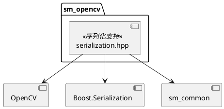
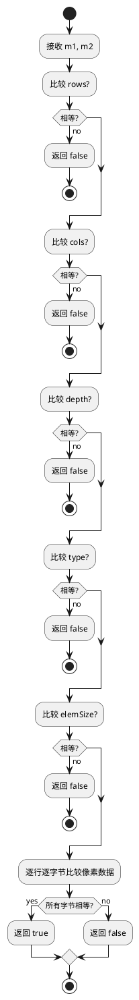

# sm_opencv 模块文档

> OpenCV 库的扩展和序列化支持

---

## 1. 📋 功能说明

### 1.1 定位
sm_opencv 是 Schweizer-Messer 库的 OpenCV 扩展模块，提供了 OpenCV 类型的序列化支持和二进制比较功能。

### 1.2 核心能力
- **cv::Mat 序列化**：使用 Boost.Serialization 序列化/反序列化 OpenCV 矩阵
- **cv::Point2f 序列化**：2D 点序列化支持
- **cv::KeyPoint 序列化**：关键点序列化支持
- **二进制比较**：isBinaryEqual 函数用于 OpenCV 类型比较
- **连续性处理**：自动处理非连续矩阵的 clone

---

## 2. 🏗️ 架构设计

sm_opencv 主要提供 OpenCV 类型的 Boost.Serialization 扩展。



### 2.1 主要组件划分
1. **cv::Mat 序列化**：save/load 分离
2. **cv::Point2f 序列化**：简单序列化
3. **cv::KeyPoint 序列化**：关键点序列化
4. **二进制比较**：isBinaryEqual 函数

### 2.2 数据流走向
```
cv::Mat → 检查连续性 → clone(如需要) → 保存元数据 → 保存二进制数据
                    ↓
                反序列化 ← 读取元数据 ← 读取二进制数据
```

### 2.3 关键设计模式
- **分离序列化**：BOOST_SERIALIZATION_SPLIT_FREE
- **二进制对象**：boost::serialization::make_binary_object
- **策略模式**：矩阵连续性检查策略

---

## 3. 🔑 关键方法

### 3.1 cv::Mat 二进制比较
```cpp
bool isBinaryEqual(const cv::Mat & m1, const cv::Mat & m2);
```
**原理**：逐字节比较两个 cv::Mat 的内容，先比较元数据再比较像素数据

**实现位置**：`include/sm/opencv/serialization.hpp:14-35`



---

### 3.2 cv::Mat 序列化（保存）
```cpp
template<class Archive>
void save(Archive & ar, const cv::Mat& mat, const unsigned int version);
```
**原理**：保存矩阵元数据和二进制数据，非连续矩阵先 clone

**实现位置**：`include/sm/opencv/serialization.hpp:113-127`

---

### 3.3 cv::Mat 序列化（加载）
```cpp
template<class Archive>
void load(Archive & ar, cv::Mat& mat, const unsigned int version);
```
**原理**：读取元数据，创建矩阵，读取二进制数据

**实现位置**：`include/sm/opencv/serialization.hpp:130-138`

---

### 3.4 cv::Point2f 序列化
```cpp
template<class Archive>
void serialize(Archive & ar, cv::Point2f & p, const unsigned int version);
```
**原理**：序列化 x 和 y 坐标

**实现位置**：`include/sm/opencv/serialization.hpp:44-48`

---

### 3.5 cv::KeyPoint 序列化
```cpp
template<class Archive>
void serialize(Archive & ar, cv::KeyPoint & k, const unsigned int version);
```
**原理**：序列化 pt, size, angle, response, octave, class_id

**实现位置**：`include/sm/opencv/serialization.hpp:51-59`

---

## 4. 🔌 对外接口

### 4.1 主要函数

#### 4.1.1 二进制比较
```cpp
bool isBinaryEqual(const cv::Mat & m1, const cv::Mat & m2);
```
**用途**：逐字节比较两个 OpenCV 矩阵

**参数**：
- `m1` — 第一个矩阵
- `m2` — 第二个矩阵

**返回值**：bool，相等返回 true

**输入输出接口定义**：
```
输入:
  m1: const cv::Mat &
  m2: const cv::Mat &

输出:
  bool: true(相等) / false(不相等)

比较内容:
  - rows, cols, depth, type, elemSize
  - 逐字节比较所有像素数据
```

---

### 4.2 Boost.Serialization 支持

#### 4.2.1 cv::Mat 序列化
```cpp
// 自动支持:
boost::archive::text_oarchive oa(ss);
cv::Mat mat = cv::imread("image.jpg");
oa << mat;

boost::archive::text_iarchive ia(ss);
cv::Mat mat2;
ia >> mat2;
```

#### 4.2.2 cv::Point2f 序列化
```cpp
cv::Point2f p(1.0f, 2.0f);
oa << p;
```

#### 4.2.3 cv::KeyPoint 序列化
```cpp
cv::KeyPoint kp;
kp.pt = cv::Point2f(100, 100);
kp.size = 10;
kp.angle = 45;
oa << kp;
```

---

### 4.3 核心数据结构

#### 4.3.1 cv::Mat 序列化元数据
```cpp
int rows;     // 行数
int cols;     // 列数
int type;     // OpenCV 类型 (CV_8UC3 等)
// 后跟二进制数据: step * rows 字节
```

---

## 5. 📦 依赖关系

### 5.1 内部依赖
- sm_common — 基础工具和断言（SM_CHECKSAME 宏）

### 5.2 外部依赖
- OpenCV (core, features2d) — 核心 OpenCV 库
- Boost (serialization) — Boost.Serialization 库

---

## 6. 💡 使用示例

### 6.1 序列化 cv::Mat
```cpp
#include <sm/opencv/serialization.hpp>
#include <boost/archive/text_oarchive.hpp>
#include <boost/archive/text_iarchive.hpp>
#include <sstream>
#include <opencv2/core/core.hpp>

// 序列化
cv::Mat image = cv::imread("image.jpg", CV_LOAD_IMAGE_GRAYSCALE);
std::stringstream ss;
boost::archive::text_oarchive oa(ss);
oa << image;

// 反序列化
cv::Mat image2;
boost::archive::text_iarchive ia(ss);
ia >> image2;
```

### 6.2 二进制比较
```cpp
#include <sm/opencv/serialization.hpp>
#include <opencv2/core/core.hpp>

cv::Mat mat1 = cv::Mat::zeros(100, 100, CV_8UC1);
cv::Mat mat2 = cv::Mat::zeros(100, 100, CV_8UC1);

if (sm::opencv::isBinaryEqual(mat1, mat2)) {
    std::cout << "Matrices are identical" << std::endl;
}

mat2.at<uchar>(50, 50) = 255;
if (!sm::opencv::isBinaryEqual(mat1, mat2)) {
    std::cout << "Matrices are different" << std::endl;
}
```

### 6.3 序列化关键点
```cpp
#include <sm/opencv/serialization.hpp>
#include <boost/archive/text_oarchive.hpp>
#include <sstream>
#include <opencv2/features2d/features2d.hpp>

std::vector<cv::KeyPoint> keypoints;
// ... 检测关键点 ...

std::stringstream ss;
boost::archive::text_oarchive oa(ss);

// 序列化每个关键点
for (const auto & kp : keypoints) {
    oa << kp;
}
```

### 6.4 使用 SM_CHECKSAME 宏
```cpp
#include <sm/opencv/serialization.hpp>

cv::Mat a, b;
// ... 初始化 a 和 b ...

// 使用 SM_CHECKSAME 比较
if (SM_CHECKSAME(a, b)) {
    // 相等
}
```

---

## 7. 🔗 相关模块
- [sm_common](./sm_common.md) — 基础依赖（SM_CHECKSAME 宏）
- [sm_boost](./sm_boost.md) — Boost 支持

---

## 8. 📄 核心文件列表

| 文件 | 职责 |
|------|------|
| `include/sm/opencv/serialization.hpp` | OpenCV 序列化支持 |
