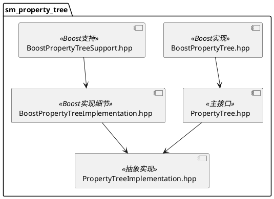
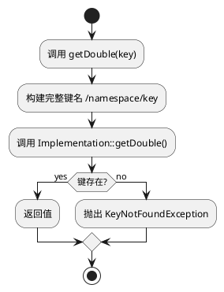

# sm_property_tree 模块文档

> 层次化属性树配置系统，提供灵活的参数管理功能

---

## 1. 📋 功能说明

### 1.1 定位
sm_property_tree 是 Schweizer-Messer 库的配置管理模块，提供了层次化组织的属性存储系统，用于类的初始化和参数管理。

### 1.2 核心能力
- **层次化存储**：支持命名空间的层次化属性组织
- **类型安全访问**：类型安全的 get/set 方法
- **默认值支持**：可选的默认值参数
- **异常处理**：完善的异常类型定义
- **实现抽象**：PropertyTreeImplementation 抽象接口
- **Boost 实现**：内置 Boost.PropertyTree 实现

---

## 2. 🏗️ 架构设计

sm_property_tree 采用桥接模式，以 PropertyTree 为前端接口，PropertyTreeImplementation 为后端实现。



### 2.1 主要组件划分
1. **接口层**：PropertyTree 主接口类
2. **实现抽象层**：PropertyTreeImplementation
3. **具体实现层**：BoostPropertyTreeImplementation
4. **包装层**：BoostPropertyTree 便捷包装
5. **支持层**：BoostPropertyTreeSupport

### 2.2 数据流走向
```
配置文件 → BoostPropertyTree → PropertyTree → 用户代码 get/set
                ↓
        PropertyTreeImplementation
```

### 2.3 关键设计模式
- **桥接模式**：PropertyTree 与 Implementation 分离
- **工厂模式**：创建不同的 Implementation
- **异常模式**：自定义异常层次结构
- **命名空间模式**：子树创建使用 child namespace

---

## 3. 🔑 关键方法

### 3.1 属性获取
```cpp
double getDouble(const std::string & key) const;
double getDouble(const std::string & key, double defaultValue) const;
int getInt(const std::string & key) const;
int getInt(const std::string & key, int defaultValue) const;
bool getBool(const std::string & key) const;
bool getBool(const std::string & key, bool defaultValue) const;
std::string getString(const std::string & key) const;
std::string getString(const std::string & key, const std::string & defaultValue) const;
```
**原理**：使用模板方法模式，有默认值版本不会抛异常

**实现位置**：`include/sm/PropertyTree.hpp`



---

### 3.2 属性设置
```cpp
void setDouble(const std::string & key, double value);
void setInt(const std::string & key, int value);
void setBool(const std::string & key, bool value);
void setString(const std::string & key, const std::string & value);
```
**原理**：设置指定键的值

**实现位置**：`include/sm/PropertyTree.hpp`

---

### 3.3 子树构造
```cpp
PropertyTree(const PropertyTree & parent, const std::string & childNamespace);
```
**原理**：从父树创建子树，自动添加命名空间前缀

**实现位置**：`include/sm/PropertyTree.hpp`

---

### 3.4 键存在检查
```cpp
bool doesKeyExist(const std::string & key) const;
```
**原理**：检查指定键是否存在

**实现位置**：`include/sm/PropertyTree.hpp`

---

## 4. 🔌 对外接口

### 4.1 主要类

#### 4.1.1 `PropertyTree`
**用途**：属性树的主接口类

**关键方法**：
- `PropertyTree(boost::shared_ptr<PropertyTreeImplementation> imp, const std::string & baseNamespace = "")` — 从实现构造
- `PropertyTree(const PropertyTree & parent, const std::string & childNamespace)` — 从父树构造子树
- `getDouble(key)` — 获取 double 值（无默认值时必须存在）
- `getDouble(key, defaultValue)` — 获取 double 值（带默认值）
- `getInt(key)` / `getInt(key, defaultValue)` — 获取 int 值
- `getBool(key)` / `getBool(key, defaultValue)` — 获取 bool 值
- `getString(key)` / `getString(key, defaultValue)` — 获取 string 值
- `setDouble(key, value)` — 设置 double 值
- `setInt(key, value)` — 设置 int 值
- `setBool(key, value)` — 设置 bool 值
- `setString(key, value)` — 设置 string 值
- `doesKeyExist(key)` — 检查键是否存在

**输入输出接口定义**：
```
输入:
  get*(): key (std::string)
  get*(default): key, defaultValue
  set*(): key, value

输出:
  get*(): 返回对应类型的值
  get*(default): 返回对应类型的值（键不存在时返回默认值）
  doesKeyExist(): bool (键是否存在)

异常:
  KeyNotFoundException: 无默认值版本且键不存在时
  InvalidValueException: 值转换失败时
```

---

#### 4.1.2 `PropertyTreeImplementation`（抽象基类）
**用途**：属性树实现的抽象接口

**关键方法**（纯虚）：
- `getDouble(key)` — 获取 double
- `setDouble(key, value)` — 设置 double
- `getInt/setInt` — int 操作
- `getBool/setBool` — bool 操作
- `getString/setString` — string 操作
- `doesKeyExist(key)` — 键存在检查

---

### 4.2 异常类

#### 4.2.1 `PropertyTree::Exception`
**用途**：属性树异常基类

#### 4.2.2 `PropertyTree::InvalidKeyException`
**用途**：无效键异常

#### 4.2.3 `PropertyTree::InvalidValueException`
**用途**：无效值异常

#### 4.2.4 `PropertyTree::KeyNotFoundException`
**用途**：键未找到异常

---

### 4.3 核心数据结构

#### 4.3.1 内部命名空间
```cpp
std::string _namespace;  // 当前树的基础命名空间
boost::shared_ptr<PropertyTreeImplementation> _imp;  // 实现指针
```

#### 4.3.2 键名构建
```cpp
std::string buildQualifiedKeyName(const std::string & key) const;
// 返回: "/namespace/key"
```

---

## 5. 📦 依赖关系

### 5.1 内部依赖
- sm_common — 基础工具和断言

### 5.2 外部依赖
- Boost (property_tree) — Boost.PropertyTree（仅 BoostPropertyTree 实现）
- Boost (shared_ptr) — 智能指针

---

## 6. 💡 使用示例

### 6.1 基本用法
```cpp
#include <sm/PropertyTree.hpp>

class MyClass {
private:
    double _theta;
    int _numIterations;
    double _phi;

public:
    MyClass(const sm::PropertyTree & config) {
        // 无默认值版本 - 键必须存在，否则抛异常
        _theta = config.getDouble("theta");
        _numIterations = config.getInt("numIterations");

        // 带默认值版本 - 键不存在时使用默认值
        _phi = config.getDouble("phi", 0.01);
    }
};
```

### 6.2 使用子树
```cpp
#include <sm/PropertyTree.hpp>

class MemberClass {
public:
    MemberClass(const sm::PropertyTree & config) {
        double x = config.getDouble("x");
        double y = config.getDouble("y");
    }
};

class ComposedClass {
private:
    MemberClass _member1;
    MemberClass _member2;

public:
    ComposedClass(const sm::PropertyTree & config) :
        _member1(sm::PropertyTree(config, "member1")),
        _member2(sm::PropertyTree(config, "member2"))
    {
        // _member1 读取 "/member1/x", "/member1/y"
        // _member2 读取 "/member2/x", "/member2/y"
    }
};
```

### 6.3 设置属性
```cpp
#include <sm/PropertyTree.hpp>

void saveConfig(sm::PropertyTree & config) {
    config.setDouble("theta", 0.5);
    config.setInt("numIterations", 100);
    config.setBool("enabled", true);
    config.setString("name", "my_config");
}
```

### 6.4 检查键存在
```cpp
#include <sm/PropertyTree.hpp>

void processConfig(const sm::PropertyTree & config) {
    if (config.doesKeyExist("optional_param")) {
        double val = config.getDouble("optional_param");
        // 使用可选参数
    } else {
        // 使用默认逻辑
    }
}
```

---

## 7. 🔗 相关模块
- [sm_common](./sm_common.md) — 基础依赖
- [sm_boost](./sm_boost.md) — Boost 支持

---

## 8. 📄 核心文件列表

| 文件 | 职责 |
|------|------|
| `include/sm/PropertyTree.hpp` | 主接口类 |
| `include/sm/PropertyTreeImplementation.hpp` | 实现抽象接口 |
| `include/sm/BoostPropertyTree.hpp` | Boost 实现包装 |
| `include/sm/BoostPropertyTreeImplementation.hpp` | Boost 实现细节 |
| `include/sm/BoostPropertyTreeSupport.hpp` | Boost 支持工具 |
