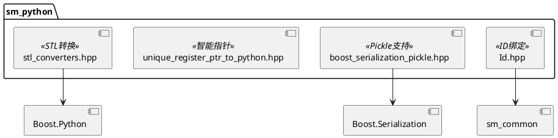
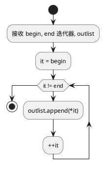

# sm_python 模块文档

> Python/C++ 绑定辅助工具，提供 STL 容器转换、序列化 Pickle 支持等功能

---

## 1. 📋 功能说明

### 1.1 定位
sm_python 是 Schweizer-Messer 库的 Python 绑定辅助模块，提供了 STL 容器转换、Boost.Serialization Pickle 支持、智能指针处理等功能，简化 Python/C++ 混合开发。

### 1.2 核心能力
- **STL 容器转换**：stlToList、stlToDict 等转换函数
- **Boost.Serialization Pickle**：自动为可序列化类提供 Pickle 支持
- **唯一注册智能指针**：unique_register_ptr_to_python 工具
- **ID 类型转换**：sm::Id 类型的 Python 绑定支持

---

## 2. 🏗️ 架构设计

sm_python 提供 Python/C++ 绑定的辅助工具集合。



### 2.1 主要组件划分
1. **STL 转换器**：stlToList、stlToDict
2. **Pickle 支持**：boost_serialization_pickle
3. **智能指针工具**：unique_register_ptr_to_python
4. **ID 绑定**：Id 类型的 Python 绑定

### 2.2 数据流走向
```
C++ STL 容器 → stlToList/stlToDict → Python list/dict
C++ 可序列化对象 → Pickle Suite → Python pickle
```

### 2.3 关键设计模式
- **函数模板模式**：stlToList/stlToDict 模板函数
- **Pickle Suite 模式**：Boost.Python 的 pickle_suite
- **RAII 模式**：智能指针管理

---

## 3. 🔑 关键方法

### 3.1 STL 列表转换
```cpp
template<typename LIST_ITERATOR_T>
inline void stlToList(const LIST_ITERATOR_T & begin,
                      const LIST_ITERATOR_T & end,
                      boost::python::list & outlist);
```
**原理**：遍历 STL 迭代器，将元素追加到 Python list

**实现位置**：`include/sm/python/stl_converters.hpp:10-21`



---

### 3.2 STL 字典转换
```cpp
template<typename MAP_ITERATOR_T>
inline void stlToDict(const MAP_ITERATOR_T & begin,
                      const MAP_ITERATOR_T & end,
                      boost::python::dict & out);
```
**原理**：遍历 STL map 迭代器，将键值对存入 Python dict

**实现位置**：`include/sm/python/stl_converters.hpp:23-31`

---

## 4. 🔌 对外接口

### 4.1 主要函数

#### 4.1.1 `stlToList`
```cpp
template<typename LIST_ITERATOR_T>
void stlToList(const LIST_ITERATOR_T & begin,
              const LIST_ITERATOR_T & end,
              boost::python::list & outlist);
```
**用途**：将 STL 容器转换为 Python list

**参数**：
- `begin` — 起始迭代器
- `end` — 结束迭代器
- `outlist` — 输出 Python list（引用）

**输入输出接口定义**：
```
输入:
  begin, end: 迭代器范围
  outlist: boost::python::list & (输出参数)

输出:
  outlist 被填充，包含 [begin, end) 中的所有元素
```

---

#### 4.1.2 `stlToDict`
```cpp
template<typename MAP_ITERATOR_T>
void stlToDict(const MAP_ITERATOR_T & begin,
              const MAP_ITERATOR_T & end,
              boost::python::dict & out);
```
**用途**：将 STL map 转换为 Python dict

**参数**：
- `begin` — 起始迭代器
- `end` — 结束迭代器
- `out` — 输出 Python dict（引用）

**输入输出接口定义**：
```
输入:
  begin, end: map 迭代器范围
  out: boost::python::dict & (输出参数)

输出:
  out 被填充，包含 [begin, end) 中的所有键值对
```

---

### 4.2 主要头文件

#### 4.2.1 `boost_serialization_pickle.hpp`
**用途**：为 Boost.Serialization 可序列化类提供 Pickle 支持

**用法**：
```cpp
class_<MyClass>("MyClass")
    .def_pickle(boost_serialization_pickle_suite<MyClass>());
```

---

#### 4.2.2 `unique_register_ptr_to_python.hpp`
**用途**：唯一注册智能指针到 Python 的工具

---

#### 4.2.3 `Id.hpp`
**用途**：sm::Id 类型的 Python 绑定支持

---

## 5. 📦 依赖关系

### 5.1 内部依赖
- sm_common — 基础工具（Id 类型）

### 5.2 外部依赖
- Boost.Python — Python/C++ 绑定
- Boost.Serialization — 序列化支持（可选）

---

## 6. 💡 使用示例

### 6.1 STL vector 转换为 Python list
```cpp
#include <sm/python/stl_converters.hpp>
#include <vector>
#include <string>
#include <boost/python.hpp>

boost::python::list getNames() {
    std::vector<std::string> names = {"Alice", "Bob", "Charlie"};

    boost::python::list result;
    sm::python::stlToList(names.begin(), names.end(), result);

    return result;
}

BOOST_PYTHON_MODULE(libmy_module_python)
{
    boost::python::def("get_names", &getNames);
}

// Python 中使用:
// import libmy_module_python
// names = libmy_module_python.get_names()
// print(names)  # ['Alice', 'Bob', 'Charlie']
```

### 6.2 STL map 转换为 Python dict
```cpp
#include <sm/python/stl_converters.hpp>
#include <map>
#include <string>
#include <boost/python.hpp>

boost::python::dict getSettings() {
    std::map<std::string, int> settings;
    settings["width"] = 640;
    settings["height"] = 480;
    settings["fps"] = 30;

    boost::python::dict result;
    sm::python::stlToDict(settings.begin(), settings.end(), result);

    return result;
}

BOOST_PYTHON_MODULE(libmy_module_python)
{
    boost::python::def("get_settings", &getSettings);
}

// Python 中使用:
// import libmy_module_python
// settings = libmy_module_python.get_settings()
// print(settings)  # {'width': 640, 'height': 480, 'fps': 30}
```

### 6.3 使用 Boost.Serialization Pickle
```cpp
#include <sm/python/boost_serialization_pickle.hpp>
#include <boost/serialization/serialization.hpp>
#include <boost/python.hpp>

class MySerializableClass {
private:
    int value_;
    std::string name_;

    friend class boost::serialization::access;

    template<class Archive>
    void serialize(Archive & ar, const unsigned int version) {
        ar & value_;
        ar & name_;
    }

public:
    MySerializableClass() : value_(0) {}
    MySerializableClass(int v, const std::string & n) : value_(v), name_(n) {}

    int getValue() const { return value_; }
    const std::string & getName() const { return name_; }
};

BOOST_PYTHON_MODULE(libmy_module_python)
{
    using namespace boost::python;

    class_<MySerializableClass>("MySerializableClass")
        .def(init<int, std::string>())
        .def("get_value", &MySerializableClass::getValue)
        .def("get_name", &MySerializableClass::getName)
        .def_pickle(boost_serialization_pickle_suite<MySerializableClass>());
}

// Python 中使用:
// import libmy_module_python
// import pickle
// obj = libmy_module_python.MySerializableClass(42, "test")
// data = pickle.dumps(obj)
// obj2 = pickle.loads(data)
```

---

## 7. 🔗 相关模块
- [numpy_eigen](./numpy_eigen.md) — NumPy/Eigen 转换器
- [sm_common](./sm_common.md) — 基础依赖

---

## 8. 📄 核心文件列表

| 文件 | 职责 |
|------|------|
| `include/sm/python/stl_converters.hpp` | STL 容器转换器 |
| `include/sm/python/boost_serialization_pickle.hpp` | Pickle 支持 |
| `include/sm/python/unique_register_ptr_to_python.hpp` | 智能指针工具 |
| `include/sm/python/Id.hpp` | ID 类型绑定 |
