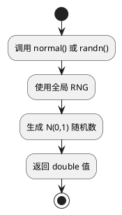

# sm_random 模块文档

> 随机数生成工具，提供多种分布的随机数生成功能

---

## 1. 📋 功能说明

### 1.1 定位
sm_random 是 Schweizer-Messer 库的随机数模块，提供了常用概率分布的随机数生成功能，包括正态分布、均匀分布等。

### 1.2 核心能力
- **标准正态分布**：生成 N(0,1) 正态分布随机数
- **均匀分布**：生成 [0,1) 均匀分布随机数
- **区间均匀分布**：生成指定区间的均匀分布随机数
- **整数均匀分布**：生成指定区间的整数随机数
- **可配置种子**：支持手动设置随机数种子

---

## 2. 🏗️ 架构设计

sm_random 是一个轻量级的随机数生成库，主要提供函数接口。


### 2.1 主要组件划分
1. **正态分布生成器**：normal()、randn()
2. **均匀分布生成器**：uniform()、rand()
3. **区间生成器**：randLU()、randLUi()
4. **种子管理**：seed()

### 2.2 数据流走向
```
种子 → RNG 状态 → 分布采样 → 随机数输出
```

### 2.3 关键设计模式
- **函数式接口**：所有功能通过自由函数提供
- **全局状态**：使用全局 RNG 实例
- **别名模式**：提供多个函数名指向同一实现

---

## 3. 🔑 关键方法

### 3.1 标准正态分布
```cpp
double normal();
double randn();
```
**原理**：生成均值为 0、标准差为 1 的正态分布随机数

**实现位置**：`include/sm/random.hpp` + 实现文件

**复杂度**：O(1)



---

### 3.2 均匀分布
```cpp
double uniform();
double rand();
```
**原理**：生成 [0.0, 1.0) 区间的均匀分布随机数

**实现位置**：`include/sm/random.hpp` + 实现文件

---

### 3.3 区间均匀分布
```cpp
double randLU(double lowerBoundInclusive, double upperBoundExclusive);
```
**原理**：生成 [lowerBoundInclusive, upperBoundExclusive) 区间的均匀分布随机数

**实现位置**：`include/sm/random.hpp` + 实现文件

---

### 3.4 整数均匀分布
```cpp
int randLUi(int lowerBoundInclusive, int upperBoundExclusive);
```
**原理**：生成 [lowerBoundInclusive, upperBoundExclusive) 区间的整数随机数

**实现位置**：`include/sm/random.hpp` + 实现文件

---

### 3.5 种子设置
```cpp
void seed(boost::uint64_t s);
```
**原理**：设置全局随机数生成器的种子

**实现位置**：`include/sm/random.hpp` + 实现文件

---

## 4. 🔌 对外接口

### 4.1 主要函数

#### 4.1.1 正态分布随机数
```cpp
double normal();
double randn();
```
**用途**：生成标准正态分布随机数

**返回值**：double 类型，N(0,1) 分布

**输入输出接口定义**：
```
输入:
  无参数

输出:
  double: N(0,1) 正态分布随机数
```

---

#### 4.1.2 均匀分布随机数
```cpp
double uniform();
double rand();
```
**用途**：生成 [0,1) 均匀分布随机数

**返回值**：double 类型，U[0,1) 分布

**输入输出接口定义**：
```
输入:
  无参数

输出:
  double: [0,1) 均匀分布随机数
```

---

#### 4.1.3 区间均匀分布（浮点）
```cpp
double randLU(double lowerBoundInclusive, double upperBoundExclusive);
```
**用途**：生成指定区间的均匀分布随机数

**参数**：
- `lowerBoundInclusive` — 下界（包含）
- `upperBoundExclusive` — 上界（不包含）

**返回值**：double 类型，U[lower, upper) 分布

**输入输出接口定义**：
```
输入:
  lowerBoundInclusive: double (包含)
  upperBoundExclusive: double (不包含)

输出:
  double: [lower, upper) 均匀分布随机数
```

---

#### 4.1.4 区间均匀分布（整数）
```cpp
int randLUi(int lowerBoundInclusive, int upperBoundExclusive);
```
**用途**：生成指定区间的整数随机数

**参数**：
- `lowerBoundInclusive` — 下界（包含）
- `upperBoundExclusive` — 上界（不包含）

**返回值**：int 类型，整数均匀分布

**输入输出接口定义**：
```
输入:
  lowerBoundInclusive: int (包含)
  upperBoundExclusive: int (不包含)

输出:
  int: [lower, upper) 整数随机数
```

---

#### 4.1.5 种子设置
```cpp
void seed(boost::uint64_t s);
```
**用途**：设置随机数生成器种子

**参数**：
- `s` — 64位无符号整数种子

**输入输出接口定义**：
```
输入:
  s: boost::uint64_t 种子值

输出:
  无返回值，设置全局 RNG 种子
```

---

### 4.2 核心数据结构

#### 4.2.1 内部 RNG 状态
```cpp
// 内部使用的随机数生成器
// 全局单例，通过 seed() 函数设置
```

---

## 5. 📦 依赖关系

### 5.1 内部依赖
- sm_common — 基础工具

### 5.2 外部依赖
- Boost (cstdint) — 整数类型定义
- Boost (random) — 随机数生成（可选/内部使用）

---

## 6. 💡 使用示例

### 6.1 基本随机数生成
```cpp
#include <sm/random.hpp>

// 正态分布
double n1 = sm::random::normal();
double n2 = sm::random::randn();  // 别名

// 均匀分布
double u1 = sm::random::uniform();
double u2 = sm::random::rand();    // 别名

// 区间均匀分布
double r1 = sm::random::randLU(0.0, 10.0);   // [0, 10)
int r2 = sm::random::randLUi(1, 7);            // [1, 7) 即 1-6
```

### 6.2 设置随机种子
```cpp
#include <sm/random.hpp>

// 设置固定种子（可重复结果）
sm::random::seed(123456ULL);

// 生成的随机数序列将是确定的
double val1 = sm::random::randn();
double val2 = sm::random::randn();
```

### 6.3 蒙特卡洛模拟
```cpp
#include <sm/random.hpp>
#include <cmath>

// 估计 π 值
int samples = 1000000;
int inside = 0;
for (int i = 0; i < samples; ++i) {
    double x = sm::random::randLU(-1.0, 1.0);
    double y = sm::random::randLU(-1.0, 1.0);
    if (x*x + y*y <= 1.0) {
        ++inside;
    }
}
double pi_estimate = 4.0 * inside / samples;
```

### 6.4 随机采样
```cpp
#include <sm/random.hpp>
#include <vector>

std::vector<int> data = {1, 2, 3, 4, 5, 6, 7, 8, 9, 10};

// 随机选择一个元素
int idx = sm::random::randLUi(0, data.size());
int selected = data[idx];

// 打乱数组
for (int i = data.size() - 1; i > 0; --i) {
    int j = sm::random::randLUi(0, i + 1);
    std::swap(data[i], data[j]);
}
```

---

## 7. 🔗 相关模块
- [sm_common](./sm_common.md) — 基础依赖
- [sm_kinematics](./sm_kinematics.md) — 运动学库（使用随机数）

---

## 8. 📄 核心文件列表

| 文件 | 职责 |
|------|------|
| `include/sm/random.hpp` | 主头文件，所有随机数函数 |
