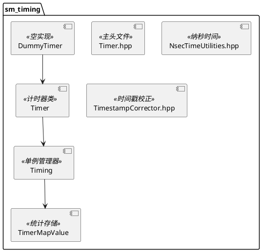
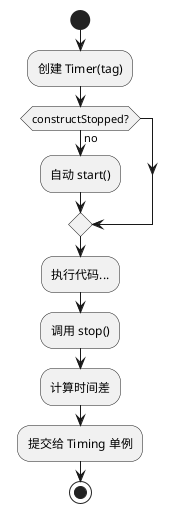

# sm_timing 模块文档

> 性能计时和统计工具，提供高精度计时器和性能分析功能

---

## 1. 📋 功能说明

### 1.1 定位
sm_timing 是 Schweizer-Messer 库的计时模块，提供了高精度的性能计时、统计分析和性能报告功能。

### 1.2 核心能力
- **高精度计时器**：支持 Windows 高性能计时器和 POSIX 计时器
- **性能统计**：均值、方差、最小值、最大值、滚动均值
- **命名计时器**：通过字符串 tag 或 handle 管理多个计时器
- **频率计算**：自动计算 Hz（每秒次数）
- **报告生成**：格式化的性能报告输出
- **DummyTimer**：Release 模式下可禁用计时

---

## 2. 🏗️ 架构设计

sm_timing 采用单例模式，以 Timing 类为核心管理所有计时器。



### 2.1 主要组件划分
1. **Timer 类**：单个计时器，测量时间间隔
2. **Timing 类**：单例，管理所有计时器和统计
3. **TimerMapValue**：存储累加器和统计数据
4. **DummyTimer**：NDEBUG 模式下的空实现
5. **NsecTimeUtilities**：纳秒级时间工具
6. **TimestampCorrector**：时间戳校正

### 2.2 数据流走向
```
Timer::start() → 记录时间戳 → Timer::stop() → 计算时间差 → Timing::addTime() → 统计累加器
```

### 2.3 关键设计模式
- **单例模式**：Timing 使用单例管理全局状态
- **策略模式**：Timer/DummyTimer 编译时选择
- **累加器模式**：Boost.Accumulators 进行统计
- **工厂模式**：通过 tag 获取/创建计时器

---

## 3. 🔑 关键方法

### 3.1 Timer 基本操作
```cpp
Timer(std::string const & tag, bool constructStopped = false);
void start();
void stop();
bool isTiming();
```
**原理**：测量 start() 和 stop() 之间的时间间隔

**实现位置**：`include/sm/timing/Timer.hpp`



---

### 3.2 Timing 静态查询
```cpp
static size_t getHandle(std::string const & tag);
static double getTotalSeconds(size_t handle);
static double getMeanSeconds(size_t handle);
static size_t getNumSamples(size_t handle);
static double getVarianceSeconds(size_t handle);
static double getMinSeconds(size_t handle);
static double getMaxSeconds(size_t handle);
static double getHz(size_t handle);
static void print(std::ostream & out);
static std::string print();
static void reset(size_t handle);
```
**原理**：通过 Timing 单例查询计时器统计数据

**实现位置**：`include/sm/timing/Timer.hpp`

---

### 3.3 TimerMapValue 统计
```cpp
struct TimerMapValue {
    boost::accumulators::accumulator_set<
      double,
      boost::accumulators::features<
        boost::accumulators::tag::lazy_variance,
        boost::accumulators::tag::sum,
        boost::accumulators::tag::min,
        boost::accumulators::tag::max,
        boost::accumulators::tag::rolling_mean,
        boost::accumulators::tag::mean
      >
    > m_acc;
};
```
**原理**：使用 Boost.Accumulators 实时计算统计量

**实现位置**：`include/sm/timing/Timer.hpp:31-45`

---

### 3.4 DummyTimer 空实现
```cpp
class DummyTimer {
public:
    DummyTimer(std::string const & /* tag */){}
    void start(){}
    void stop(){}
    bool isTiming(){ return false; }
};
```
**原理**：NDEBUG 模式下所有操作都是空操作，无性能开销

**实现位置**：`include/sm/timing/Timer.hpp:51-62`

---

## 4. 🔌 对外接口

### 4.1 主要类

#### 4.1.1 `Timer`
**用途**：单个计时器，测量时间间隔

**关键方法**：
- `Timer(size_t handle, bool constructStopped = false)` — 从 handle 构造
- `Timer(std::string const & tag, bool constructStopped = false)` — 从 tag 构造
- `start()` — 开始计时
- `stop()` — 停止计时
- `isTiming()` — 检查是否正在计时

**输入输出接口定义**：
```
输入:
  构造: tag (std::string) 或 handle (size_t)
  start(): 无参数
  stop(): 无参数

输出:
  isTiming(): bool (是否正在计时)
  时间差自动提交给 Timing 单例
```

---

#### 4.1.2 `Timing`
**用途**：单例，管理所有计时器和统计

**关键静态方法**：
- `getHandle(tag)` — 获取或创建计时器 handle
- `getTag(handle)` — 获取 handle 对应的 tag
- `getTotalSeconds(handle/tag)` — 获取总时间
- `getMeanSeconds(handle/tag)` — 获取平均时间
- `getNumSamples(handle/tag)` — 获取采样次数
- `getVarianceSeconds(handle/tag)` — 获取方差
- `getMinSeconds(handle/tag)` — 获取最小值
- `getMaxSeconds(handle/tag)` — 获取最大值
- `getHz(handle/tag)` — 获取频率（Hz）
- `print(out)` — 打印报告到流
- `print()` — 返回报告字符串
- `reset(handle/tag)` — 重置计时器统计

**输入输出接口定义**：
```
输入:
  getHandle(): tag (std::string)
  getTotalSeconds() 等: handle (size_t) 或 tag (std::string)

输出:
  getTotalSeconds(): double (秒)
  getMeanSeconds(): double (秒)
  getNumSamples(): size_t (次数)
  getVarianceSeconds(): double (秒²)
  getMinSeconds(): double (秒)
  getMaxSeconds(): double (秒)
  getHz(): double (1/秒)
  print(): std::string (格式化报告)
```

---

#### 4.1.3 `DummyTimer`
**用途**：Release 模式下的空实现，无性能开销

**关键方法**（同 Timer，但都是空操作）：
- `start()` — 空操作
- `stop()` — 空操作
- `isTiming()` — 返回 false

---

### 4.2 条件类型定义

#### 4.2.1 `DebugTimer`
```cpp
#ifdef NDEBUG
typedef DummyTimer DebugTimer;
#else
typedef Timer DebugTimer;
#endif
```
**用途**：Debug 模式使用 Timer，Release 模式使用 DummyTimer

---

### 4.3 核心数据结构

#### 4.3.1 Timer 内部存储
```cpp
#ifdef SM_USE_HIGH_PERF_TIMER
LARGE_INTEGER m_time;        // Windows 高性能计时器
#else
boost::posix_time::ptime m_time;  // POSIX 时间
#endif
bool m_timing;               // 是否正在计时
size_t m_handle;             // 计时器 handle
```

#### 4.3.2 Timing 单例存储
```cpp
typedef std::map<std::string,size_t> map_t;    // tag -> handle
typedef std::vector<TimerMapValue> list_t;      // handle -> 统计
list_t m_timers;
map_t m_tagMap;
size_t m_maxTagLength;
```

---

## 5. 📦 依赖关系

### 5.1 内部依赖
- sm_common — 基础工具和断言

### 5.2 外部依赖
- Boost (date_time) — 时间支持（非 Windows）
- Boost (accumulators) — 统计累加器
- Windows (high performance timer) — Windows 平台

---

## 6. 💡 使用示例

### 6.1 基本计时
```cpp
#include <sm/timing/Timer.hpp>

void myFunction() {
    // 创建计时器（自动 start）
    sm::timing::Timer timer("myFunction");

    // ... 执行代码 ...

    // 停止计时（析构时也会自动停止）
    timer.stop();
}
```

### 6.2 查询统计
```cpp
#include <sm/timing/Timer.hpp>

// 获取计时器 handle
size_t handle = sm::timing::Timing::getHandle("myFunction");

// 查询统计
double total = sm::timing::Timing::getTotalSeconds(handle);
double mean = sm::timing::Timing::getMeanSeconds(handle);
size_t count = sm::timing::Timing::getNumSamples(handle);
double hz = sm::timing::Timing::getHz(handle);

std::cout << "Total: " << total << "s" << std::endl;
std::cout << "Mean: " << mean << "s" << std::endl;
std::cout << "Count: " << count << std::endl;
std::cout << "Frequency: " << hz << " Hz" << std::endl;
```

### 6.3 打印性能报告
```cpp
#include <sm/timing/Timer.hpp>
#include <iostream>

// 打印到标准输出
sm::timing::Timing::print(std::cout);

// 获取报告字符串
std::string report = sm::timing::Timing::print();
std::cout << report;
```

### 6.4 使用 DebugTimer
```cpp
#include <sm/timing/Timer.hpp>

// Debug 模式用 Timer，Release 模式用 DummyTimer
sm::timing::DebugTimer timer("debug_section");

// ... 代码 ...

// Release 模式下无性能开销
```

### 6.5 重置计时器
```cpp
#include <sm/timing/Timer.hpp>

// 重置特定计时器
sm::timing::Timing::reset("myFunction");

// 或通过 handle
size_t handle = sm::timing::Timing::getHandle("myFunction");
sm::timing::Timing::reset(handle);
```

---

## 7. 🔗 相关模块
- [sm_common](./sm_common.md) — 基础依赖
- [sm_boost](./sm_boost.md) — Boost 支持

---

## 8. 📄 核心文件列表

| 文件 | 职责 |
|------|------|
| `include/sm/timing/Timer.hpp` | 主头文件，Timer 和 Timing 类 |
| `include/sm/timing/NsecTimeUtilities.hpp` | 纳秒时间工具 |
| `include/sm/timing/TimestampCorrector.hpp` | 时间戳校正 |
| `include/sm/timing/implementation/TimestampCorrector.hpp` | 时间戳校正实现 |
